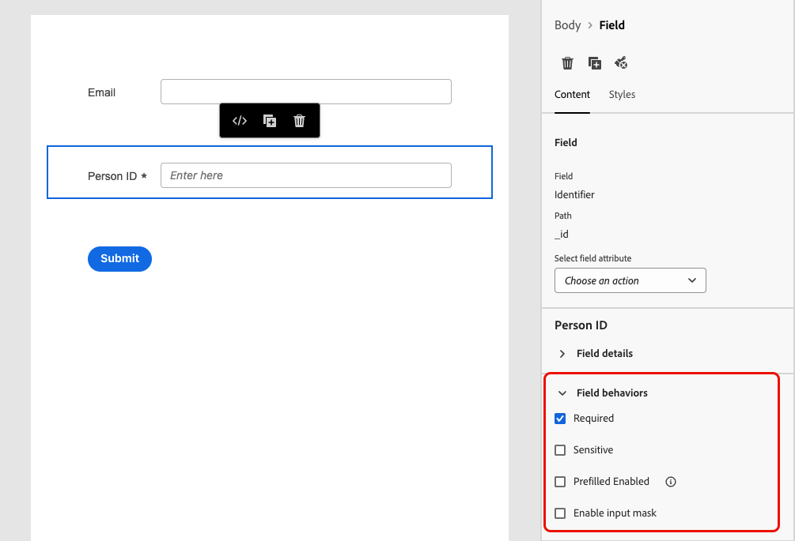
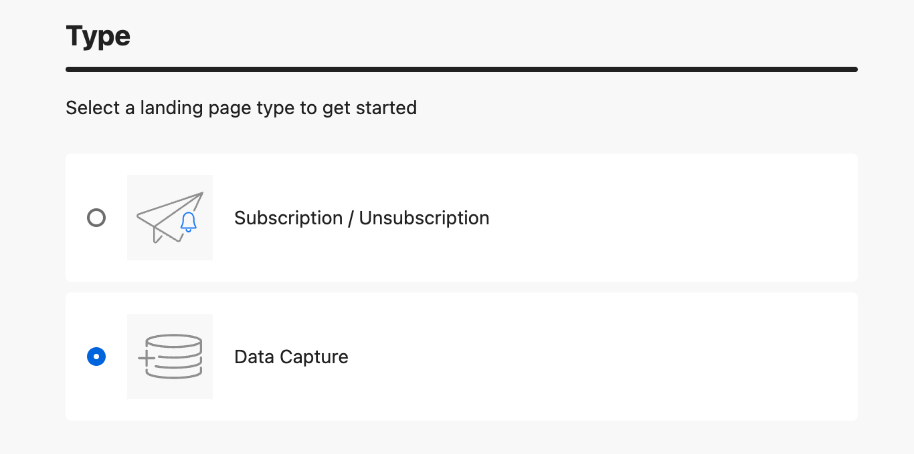

# 在登陆页面中使用表单 {#lp-forms}

>[!AVAILABILITY]
>
>此功能为限量发布版。请联系 Adobe 代表以获取访问权限。

要使用您的[!DNL Journey Optimizer]登陆页面捕获配置文件数据并扩充[!DNL Experience Platform]数据集，您可以在登陆页面中利用表单。

## 创建表单预设 {#create-form-preset}

>[!CONTEXTUALHELP]
>id="ajo_lp_form_connection"
>title="选择要使用的端点"
>abstract="定义在提交表单时发送数据的流端点。"
>additional-url="https://experienceleague.adobe.com/en/docs/experience-platform/sources/ui-tutorials/create/streaming/http" text="创建HTTP API流连接"

>[!CONTEXTUALHELP]
>id="ajo_lp_form_dataset"
>title="选择数据集"
>abstract="定义一个数据集，其中将存储和反映表单响应。 您可以键入以搜索特定数据集，或从列表中选择该数据集。"

在创建表单之前，您需要创建一个专用预设，从中选择发送表单提交数据的连接端点以及存储通过表单捕获的数据的数据集。

当数据登陆流端点时，它会与数据集信息相关联。 然后，使用生成的源/目标连接和源流量，将数据推送到数据集中。

创建预设时：

* 您可以使用不同的数据集和流连接组合来设置多个预设。
* 同一数据集或流连接可以在多个预设中重用。
* 每个流连接都会自动生成资源，例如：
   * **Source连接** — 数据来源。
   * **目标连接** — 存储或使用数据的位置。
   * **Source流** — 将数据从源连接移动到[!DNL Experience Platform]的管道，用于处理映射、转换和验证。

>[!NOTE]
>
> 要访问和编辑表单预设，您必须对生产沙盒具有&#x200B;**[!UICONTROL 管理表单预设]**&#x200B;权限。 在[本节](../administration/high-low-permissions.md#administration-permissions).<!--TBC-->中了解有关权限的详细信息

1. 要访问&#x200B;**[!UICONTROL 表单预设]**&#x200B;清单，请从左侧菜单中选择&#x200B;**[!UICONTROL 管理]** > **[!UICONTROL 渠道]** >**[!UICONTROL 表单设置]**。

1. 单击&#x200B;**[!UICONTROL 创建表单预设]**。

1. 更新名称以更轻松地检索它，并根据需要添加描述。

   {width=80%}

1. 选择要用于该表单的&#x200B;**[!UICONTROL 流连接]**。 这是流式端点，在提交表单时从中发送数据。

   >[!NOTE]
   >
   >在[Experience Platform文档](https://experienceleague.adobe.com/en/docs/experience-platform/sources/ui-tutorials/create/streaming/http){target="_blank"}中了解有关创建流源连接的更多信息。

1. 选择要与表单链接的&#x200B;**[!UICONTROL 数据集]**。 这是将存储和反映表单响应的位置。 您可以键入以搜索特定数据集，或从列表中选择该数据集。

   >[!NOTE]
   >
   >当前只有[!DNL Adobe Experience Platform]个数据集可供选择。 一次只能选择一个数据集。

1. 单击&#x200B;**[!UICONTROL 发布]**。 您的预设现已准备就绪，可在表单中使用。

## 访问和管理表单 {#access-forms}

要访问表单列表，请从左侧菜单中选择&#x200B;**[!UICONTROL 内容管理]** > **[!UICONTROL Forms]**。

将显示所有现有表单。 您可以根据表单的状态、创建或修改日期来筛选表单。

## 创建和设计表单 {#create-form}

>[!CONTEXTUALHELP]
>id="ajo_lp_form_preset"
>title="选择预设"
>abstract="选择包含要使用的连接的预定义预设和表单的预定义数据集。"
>additional-url="https://experienceleague.adobe.com/en/docs/journey-optimizer/using/content-management/landing-pages/lp-forms#create-form-preset" text="创建表单预设"

要创建表单，请执行以下步骤。

1. 从&#x200B;**[!UICONTROL Forms]**&#x200B;列表中，单击&#x200B;**[!UICONTROL 创建表单]**。

1. 添加名称。 您可以根据需要添加描述。

   

1. 选择包含要使用的连接的&#x200B;**[!UICONTROL 预设]**&#x200B;和表单的预定义数据集。 [了解如何创建表单预设](#create-form-preset)

1. 单击&#x200B;**[!UICONTROL 创建]**。表单设计器将打开，允许您添加结构和内容[组件](../email/content-components.md#add-content-components)来构建内容。 您可以使用[Text](../email/content-components.md#text)和&#x200B;**[!UICONTROL Field]**&#x200B;组件。

1. 要捕获配置文件数据和属性，请向表单中添加特定字段。 [了解详情](#define-fields)

1. 配置并设计这些字段。 [了解详情](#configure-fields)

1. 您可以使用&#x200B;**[!UICONTROL 样式]**&#x200B;窗格根据需要调整表单的布局、样式和维度。 [了解有关样式设置的更多信息](../email/get-started-email-style.md)

1. 配置所有字段后，单击&#x200B;**[!UICONTROL 保存并关闭]**。

1. 配置感谢页面。 [了解如何操作](#thank-you-page)

1. **[!UICONTROL 发布]**&#x200B;表单以供在登陆页面中选择。

### 定义特定字段 {#define-fields}

若要向表单中添加特定字段，请将结构拖放到画布中，并将&#x200B;**[!UICONTROL 字段]**&#x200B;组件拖入其中。<!--**[!UICONTROL Select field attribute]** or **[!UICONTROL Add custom field]**.-->

然后选择以下选项之一：

>[!BEGINTABS]

>[!TAB 选择字段属性]

使用此选项可根据链接到表单的数据集架构选择属性。

>[!NOTE]
>
>在为表单选择的预设中定义数据集。 [了解详情](#create-form-preset)

{width=100%}

例如，您可以设置电子邮件和人员ID。 当用户填写这些字段时，输入的信息将保存到所选数据集。

{width=55%}

要将收集的数据与配置文件进行映射，请选择配置文件标识字段。 身份字段在属性列表中标记为&#x200B;**[!UICONTROL 必填]** — 您可以对其进行筛选。

{width=65%}

>[!TAB 添加自定义字段]

利用此选项，您可以只定义自由字段，而无需将其映射到链接数据集中的字段。

{width=85%}

>[!ENDTABS]

### 配置和设计字段 {#configure-fields}

选择字段属性或添加自定义字段后，您可以在提交表单时进一步调整其详细信息及其行为。

1. 在右侧&#x200B;**[!UICONTROL Content]**&#x200B;选项卡的&#x200B;**[!UICONTROL 字段详细信息]**&#x200B;部分中，您可以根据需要指定以下元素：

   * 调整&#x200B;**[!UICONTROL 标签]**&#x200B;以向表单收件人明确说明。
   * 根据需要更改&#x200B;**[!UICONTROL 字段类型]**。 它可以是复选框、货币、日期、滑块、URL等。

     >[!NOTE]
     >
     >其他字段详细信息可能会因所选的字段类型而异。

   * 添加&#x200B;**[!UICONTROL 占位符]**.<!--To explain-->
   * 指定&#x200B;**[!UICONTROL 指令]**.<!--How will they be displayed in the form? To explain-->
   * 输入&#x200B;**[!UICONTROL 默认值]**，该值将在表单用户填写字段之前显示。
   * 您可以定义自定义&#x200B;**[!UICONTROL 验证消息]**。
   * 设置&#x200B;**[!UICONTROL 最大长度]**。 如果填写字段时表单的收件人超出限制，则会显示错误消息。

   {width=85%}

1. 在&#x200B;**[!UICONTROL 字段行为]**&#x200B;部分中，可以定义以下内容：

   * 选择&#x200B;**[!UICONTROL 必填]**&#x200B;使该字段为必填。 如果用户不填写字段，则无法提交表单。
   * 选择&#x200B;**[!UICONTROL 区分大小写]**&#x200B;以使字段区分大小写。<!--To confirm - do you mean retain capitalization when added to the dataset?-->
   * 选择&#x200B;**[!UICONTROL 预填已启用]**&#x200B;以从配置文件信息中填充字段（如果可用）。<!--Even for a custom field, or a field not mapped to a profile? What happens if no data is available?-->
   * 选择&#x200B;**[!UICONTROL 启用输入掩码]**&#x200B;以使用通用字符替换用户的输入。 您可以使用&#x200B;*9*&#x200B;表示任意数字，*a*&#x200B;表示任意字母，或*表示任意数字或字母。<!--Not sure how you define that in the form-->

   {width=75%}

### 配置感谢页面 {#thank-you-page}

>[!CONTEXTUALHELP]
>id="ajo_lp_forms_thankyou_page"
>title="感谢页面"
>abstract="配置某人填写或转发表单时将发生的情况。"

在&#x200B;**[!UICONTROL 感谢页面]**&#x200B;部分中，配置当用户填写表单时会发生什么情况。

{width=70%}

设置以下操作之一：

* **[!UICONTROL 停留在页面]** — 此选项在提交表单时将访客保留在相同的页面上。
* **[!UICONTROL 登陆页面]** — 选择已发布的[登陆页面](create-lp.md)，用户将在提交表单后重定向到该登陆页面。
* **[!UICONTROL 外部URL]** — 输入要作为后续页面的完整URL。 用户提交表单后，会被定向到指定的URL。
* **[!UICONTROL 条件重定向]** — 设置规则以根据表单响应动态显示不同的跟进操作。

  您可以为每个特定受众定义规则。 例如，您可以为美国居民显示特定登陆页面，为加拿大居民显示其他页面，等等。 最后，为不属于您定义的任何规则的用户设置默认操作。

  >[!NOTE]
  >
  >系统会按顺序读取规则中定义的条件。

  {width=40%}

## 编辑已发布的表单 {#edit-form}

发布表单后，您仍可以对其进行编辑。 请按照以下步骤操作。

1. 访问[表单列表](#access-forms)并选择已发布的表单。

1. 单击&#x200B;**[!UICONTROL 编辑表单]**&#x200B;按钮。

   {width=90%}

1. 将创建具有草稿状态的表单新版本。 单击&#x200B;**[!UICONTROL 创建草稿版本]**。

1. 根据需要更新表单，然后单击&#x200B;**[!UICONTROL 保存]**。 该表单现在具有&#x200B;**[!UICONTROL 已发布（草稿）]**&#x200B;状态：

   * 当前版本继续具有&#x200B;**[!UICONTROL 已发布]**&#x200B;状态，直到您发布更新的版本。

   * 更新的版本具有&#x200B;**[!UICONTROL 草稿]**&#x200B;状态。

1. 返回表单摘要，您可以在表单的两个版本之间导航。

   {width=70%}

1. 在&#x200B;**[!UICONTROL 草稿]**&#x200B;部分中，您可以发布或放弃草稿，以及编辑表单的详细信息或内容。

   {width=75%}

## 在登陆页面中利用表单 {#leverage-form-in-lp}

您现在可以将此表单嵌入到登陆页面，以便捕获与您在表单中定义的属性对应的数据，并将其保存到选定的数据集中。 请按照以下步骤操作。

1. 创建登陆页面。 [了解如何操作](create-lp.md#create-landing-page)

1. 选择&#x200B;**[!UICONTROL 数据捕获]**&#x200B;作为登陆页类型，然后单击&#x200B;**[!UICONTROL 创建]**。

   {width=65%}

1. 配置主页面。 [了解如何操作](create-lp.md#configure-primary-page)

1. 打开[登陆页设计器](design-lp.md)。

1. 将&#x200B;**[!UICONTROL 结构组件]**&#x200B;拖放到您的内容中。 将&#x200B;**[!UICONTROL 表单]**&#x200B;组件拖放到该结构中。

   >[!NOTE]
   >
   >登陆页面中只能选择已发布的表单。

1. 在&#x200B;**[!UICONTROL 嵌入表单]**&#x200B;部分中，选择您创建的表单。

   

   >[!NOTE]
   >
   >您可以使用&#x200B;**[!UICONTROL 编辑表单]**&#x200B;按钮更新所选表单。 该表单将在新选项卡中打开。 编辑表单内容的步骤与[此部分](#create-form)中描述的步骤相同。

1. 在&#x200B;**[!UICONTROL 跟进类型]**&#x200B;部分中，配置当用户填写表单时会发生什么情况：

   * 选择&#x200B;**[!UICONTROL 定义表单]**&#x200B;以选择在嵌入表单中定义的操作。 [了解详情](#thank-you-page)

   * 您还可以选择已发布的[登陆页面](create-lp.md)，在提交表单后，用户将重定向到该登陆页面。

   * 或者，将&#x200B;**[!UICONTROL 外部URL]**&#x200B;定义为后续页面，在提交表单时指引用户。

1. 保存并测试您的登陆页面。 [了解如何操作](create-lp.md#test-landing-page)

一旦您的登陆页面被[发布](create-lp.md#publish-landing-page)并用于历程中，当用户填写表单时，输入的信息将被摄取到选定的数据集中。

>[!NOTE]
>
>如果您取消发布登陆页面中使用的表单，编辑此表单并再次发布，则登陆页面始终使用表单的最新发布版本。
