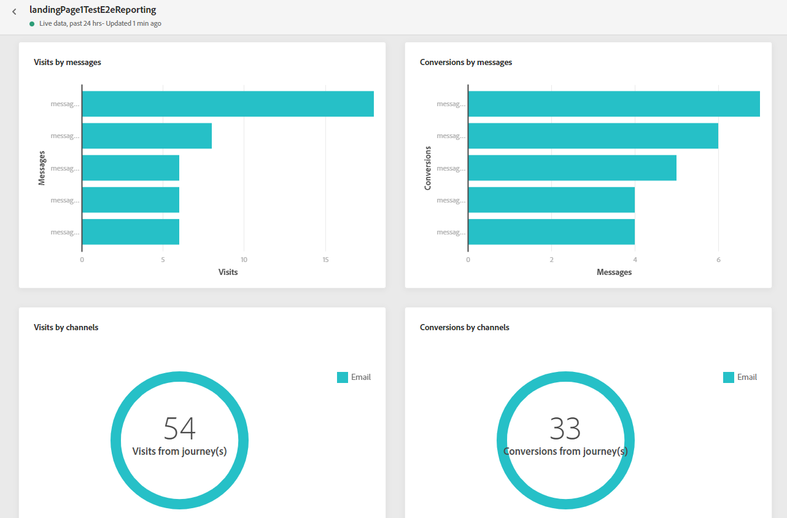
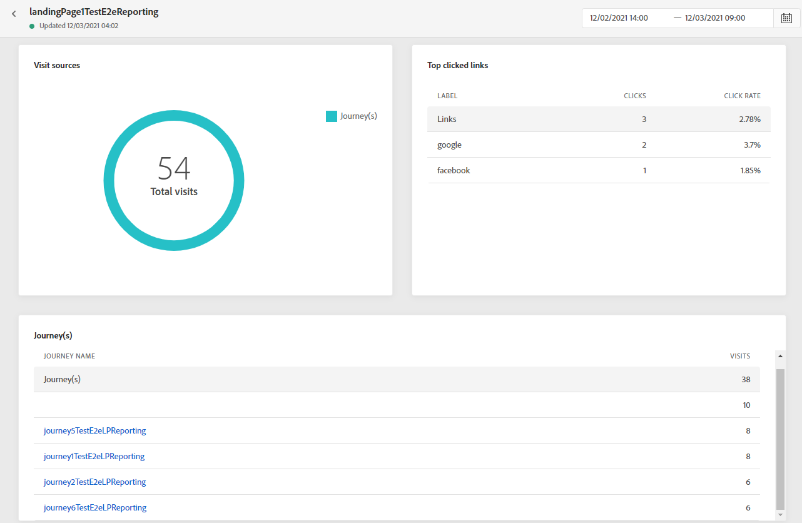

# 登陆页面报表 {#lp-report}

登陆页面报表显示有关登陆页面影响的详细信息。 有两种报表类型可用：

* 的 **[!UICONTROL Live report]** ，以仅测量和可视化登陆页面在过去24小时内的成功情况。

* 的 **[!UICONTROL Global report]** ，以测量和显示选定时间段内登陆页面的成功情况。

要访问您的报表，请选择 **实时** 或 **[!UICONTROL Global report]** ，从选定登陆页面的高级菜单访问。

## 登陆页面实时报表 {#lp-live}

的 **[!UICONTROL Landing page performance]** 小组件通过KPI详细介绍了过去24小时内与您的消息相关的主要信息：

* **[!UICONTROL Total visits]**:从历程或其他来源访问登陆页面的总次数，包括一个收件人的多次访问。

* **[!UICONTROL Conversions]**:与登陆页面进行交互（例如订阅了表单）的人数。

* **[!UICONTROL Bounces]**:未与登陆页面进行交互且未完成订阅操作的人员数。

的 **[!UICONTROL Visit sources]** 小组件表示访客如何访问您的登陆页面：

* **[!UICONTROL Journey(s)]**:历程对登陆页面的访问次数。

* **[!UICONTROL Other sources]**:来自外部源而非历程的登陆页面访问次数。

的 **[!UICONTROL Top clicked links]** 识别访客与登陆页面的交互：

* **[!UICONTROL Clicks]**:内容在登陆页面中的点击次数。

的 **[!UICONTROL Journey(s)]** 小组件表示从历程到登陆页面的访问次数。

的 **[!UICONTROL Other sources]** 小组件表示从外部源而不是历程访问登陆页面的次数。

的 **[!UICONTROL Visits by messages]** / **[!UICONTROL Conversions by messages]** 图形表示过去24小时内与您的登陆页面成功交互的访问和人员总数，具体取决于已发送的消息。

的 **[!UICONTROL Visits by channels]** / **[!UICONTROL Conversions by channels]** 图形表示过去24小时内与您的登陆页面成功交互的访问和人员总数，具体取决于渠道。

## 登陆页面全局报表 {#lp-global}

的 **[!UICONTROL Number of visits]** 和 **[!UICONTROL Number of visits over time]** 利用小组件，可通过具有以下量度的图形和KPI，查看选定时间段内登陆页面的影响：

* **[!UICONTROL Total visits]**:来自历程和外部源对您登陆页面的访问总数，包括一个收件人的多次访问。

* **[!UICONTROL Unique visitors]**:访问您的登陆页面的人数，则不会考虑一个收件人的多次访问。

的 **[!UICONTROL Landing page performance]** 小组件通过KPI详细描述与您的消息相关的主要信息：

* **[!UICONTROL Conversion rate]**:与登陆页面进行交互（例如，订阅表单）的人数与访问总数相关。

* **[!UICONTROL Bounce rate]**:与访问总数相比，未与登陆页面进行交互且未完成订阅操作的人员数。

的 **[!UICONTROL Visit sources]** 小组件表示访客如何访问您的登陆页面：

* **[!UICONTROL Journey(s)]**:历程对登陆页面的访问次数。

* **[!UICONTROL Other sources]**:来自外部源而非历程的登陆页面访问次数。

的 **[!UICONTROL Top clicked links]** 识别访客与投放的交互：

* **[!UICONTROL Clicks]**:内容在登陆页面中的点击次数。

* **[!UICONTROL Click rate]**:登陆页面中的点击次数百分比。

的 **[!UICONTROL Journey(s)]** 小组件表示从历程到登陆页面的访问次数：

* **[!UICONTROL Visits]**:登陆页面的访问次数，包括一个收件人的多次访问。

的 **[!UICONTROL Other sources]** 小组件表示从外部源而不是历程访问登陆页面的次数。

的 **[!UICONTROL Visits by messages]** / **[!UICONTROL Conversions by messages]** 图形表示在相关时段内成功与您的登陆页面交互的访问和人员总数，具体取决于已发送的消息。

的 **[!UICONTROL Visits by channels]** / **[!UICONTROL Conversions by channels]** 图形表示在相关时段内成功与您的登陆页面交互的访问和人员总数，具体取决于渠道。
