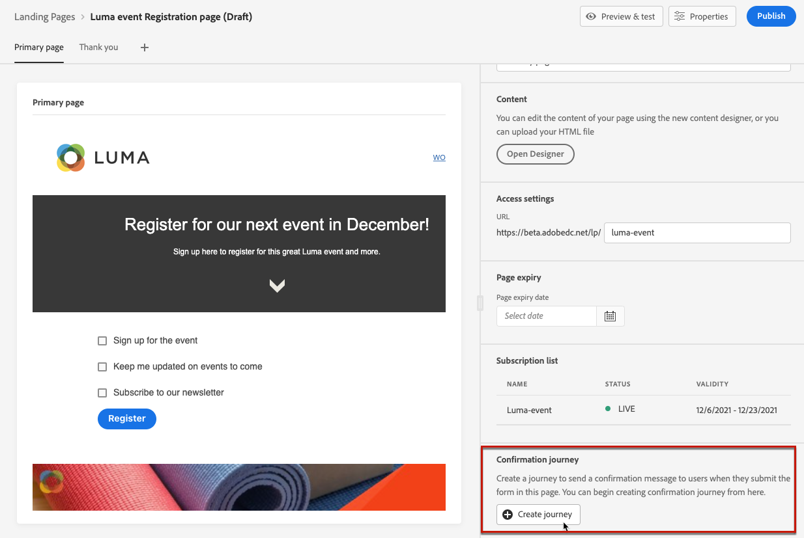
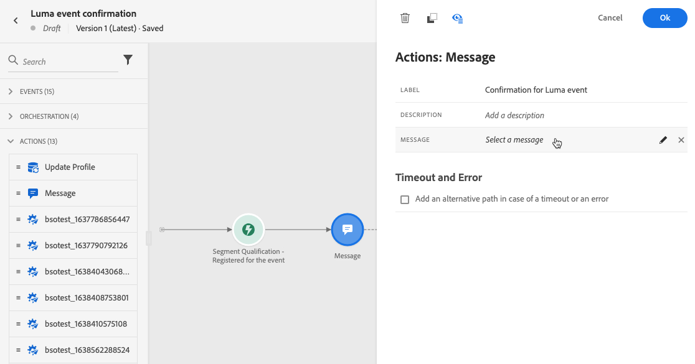
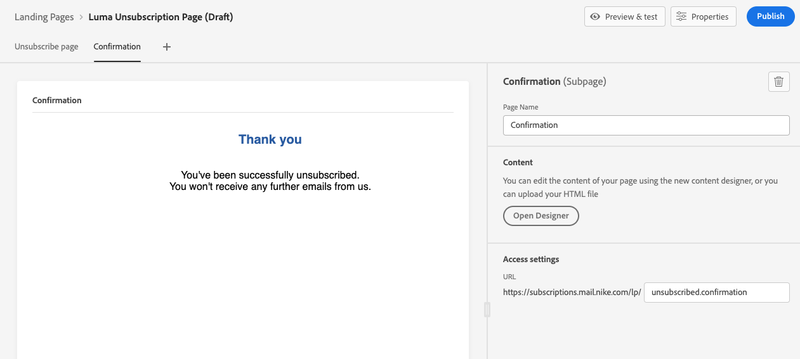

# 登陆页面用例 {#lp-use-cases}

以下是一些说明如何使用的示例 [!DNL Journey Optimizer] 登陆页面，让您的客户选择启用/禁用接收部分或全部通信。

<!--The main use cases are:
* Subscription to a service
* Opt-in
* Opt-out-->

## 订购服务 {#subscription-to-a-service}

最常见的用例之一是邀请客户 [订购服务](subscription-list.md) （例如新闻稿或事件）。 下图介绍了主要步骤：

例如，假设您下月组织了一个事件，并且想要启动一个事件注册营销活动<!--to keep your customers that are interested updated on that event-->. 为此，您将发送一封电子邮件，其中包含指向登陆页面的链接，以便您的收件人注册参加此活动。 注册的用户将添加到您为此创建的订阅列表中。

### 设置登陆页面 {#set-up-lp}

1. 创建事件注册的订阅列表，该列表将存储注册的用户。 了解如何创建订阅列表 [此处](subscription-list.md#define-subscription-list).

   

1. [创建登陆页面](create-lp.md) ，以便收件人注册您的活动。

1. 配置注册 [主登陆页面](create-lp.md#configure-primary-page).

1. 设计 [登陆页面内容](design-lp.md)，选择您创建的订阅列表，以使用选中注册复选框的用户档案对其进行更新。

   

1. 创建“感谢”页面，在收件人提交注册表单后，该页面将显示给收件人。 了解如何配置登陆子页面 [此处](create-lp.md#configure-subpages).

   

1. [发布](create-lp.md#publish) 登陆页面。

1. [创建电子邮件](../messages/create-message.md) 以宣布注册现已对您的活动开放。

1. [插入链接](../messages/message-tracking.md#insert-links) 到消息内容中。 选择 **[!UICONTROL Landing page]** 作为 **[!UICONTROL Link type]** 然后选择 [登陆页面](create-lp.md#configure-primary-page) 创建的注册目录。

   

1. 保存您的内容并[发布您的消息](../messages/publish-manage-message.md)。

1. 通过 [历程](../building-journeys/journey.md) 将流量引导至注册登陆页面。

   

   收到电子邮件后，如果您的收件人单击登陆页面的链接，他们将被定向到“谢谢”页面，并被添加到订阅列表。

### 发送确认电子邮件 {#send-confirmation-email}

此外，您还可以向为您的活动注册的收件人发送电子邮件确认。 为此，请执行以下步骤。

1. 创建其他 [历程](../building-journeys/journey.md). 您可以通过单击 **[!UICONTROL Create journey]** 按钮。 了解更多 [此处](create-lp.md#configure-primary-page)

   

1. 展开&#x200B;**[!UICONTROL Events]**&#x200B;类别并将&#x200B;**[!UICONTROL Segment Qualification]**&#x200B;活动放入画布中。了解更多 [此处](../building-journeys/segment-qualification-events.md)

1. 单击 **[!UICONTROL Segment]** 字段，然后选择您创建的订阅列表。

   

1. 选择您选择的确认电子邮件，并通过历程发送该电子邮件。

   

为您的活动注册的所有用户都将收到确认电子邮件。

<!--The event registration's subscription list tracks the profiles who registered and you can send them targeted event updates.-->

## 选择退出 {#opt-out}

要使收件人取消订阅您的通信，您可以在电子邮件中包含一个指向选择退出登陆页面的链接。

进一步了解管理收件人的同意，以及为什么在 [此部分](../messages/consent.md).

### 选择退出管理 {#opt-out-management}

向收件人提供取消订阅以停止从品牌接收通信的功能是一项法律要求。在 [Experience Platform 文档](https://experienceleague.adobe.com/docs/experience-platform/privacy/regulations/overview.html?lang=zh-Hans#regulations){target=&quot;_blank&quot;}中进一步了解适用的法规。

因此，您必须在发送给收件人的每封电子邮件中都加入&#x200B;**取消订阅链接**：

* 单击此链接后，收件人将被定向到一个包含确认取消订阅按钮的登陆页面。
* 单击选择退出按钮后，用户档案数据将更新此信息。

### 配置选择退出 {#configure-opt-out}

要使电子邮件的收件人能够通过登陆页面取消订阅您的通信，请执行以下步骤。

1. 创建登陆页面。 [了解详情](create-lp.md)

1. 定义主页面。 [了解详情](create-lp.md#configure-primary-page)

1. [设计](design-lp.md) 主页面内容：使用特定于登陆页面的 **[!UICONTROL Form]** 组件，定义 **[!UICONTROL Opt-out]** 复选框并选择更新 **[!UICONTROL Channel (email)]**:所有通信中将禁用您登陆页面上选择退出框的用户档案。

   

   <!--You can also build your own landing page and host it on the third-party system of your choice. To keep?-->

1. 添加确认 [子页面](create-lp.md#configure-subpages) 将向提交表单的用户显示。

   

   >[!NOTE]
   >
   >确保在主页面的 **[!UICONTROL Call to action]** 部分 **[!UICONTROL Form]** 组件。 [了解详情](design-lp.md)

1. 配置并定义页面内容后， [发布](create-lp.md#publish) 登陆页面。

   

1. [创建电子邮件](../messages/create-message.md) in [!DNL Journey Optimizer].

1. 选择内容中的文本，并 [插入链接](../messages/message-tracking.md#insert-links) 使用上下文工具栏。 您还可以在按钮上使用链接。

   

1. 选择 **[!UICONTROL Landing page]** 从 **[!UICONTROL Link type]** 下拉列表中，然后选择 [登陆页面](create-lp.md#configure-primary-page) 您为选择退出而创建的。

   

1. 保存您的内容并[发布您的消息](../messages/publish-manage-message.md)。

1. 通过历程发送您的消息。 [了解详情](../building-journeys/journey.md)。

1. 收到消息后，如果收件人单击电子邮件中的取消订阅链接，则会显示您的登陆页面。

   

   如果收件人选中框并提交表单：

   * 已选择退出的收件人将被重定向到确认消息屏幕。

   * 用户档案数据已更新，除非再次订阅，否则将不会从您的品牌接收通信。

要检查相应用户档案的选择是否已更新，请转到 Experience Platform，并通过选择身份命名空间和相应的身份值访问该用户档案。在 [Experience Platform 文档](https://experienceleague.adobe.com/docs/experience-platform/profile/ui/user-guide.html?lang=zh-Hans#getting-started){target=&quot;_blank&quot;}中了解更多信息。

在 **[!UICONTROL Attributes]** 选项卡中，您可以看到 **[!UICONTROL choice]** 的值已更改为 **[!UICONTROL no]**。

<!--

### Other ways to opt out

You can also enable your recipients to unsubscribe whithout using landing pages.

* **One-click opt-out**

    You can add a one-click opt-out link into your email content. This will enable your recipients to quickly unsubscribe from your communications, without being redirected to a landing page where they need to confirm opting out. [Learn more](../messages/message-tracking.md#one-click-opt-out-link)

* **Unsubscribe link in header**

    If the recipients' email client supports displaying an unsubscribe link in the email header, emails sent with [!DNL Journey Optimizer] automatically include this link. [Learn more](../messages/consent.md#unsubscribe-email)
-->
