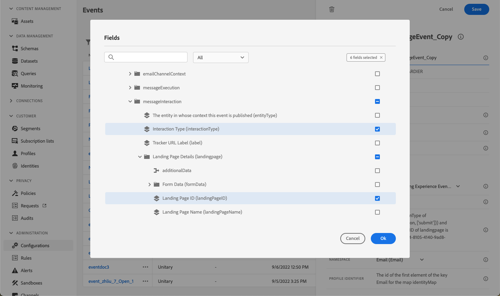
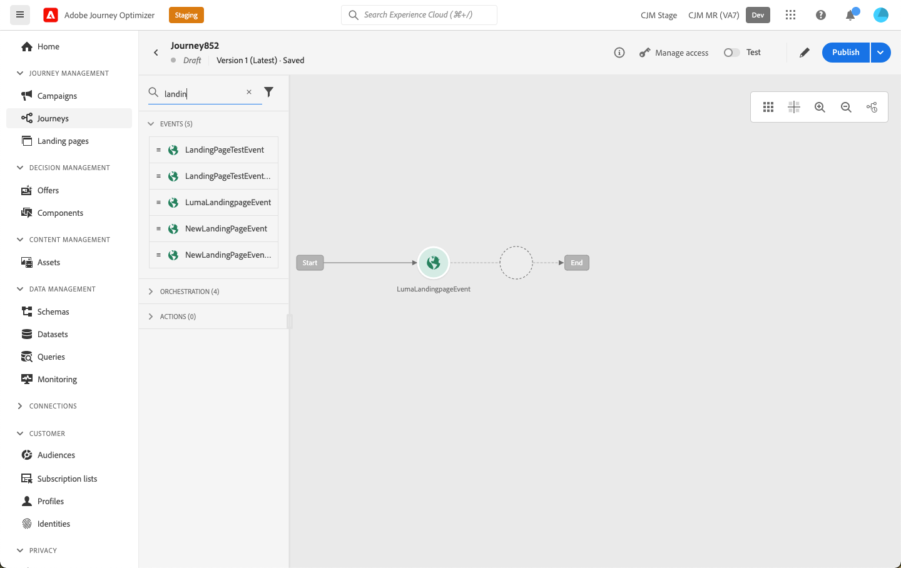

# 登陆页面用例 {#lp-use-cases}

以下是如何使用的一些示例 [!DNL Journey Optimizer] 登陆页面，让您的客户选择启用/禁用接收您的部分或全部通信。

## 订阅服务 {#subscription-to-a-service}

最常见的用例之一是邀请您的客户 [订购服务](subscription-list.md) （例如新闻稿或活动）。 主要步骤如下图所示：

例如，假设您在下月组织了一个事件，并且想要启动一个事件注册营销活动<!--to keep your customers that are interested updated on that event-->. 为此，您将发送一封电子邮件，其中包含登陆页面的链接，以便收件人注册参加此事件。 注册的用户将被添加到您为此目的创建的订阅列表中。

### 设置登陆页面 {#set-up-lp}

1. 创建事件注册的订阅列表，该列表将存储已注册的用户。 了解如何创建订阅列表 [此处](subscription-list.md#define-subscription-list).

   

1. [创建登陆页面](create-lp.md) 以使您的收件人能够注册您的事件。

   

1. 配置注册 [主登陆页面](create-lp.md#configure-primary-page).

1. 设计 [登陆页面内容](design-lp.md)，选择您创建的订阅列表，以使用选中注册复选框的用户档案对其进行更新。

   

1. 创建一个“感谢”页面，在收件人提交注册表单后，该页面将显示给收件人。 了解如何配置登陆子页面 [此处](create-lp.md#configure-subpages).

   

1. [Publish](create-lp.md#publish) 登陆页面。

1. 在 [历程](../building-journeys/journey.md)，添加 **电子邮件** 活动，将流量引导至注册登陆页面。

   

1. [设计电子邮件](../email/get-started-email-design.md) 以宣布您的活动已开放注册。

1. [插入链接](../email/message-tracking.md#insert-links) 放入您的消息内容。 选择 **[!UICONTROL 登陆页面]** 作为 **[!UICONTROL 链接类型]** 并选择 [登陆页面](create-lp.md#configure-primary-page) 您为注册而创建的。

   

   >[!NOTE]
   >
   >要能够发送消息，请确保您选择的登陆页面尚未过期。 了解如何更新到期日期 [在此部分中](create-lp.md#configure-primary-page).

   收到电子邮件后，如果您的收件人单击登陆页面的链接，他们将被定向到“感谢”页面，并将他们添加到订阅列表。

### 发送确认电子邮件 {#send-confirmation-email}

此外，您还可以向注册了事件的收件人发送确认电子邮件。 要实现此目的，请执行以下步骤。

1. 创建另一个 [历程](../building-journeys/journey.md). 您可以直接从登陆页面中单击 **[!UICONTROL 创建历程]** 按钮。 [了解详情](create-lp.md#configure-primary-page)

   

1. 展开 **[!UICONTROL 活动]** 类别并放置 **[!UICONTROL 受众资格]** 活动移入画布。 [了解详情](../building-journeys/audience-qualification-events.md)

1. 单击 **[!UICONTROL 受众]** 字段并选择您创建的订阅列表。

   

1. 添加您选择的确认电子邮件，并通过历程发送它。

   

所有注册您的活动的用户都将收到确认电子邮件。

<!--The event registration's subscription list tracks the profiles who registered and you can send them targeted event updates.-->

## 选择退出登陆页面 {#opt-out}

要使收件人能够取消订阅您的通信，您可以在电子邮件中包含指向选择退出登陆页面的链接。

>[!NOTE]
>
>了解有关管理收件人同意的更多信息，以及这在中为什么很重要 [本节](../privacy/opt-out.md).

### 选择退出管理 {#opt-out-management}

向收件人提供取消订阅以停止从品牌接收通信的功能是一项法律要求。在 [Experience Platform 文档](https://experienceleague.adobe.com/docs/experience-platform/privacy/regulations/overview.html?lang=zh-Hans#regulations){target="_blank"}中进一步了解适用的法规。

因此，您必须在发送给收件人的每封电子邮件中都加入&#x200B;**取消订阅链接**：

* 单击此链接后，收件人将被定向到一个包含确认取消订阅按钮的登陆页面。
* 单击选择退出按钮后，用户档案数据将使用此信息更新。

### 配置电子邮件选择退出 {#configure-opt-out}

要使电子邮件的收件人能够通过登陆页面取消订阅您的通信，请执行以下步骤：

1. 创建登陆页面。 [了解详情](create-lp.md)

1. 定义主页面。 [了解详情](create-lp.md#configure-primary-page)

1. [设计](design-lp.md) 主页面内容：使用特定于登陆页面 **[!UICONTROL 表单]** 组件，定义 **[!UICONTROL 选择退出]** 复选框，然后选择以更新 **[!UICONTROL 渠道（电子邮件）]**：选中登陆页面上的选择退出框的配置文件将退出您的所有通信。

   

   <!--You can also build your own landing page and host it on the third-party system of your choice.-->

1. 添加确认 [子页面](create-lp.md#configure-subpages) 将显示给提交表单的用户。

   

   >[!NOTE]
   >
   >确保您在主页面的 **[!UICONTROL 行动号召]** 的部分 **[!UICONTROL 表单]** 组件。 [了解详情](design-lp.md)

1. 配置和定义页面的内容后， [发布](create-lp.md#publish) 登陆页面。

1. [创建电子邮件](../email/get-started-email-design.md) 在旅程中。

1. 选择内容中的文本并 [插入链接](../email/message-tracking.md#insert-links) 使用上下文工具栏。 您还可以在按钮上使用链接。

1. 选择 **[!UICONTROL 登陆页面]** 从 **[!UICONTROL 链接类型]** 下拉列表，然后选择 [登陆页面](create-lp.md#configure-primary-page) 您创建用于选择退出的库。

   

   >[!NOTE]
   >
   >要能够发送消息，请确保您选择的登陆页面尚未过期。 了解如何更新到期日期 [在此部分中](create-lp.md#configure-primary-page).

1. 发布并运行历程。 [了解详情](../building-journeys/journey.md)。

1. 收到消息后，如果收件人单击电子邮件中的取消订阅链接，则会显示您的登陆页面。

   

   如果收件人选中该框并提交表单：

   * 选择退出的收件人将被重定向至确认消息屏幕。

   * 配置文件数据已更新，除非再次订阅，否则将不会收到您品牌的通信。

要检查相应用户档案的选择是否已更新，请转到 Experience Platform，并通过选择身份命名空间和相应的身份值访问该用户档案。在中了解详情 [Experience Platform文档](https://experienceleague.adobe.com/docs/experience-platform/profile/ui/user-guide.html?lang=zh-Hans#getting-started){target="_blank"}.

在 **[!UICONTROL 属性]** 选项卡中，您可以看到的值 **[!UICONTROL 选择]** 已更改为 **[!UICONTROL 否]**.

选择退出信息将存储在 **同意服务数据集**. [了解有关数据集的更多信息](../data/get-started-datasets.md)

>[!NOTE]
>
>如果默认为合并方法 [Adobe Experience Platform](https://experienceleague.adobe.com/docs/experience-platform/profile/home.html?lang=zh-Hans){target="_blank"} **[!UICONTROL 配置文件]** 合并策略为 **[!UICONTROL 数据集优先级]**，确保启用 **[!UICONTROL AJO同意服务数据集]** 并在合并策略中对其进行优先处理。 [了解详情](https://experienceleague.adobe.com/docs/experience-platform/profile/merge-policies/ui-guide.html#dataset-precedence-profile){target="_blank"}
>
>即使未将任何批次添加到此数据集，它仍将包含选择启用/选择禁用信息。

**另请参阅：**

* [一键式选择退出](../email/email-opt-out.md#one-click-opt-out-link)
* [电子邮件标头中的选择退出链接](../email/email-opt-out.md#unsubscribe-header)

<!--

### Other ways to opt out

You can also enable your recipients to unsubscribe whithout using landing pages.

* **One-click opt-out**

    You can add a one-click opt-out link into your email content. This will enable your recipients to quickly unsubscribe from your communications, without being redirected to a landing page where they need to confirm opting out. [Learn more](../privacy/opt-out.md#one-click-opt-out-link)

* **Unsubscribe link in header**

    If the recipients' email client supports displaying an unsubscribe link in the email header, emails sent with [!DNL Journey Optimizer] automatically include this link. [Learn more](../privacy/opt-out.md#unsubscribe-header)

////////

## Leverage landing page submission event {#leverage-lp-event}

You can use information that was submitted on a landing page to send communications to your customers. For example, if a user subscribes to a given subscription list, you can leverage that information to send an email recommending other subscription lists to that user.

To do this, you need to create an event containing the landing page submission information and use it in a journey. Follow the steps below.

1. Go to **[!UICONTROL Administration]** > **[!UICONTROL Configurations]**, and in the **[!UICONTROL Events]** section, select **[!UICONTROL Manage]**.

    

1. The list of events displays. Select **[!UICONTROL Create Event]**.

    

1. The event configuration pane opens on the right side of the screen. Configure a rule-based unitary event. [Learn more](../event/about-creating.md)

1. Define the schema: select **[!UICONTROL AJO Email Tracking Experience Event Schema v.1]** (available by default in [!DNL Journey Optimizer]).

    

1. In the **[!UICONTROL Fields]** section, select the following elements:

    * **[!UICONTROL _experience]** > **[!UICONTROL customerJourneyManagement]** > **[!UICONTROL messageInteraction]** > **[!UICONTROL Interaction Type]**
    
    * **[!UICONTROL _experience]** > **[!UICONTROL customerJourneyManagement]** > **[!UICONTROL messageInteraction]** > **[!UICONTROL Landing Page Details]** > **[!UICONTROL Landing Page ID]**

    

1. Click inside the **[!UICONTROL Event ID condition]** field. Using the simple personalization editor, define the condition for the **[!UICONTROL Interaction Type]** and **[!UICONTROL Landing Page ID]** fields. This will be used by the system to identify the events that will trigger your journey.

    

    >[!NOTE]
    >
    >To find the landing page ID, you can insert the landing page as a link into an email and select the source code from the contextual toolbar to display the landing page information.
    >
    >

1. Save your changes.

1. Create a [journey](../building-journeys/journey.md). You can do it directly from the landing page by clicking the **[!UICONTROL Create journey]** button. Learn more [here](create-lp.md#configure-primary-page)

    

1. In the journey, unfold the **[!UICONTROL Events]** category and drop the event that you created into the canvas. Learn more [here](../building-journeys/audience-qualification-events.md)

    

1. Unfold the **[!UICONTROL Actions]** category and drop an email action into the canvas.

    

///How do you use the information from the event to send an email to the users? -->
