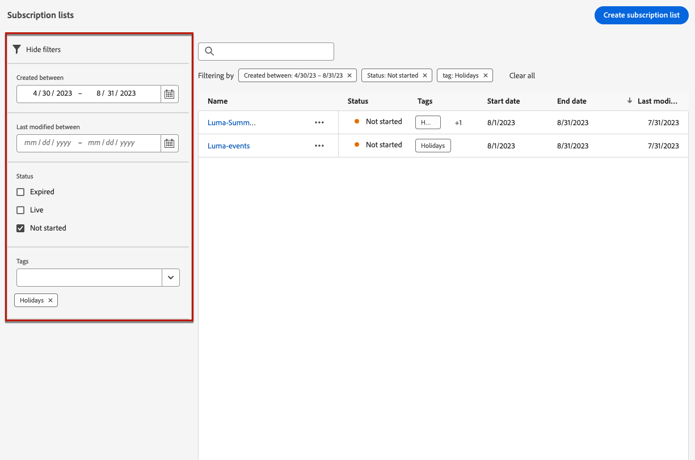

# 订阅列表 {#create-subscription-list}

## 什么是订阅列表？ {#subscription-list-definition}

>[!CONTEXTUALHELP]
>id="ajo_subscription_list"
>title="设置订阅列表"
>abstract="创建订阅列表，用于收集已选择接收特定主题或事件通信的配置文件。 "
>additional-url="https://experienceleague.adobe.com/docs/journey-optimizer/using/landing-pages/subscription-list.html?lang=zh-Hans#define-subscription-list" text="创建订阅列表"

订阅服务是指向选择接收有关特定主题/事件/兴趣/等的通信的客户提供的营销商品和服务。 持续进行。 在 [!DNL Journey Optimizer]，则这些选择加入的客户会收集到订阅列表中。

订阅服务可以是：

* 新闻稿，例如：“Running series”
* 例如，活动：“Summit 2021”
* 网络研讨会，例如：“了解有关加密编译的更多信息”
* 对特定产品/运动/服务/等的兴趣，例如：“有兴趣在未来12个月内购买房屋”
* 关于通知方式的首选项，例如：“通过电子邮件接收新歌曲通知”

用户档案可以通过添加到订阅列表 [登陆页面](create-lp.md). 有关示例，请参见 [本节](lp-use-cases.md#subscription-to-a-service).

## 创建订阅列表 {#define-subscription-list}

要创建订阅列表，请执行以下步骤。

1. 要访问订阅列表，请选择 **[!UICONTROL 客户]** > **[!UICONTROL 订阅列表]**.

   

1. 选择 **[!UICONTROL 创建订阅列表]** 按钮。

   

1. 添加标题和描述。 这些字段为必填字段。

   

   >[!CAUTION]
   >
   >当前不能使用空格或输入中其他订阅列表已存在的名称 **[!UICONTROL 标题]** 字段。

1. 您可以定义开始日期和结束日期。

   

1. 从中选择或创建Adobe Experience Platform标记 **[!UICONTROL 标记]** 用于对登陆页面进行分类以改进搜索的字段。 [了解详情](../start/search-filter-categorize.md#tags)

1. 单击&#x200B;**[!UICONTROL 保存]**。

该列表显示了创建的所有订阅列表。 您可以根据创建日期或修改日期及其状态筛选它们。

可能的状态如下：

* **[!UICONTROL 未开始]**：您定义的开始日期晚于当前日期。 订阅的用户档案将尚未收到与此订阅列表相关的通信。
* **[!UICONTROL 实时]**：当天介于订阅列表开始日期和结束日期之间，或者您未定义结束/开始日期，这意味着订阅列表始终有效。
* **[!UICONTROL 已过期]**：结束日期已过，因此订阅列表不再有效。 任何订阅的配置文件都不会再收到与此订阅列表相关的任何通信。

创建订阅列表后，您可以在登陆页面中使用该列表。 选择通过登陆页面表单加入的用户档案将添加到列表中。 [了解详情](design-lp.md)

在以下情况下，您还可以使用订阅列表作为受众 [构建历程](../building-journeys/journey-gs.md#jo-build) 和添加个性化。

>[!NOTE]
>
>您可以通过特定报告监控订阅列表的影响。 [了解详情](../reports/subscription-report-live.md)
