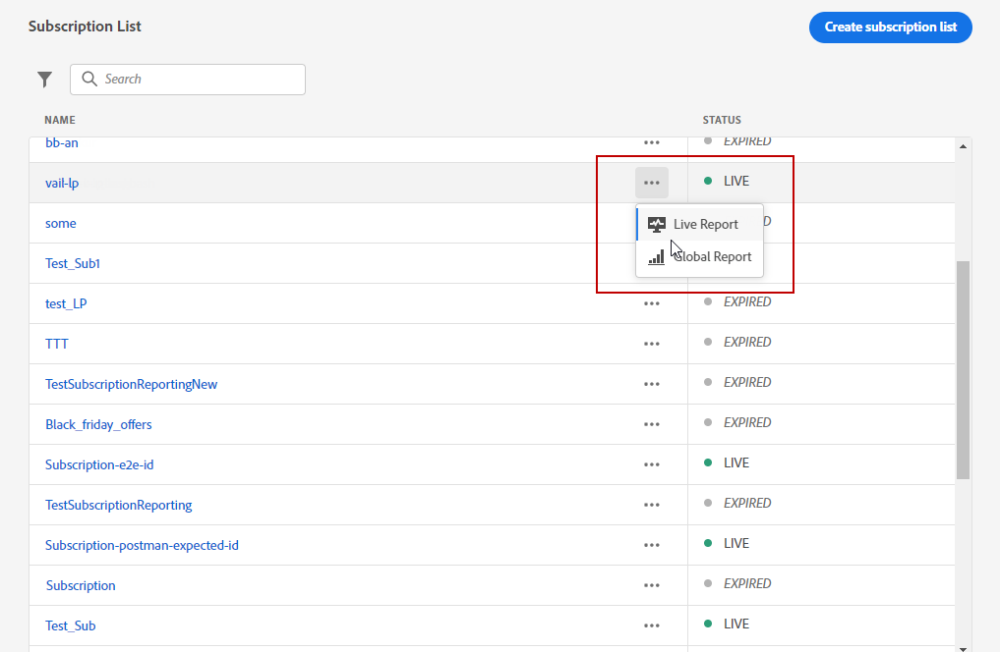
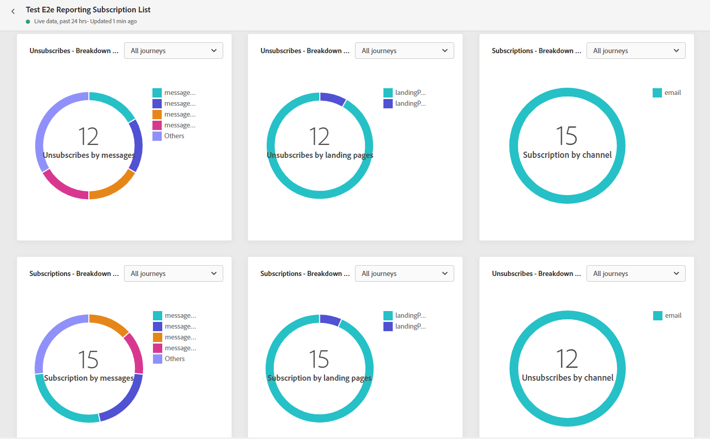

# 订阅报告 {#subscription-report}

订阅报表显示有关订阅者活动的详细信息。 有两种报表类型可用：

* 的 **[!UICONTROL Live report]** 以仅测量和显示过去24小时内投放的订阅和退订情况。

* 的 **[!UICONTROL Global report]** 可测量和显示选定时间段内投放的订阅和退订情况。

要访问您的报表，请选择 **实时** 或 **[!UICONTROL Global report]** 的下一页。

## 订阅实时报告 {#subscription-live}

的 **[!UICONTROL Subscription performance]** KPI和 **[!UICONTROL Subscriptions by journey]**/**[!UICONTROL Unsubscribes by journey]** 表格详细介绍了与访客对您登陆页面的参与度相关的主要信息。 表和KPI包含与登陆页面相关的可用数据，例如：

* **[!UICONTROL Subscribes]**:过去24小时内的订阅总数。

* **[!UICONTROL Unsubscribes]**:过去24小时内取消订阅的总数。

的 **[!UICONTROL Subscription performance]** 图表显示了过去24小时内订阅的演变。

的 **订阅 — 划分** 和 **取消订阅 — 划分** 图表表示过去24小时内订阅或取消订阅的总人数，具体取决于消息、登陆页面和渠道。

## 订阅全局报告 {#subscription-global}

的 **[!UICONTROL Subscription performance]** KPI和 **[!UICONTROL Subscriptions by journey]**/**[!UICONTROL Unsubscribes by journey]** 表格详细列出了与访客对登陆页面的参与度相关的主要信息。 表和KPI包含与登陆页面相关的可用数据，例如：

* **[!UICONTROL Subscribes]**:有关期间的订购总数。

* **[!UICONTROL Unsubscribes]**:有关期间的退订总数。

的 **[!UICONTROL Subscription performance]** 图表显示了相关期间订阅的演变。

的 **订阅 — 划分** 和 **取消订阅 — 划分** 根据消息、登陆页面和渠道，表示在选定时间段内订阅或取消订阅的总人数。
