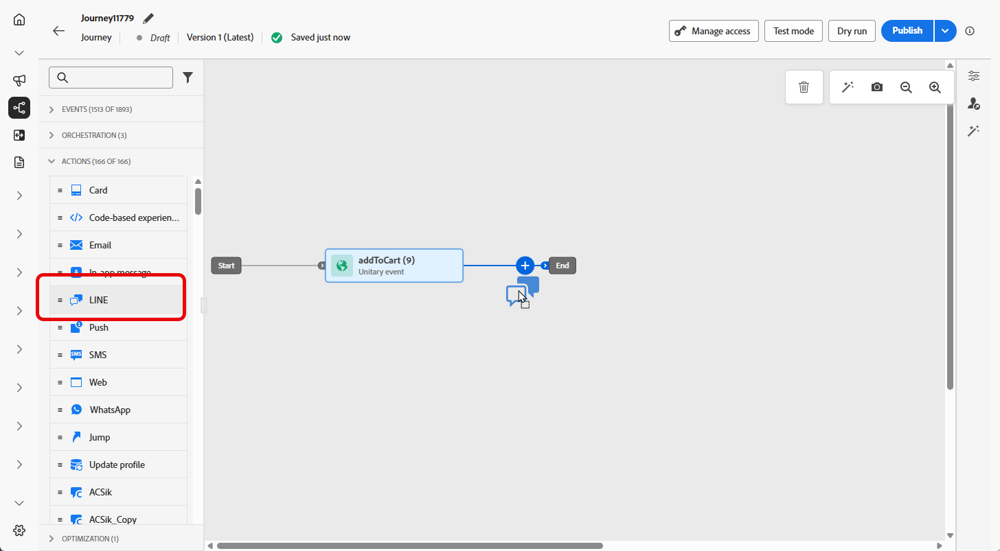

# 创建LINE消息 {#create-line}

## 添加LINE消息 {#create-line-journey-campaign}

浏览以下选项卡，了解如何在营销活动或历程中添加LINE消息。

>[!BEGINTABS]

>[!TAB 向历程添加LINE消息]

1. 打开您的历程，然后从调色板的&#x200B;**操作**&#x200B;部分拖放&#x200B;**LINE**&#x200B;活动。

   

1. 提供有关消息的基本信息（标签、说明、类别），然后选择要使用的消息配置。

   有关如何配置历程的详细信息，请参阅[此页面](../building-journeys/journey-gs.md)

   默认情况下，**[!UICONTROL 配置]**&#x200B;字段已预填充用户用于该渠道的最后一个配置。

您现在可以从&#x200B;**[!UICONTROL 编辑内容]**&#x200B;按钮开始设计短信消息的内容，如下所述。

>[!TAB 向营销活动添加LINE消息]

1. 访问&#x200B;**[!UICONTROL 营销活动]**&#x200B;菜单，然后单击&#x200B;**[!UICONTROL 创建营销活动]**。

1. 选择要执行的营销活动类型

   * **已计划 — 营销**：立即或在指定日期执行营销活动。 计划的营销活动旨在发送营销消息。 它们从用户界面配置和执行。

   * **API触发 — 营销/事务性**：使用API调用执行营销活动。 API触发的营销活动旨在发送营销或事务型消息，即，在个人执行操作（密码重置、购物车购买等）之后发送的消息。

1. 从&#x200B;**[!UICONTROL 属性]**&#x200B;部分，编辑营销活动的&#x200B;**[!UICONTROL 标题]**&#x200B;和&#x200B;**[!UICONTROL 描述]**。

1. 单击&#x200B;**[!UICONTROL 选择受众]**&#x200B;按钮，从可用Adobe Experience Platform受众列表中定义要定位的受众。 [了解详情](../audience/about-audiences.md)。

1. 在&#x200B;**[!UICONTROL 身份命名空间]**&#x200B;字段中，选择要使用的命名空间，以便识别所选受众中的个人。 [了解详情](../event/about-creating.md#select-the-namespace)。

1. 在&#x200B;**[!UICONTROL 操作]**&#x200B;部分中，选择&#x200B;**[!UICONTROL 行]**，然后选择或创建新配置。

   在[此页面](line-configuration.md)中了解有关LINE配置的更多信息。

   

1. 单击&#x200B;**[!UICONTROL 创建试验]**&#x200B;开始配置内容试验并创建处理以测量其性能并为目标受众确定最佳选项。 [了解详情](../content-management/content-experiment.md)

1. 在&#x200B;**[!UICONTROL 操作跟踪]**&#x200B;部分中，指定是否要跟踪短信消息中的链接点击次数。

1. 营销活动旨在按特定日期或循环频率执行。 在[本节](../campaigns/create-campaign.md#schedule)中了解如何配置促销活动的&#x200B;**[!UICONTROL 计划]**。

1. 从&#x200B;**[!UICONTROL 操作触发器]**&#x200B;菜单中，选择短信消息的&#x200B;**[!UICONTROL 频率]**：

   * 一次
   * 每日
   * 每周
   * 月

您现在可以从&#x200B;**[!UICONTROL 编辑内容]**&#x200B;按钮开始设计文本消息的内容，如下所述。

>[!ENDTABS]

## 定义LINE内容{#line-content}

要配置LINE内容，请执行以下步骤。

1. 在历程或营销策划配置屏幕中，单击&#x200B;**[!UICONTROL 编辑内容]**&#x200B;按钮以配置文本消息内容。

1. 单击&#x200B;**[!UICONTROL 编辑代码]**&#x200B;以编辑JSON内容。

1. 使用个性化编辑器定义内容、添加个性化和动态内容。 您可以使用任何属性，例如配置文件名称或城市。 您还可以定义条件规则。 浏览到以下页面，了解有关个性化编辑器中的[个性化](../personalization/personalize.md)和[动态内容](../personalization/get-started-dynamic-content.md)的更多信息。

1. 单击&#x200B;**[!UICONTROL 保存]**&#x200B;并在预览中检查您的消息。

1. 使用&#x200B;**[!UICONTROL 模拟内容]**&#x200B;按钮预览LINE消息内容和个性化内容。

执行测试并验证内容后，您可以向受众发送LINE消息。 这些步骤在[此页面](send-line.md)中详述

发送后，您可以在促销活动或历程报表中测量LINE的影响。 有关报告的更多信息，请参考[此章节](../reports/campaign-global-report-cja.md)。
