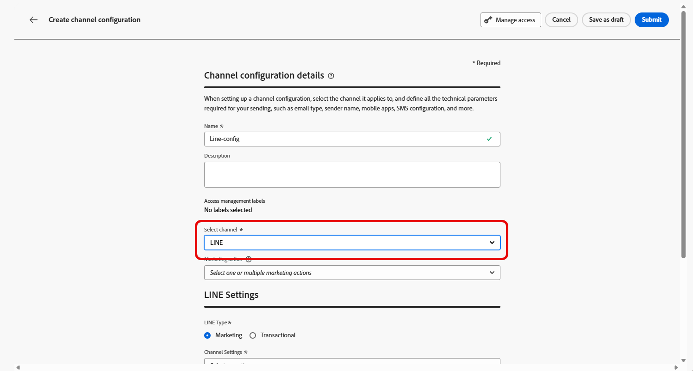

# 在 Journey Optimizer 中配置 LINE 渠道 {#line-configuration}

1. 访问&#x200B;**[!UICONTROL 渠道]** > **[!UICONTROL 常规设置]** > **[!UICONTROL 渠道配置]**&#x200B;菜单，然后单击&#x200B;**[!UICONTROL 创建渠道配置]**。

   

1. 输入配置的名称和说明（可选），然后选择要配置的渠道。

   >[!NOTE]
   >
   > 名称必须以字母(A-Z)开头。 它只能包含字母数字字符。 您还可以使用下划线 `_`、点 `.` 和连字符 `-` 符号。

1. 要为配置分配自定义或核心数据使用标签，您可以选择&#x200B;**[!UICONTROL 管理访问权限]**。 [了解有关对象级访问控制(OLAC)的更多信息](../administration/object-based-access.md)。

1. 选择&#x200B;**LINE**&#x200B;频道。

   

1. 选择&#x200B;**[!UICONTROL 营销操作]**&#x200B;以使用此配置将同意策略关联到消息。 所有与营销活动相关的同意政策均可利用，以尊重客户的偏好。 [了解详情](../action/consent.md#surface-marketing-actions)

1. 选择配置的消息类型：

   * **营销**：促销消息，如零售商店的每周促销活动。 这些消息需要用户同意，并应遵守LINE有关用户选择加入的策略。
   * **事务性**：对于非商业消息，如订单确认、密码重置通知或投放更新。 这些消息甚至可以发送给已取消订阅营销通信但严格限于特定事务上下文的用户。

1. 选择您的&#x200B;**[!UICONTROL 渠道设置]**。

   请联系您的Adobe代表以设置您的&#x200B;**[!UICONTROL 渠道设置]**。

   

1. 选择要映射的&#x200B;**[!UICONTROL LINE用户ID]**。 这是用于将消息链接到LINE渠道中各个用户的标识符。

1. 键入您的&#x200B;**[!UICONTROL 发件人姓名]**，如您的品牌名称。

1. 提交更改。

现在，您可以在创建LINE消息时选择配置。

## 配置LINE渠道设置API {#line-api}

此API设置渠道设置，这些设置存储连接到LINE消息传递API所需的授权和配置详细信息。 这些设置允许Adobe Journey Optimizer使用提供的凭据通过LINE进行身份验证和发送消息。

**终结点**

```
POST https://platform.adobe.io/journey/imp/config/channel-settings
```

| 标头名称 | 描述 |
|-|-|
| Authorization | 技术帐户中的用户令牌 |
| x-api-key | Adobe Developer Console中的客户端ID |
| x-gw-ims-org-id | 您的IMS组织ID |
| x-sandbox-name | 沙盒名称，例如prod |
| Content-Type | 必须为application/json |


**请求正文**

```json
{
    "name": "your_defined_name",
    "channelRegistryId": "line",
    "channel": "line",
    "channelSettings": {
        "channelId": "your_line_channel_id",
        "channelSecret": "your_line_channel_secret"
    }
}
```

**渠道设置响应**

```json
{
"id": "3603ed66-ae86-42b8-8a90-d4b4e54e7c3b",
"name": "your_defined_name",
"channelRegistryId": "line",
"channel": "line",
"channelSettings": {
    "channelId": "your_line_channel_id",
    "channelSecret": "your_line_channel_secret"
    },
    "channelPublicationId": "v1_line",
    "createdAt": "2025-07-30T12:00:00.000Z",
    "modifiedAt": "2025-07-30T12:00:00.000Z",
    "isFromLatestVersion": true,
    "_etag": "\"eab98d24-18af-48ae-90f9-e59d4f8cfb2b\""
}
```
