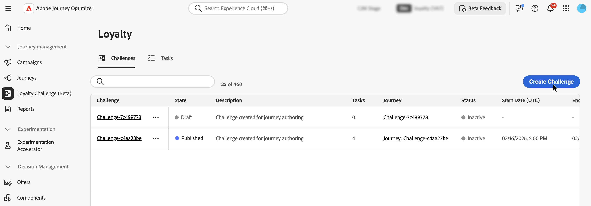
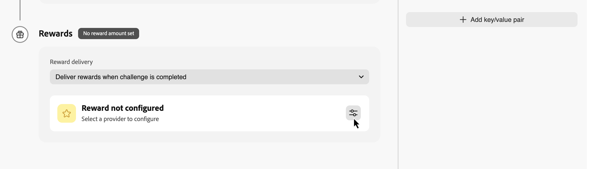

# 创建挑战 {#create-challenges}

>[!BEGINSHADEBOX]

**目录**

[忠诚度挑战入门](get-started.md)

<table style="table-layout:fixed">
<tr style="border: 0;">
<td style="vertical-align:top;">

**创建和管理挑战**

* [访问和管理挑战和任务](access-loyalty-challenges.md)
* **创建挑战** ◀︎**您在这里**
* [创建任务](create-tasks.md)
* [监测忠诚度挑战表现](loyalty-reporting.md)

</td>
<td style="vertical-align:top;">

**配置并集成**

* [配置忠诚度挑战](loyalty-admin.md)
* [奖励定义指南](reward-definition-guide.md)
* [Event Transformer 指南](event-transformer-guide.md)
* [忠诚度数据和数据集](loyalty-data-and-datasets.md)
* [忠诚度挑战API参考](https://developer.adobe.com/journey-optimizer-apis/references/loyalty-challenges){target="_blank"}

</td>
</tr>
</table>

>[!ENDSHADEBOX]

>[!AVAILABILITY]
>
>此功能当前处于&#x200B;**私人测试版**&#x200B;中。 有关发行周期和可用性阶段的完整详细信息，请参阅 [Journey Optimizer 发行周期](../rn/releases.md)。

本页介绍了创建忠诚度挑战的完整过程，从选择挑战类型并配置设置、结构、内容和消息，到生成和发布为客户提供挑战的历程。

创建质询涉及以下步骤：

1. **[创建挑战](#create-the-challenge)** — 选择挑战类型并打开挑战编辑器。
1. **[配置设置](#settings)** — 定义挑战名称、受众、计划、选择加入规则和重复限制。
1. **[配置结构](#structure)** — 添加任务和奖励（不适用于自带数据挑战）。
1. **[配置内容](#configure-content-cards)** *（可选）* — 定义如何使用内容卡或基于代码的体验向成员显示挑战。
1. **[配置消息](#configure-messaging)** *（可选）* — 为启动阶段、进行中阶段和结束阶段设置渠道消息。
1. **[发布挑战](#launch)** — 使挑战可用于历程生成。
1. **[生成并发布历程](#launch)** — 触发自动生成的历程，该历程将向客户提出挑战。

## 创建挑战 {#create-the-challenge}

1. 在Journey Optimizer中导航到&#x200B;**[!UICONTROL 忠诚度挑战(Beta)]**。

1. 选择&#x200B;**[!UICONTROL 挑战]**&#x200B;选项卡，然后选择&#x200B;**[!UICONTROL 创建挑战]**。

   

1. 选择挑战类型：

   * **[!UICONTROL Standard]**：客户以任意顺序完成任意指定数量的任务\
     *示例：完成5个可用任务中的3个*

   * **[!UICONTROL 条纹]**：客户连续多次完成同一任务\
     *示例：连续7天购买*

   * **[!UICONTROL 顺序]**：客户按定义的顺序完成任务\
     *示例： Purchase → Review → Share（必须按此顺序完成）*

   * **[!UICONTROL 自带数据]**：如果您希望从忠诚度挑战数据集成中收集挑战框架（如任务和奖励），请选择&#x200B;**[!UICONTROL 自带数据]**。 选择此类型时，**[!UICONTROL 结构]**&#x200B;选项卡为只读。 以与其他质询类型相同的方式配置&#x200B;**[!UICONTROL 设置]**、**[!UICONTROL 内容]**&#x200B;和&#x200B;**[!UICONTROL 消息]**。

     >[!AVAILABILITY]
     >
     >**[!UICONTROL 自带数据]**&#x200B;挑战类型当前可供受限组织使用，并将在未来版本中更广泛地提供。

   选择挑战类型后，挑战编辑器将打开以下选项卡： **[!UICONTROL 设置]**、**[!UICONTROL 结构]**、**[!UICONTROL 内容]**&#x200B;和&#x200B;**[!UICONTROL 消息]**。 从&#x200B;**[!UICONTROL 设置]**&#x200B;开始，以定义挑战详细信息、受众、计划和规则。 然后，为除&#x200B;**[!UICONTROL 自带数据]**&#x200B;之外的所有类型配置&#x200B;**[!UICONTROL 结构]**（任务和奖励）。

## 配置质询设置 {#settings}

在&#x200B;**[!UICONTROL 设置]**&#x200B;选项卡中，配置质询级别的属性：谁可以参与、质询运行时、成员如何选择加入和获得进度，以及可选元数据。

### 挑战详细信息 {#challenge-details}

>[!CONTEXTUALHELP]
>id="ajo_loyalty_challenge_properties"
>title="挑战详细信息"
>abstract="设置挑战名称和描述。 挑战 ID 会在创建挑战时自动生成，并可复制用于 API 或集成场景。"

1. 在&#x200B;**[!UICONTROL 质询详细信息]**&#x200B;部分中，定义以下内容：

   * **[!UICONTROL 名称]**：为您的质询输入描述性名称。 此名称显示在挑战清单中。
   * **[!UICONTROL 质询ID]**：创建质询时分配的唯一标识符。 使用复制控件在API或外部系统中引用此ID。
   * **[!UICONTROL 描述]**：输入描述来说明挑战的目的和目标。

   

### 受众 {#audience}

>[!CONTEXTUALHELP]
>id="ajo_loyalty_challenge_audience"
>title="受众"
>abstract="选择可参与挑战的对象。 添加 Adobe Experience Platform 受众，或将受众留空，以便所有忠诚度计划成员均可参与。 可选择要求先完成其他挑战作为前置条件。"

定义谁可以参与您的忠诚度挑战。

1. 在&#x200B;**[!UICONTROL 受众]**&#x200B;部分中，选择&#x200B;**[!UICONTROL 添加受众]**&#x200B;以将挑战限制于特定的Adobe Experience Platform受众。 [了解如何使用受众](../audience/about-audiences.md)。

   

1. 在&#x200B;**[!UICONTROL 质询先决条件]**&#x200B;下，选择&#x200B;**[!UICONTROL 要求完成质询]**&#x200B;以将资格限制为已完成一个或多个选定质询的成员。

### 计划 {#schedule}

>[!CONTEXTUALHELP]
>id="ajo_loyalty_challenge_schedule"
>title="挑战计划"
>abstract="通过设置开始日期和时间、结束日期和时间以及时区来定义挑战的有效期。 在任务完成时间窗口中，选择客户在挑战期间可以完成任务的时间范围。"

配置质询运行时间：

1. 在&#x200B;**[!UICONTROL 计划]**&#x200B;部分中，设置：

   * **[!UICONTROL 开始日期和时间]**：客户可以使用质询的时间。
   * **[!UICONTROL 结束日期和时间]**：质询过期且不再接受新完成的时间。
   * **[!UICONTROL 时区]**：用于质询计划的时区。

   

1. 在&#x200B;**[!UICONTROL 任务完成窗口]**&#x200B;下，选择客户何时可以完成任务：

   * **[!UICONTROL 在挑战赛期间的任何时间]**：客户可以在挑战赛开始日期和结束日期之间的任何时间完成任务。
   * **[!UICONTROL 在一天中的特定小时内]**：通过设置&#x200B;**[!UICONTROL 开始时间]**&#x200B;和&#x200B;**[!UICONTROL 结束时间]**，将任务完成限制为特定的每日小时数。

### 规则 {#rules}

配置成员如何选择加入、任务进度何时计入挑战以及完成挑战的次数。

* **[!UICONTROL 选择加入触发器]**：

  * **[!UICONTROL 选择加入方法]**：选择客户是手动加入挑战还是通过事件触发器加入挑战。
  * **[!UICONTROL 事件]**：对于基于事件的选择加入，请选择触发选择加入的事件。 管理员可以单击按钮创建事件定义。 [了解如何配置事件定义](loyalty-admin.md#event-definitions)

* **[!UICONTROL 开始跟踪进度]**：

  * **[!UICONTROL 任务进度跟踪开始]**：选择任务完成何时计入挑战进度。 例如，选择&#x200B;**[!UICONTROL 当质询开始时（在选择加入后）]**，则进度将在成员选择加入且质询处于活动状态后开始。

    当成员看到挑战时，您可以将其与跟踪进度时分离。 例如，可能会显示挑战信息卡，并在任务完成前接受选择加入，以备稍后开始计入进度。

  * **[!UICONTROL 开始]**：当您选择自定义开始选项时，请设置进度跟踪开始的日期和时间。

* **[!UICONTROL 重复限制]**：

  * **[!UICONTROL 可以完成质询]**：选择质询可以完成一次还是多次。 例如，**[!UICONTROL 一次]**&#x200B;或定义的完成数。

  * **[!UICONTROL 可以完成的次数]**：启用重复后，指定成员可以完成质询的次数。

* **[!UICONTROL 完成要求]** *（仅限标准挑战）*：

  * **[!UICONTROL 在一个事务中完成]**：启用时，客户必须在一个事务中完成所有任务。 禁用后，可以跨单独的事务完成任务。

### 自定义元数据 {#custom-metadata}

在&#x200B;**[!UICONTROL 自定义元数据]**&#x200B;部分中，选择&#x200B;**[!UICONTROL 添加键/值对]**&#x200B;以添加自定义元数据。 使用元数据跟踪或与外部系统集成。

## 配置挑战结构 {#structure}

在&#x200B;**[!UICONTROL 结构]**&#x200B;选项卡中，定义客户必须完成的任务以及他们获得的奖励。 此选项卡不用于&#x200B;**[!UICONTROL 自带数据]**&#x200B;挑战。

### 添加任务 {#add-tasks}

>[!CONTEXTUALHELP]
>id="ajo_loyalty_challenge_tasks"
>title="任务"
>abstract="选择要执行的任务，以完成挑战。 接下来，配置如何完成挑战——有哪些可用的选项取决于您的挑战类型（标准、连胜或按序）。"

任务定义客户要获得奖励必须完成的特定操作。 您可以配置任务类型（购买、支出或自定义事件）、数量、产品筛选器和其他属性。

要向挑战添加任务，请执行以下步骤：

1. 在&#x200B;**[!UICONTROL 任务]**&#x200B;部分中，选择&#x200B;**[!UICONTROL 添加任务]**。

   

1. **[!UICONTROL 任务清单]**&#x200B;打开。 从列表中选择一个或多个任务，然后选择&#x200B;**[!UICONTROL 添加]**。 要创建新任务，请选择&#x200B;**[!UICONTROL 新建]**。 [了解如何创建和配置任务](create-tasks.md)。

1. 指定何时将质询视为已完成。 可用的设置取决于质询类型：

   +++标准挑战

   在&#x200B;**[!UICONTROL 任务完成要求]**&#x200B;下拉列表中，选择：

   * **[!UICONTROL 客户选择完成1项任务]** - *客户可以选择并完成任何一项任务以获得奖励*
   * **[!UICONTROL 客户完成特定数量的任务]** - *客户必须完成定义数量的任务。 指定要完成的所需任务数。*

   +++

   +++Streak挑战

   在&#x200B;**[!UICONTROL Streak type]**&#x200B;下拉列表中，选择：

   * **连续**：客户必须在连续几天不间断地完成任务。 *示例：在星期一、星期二、星期三购买 — 错过一天就打破了条条纹。*

   * **非连续**：客户可以在完成之间有间隔的情况下完成任务。 *示例：在30天内完成7次购买，允许中断。*

   在&#x200B;**[!UICONTROL 条纹长度]**&#x200B;字段中，指定任务必须完成的次数。 *示例：将“7天购买连锁”设置为7。*

   +++

   +++顺序挑战

   在&#x200B;**[!UICONTROL 任务完成要求]**&#x200B;下拉列表中，选择：

   * **[!UICONTROL 客户选择完成1项任务]** - *客户可以选择并完成任何一项任务以获得奖励*
   * **[!UICONTROL 客户完成特定数量的任务]** - *客户必须按照您定义的确切顺序完成定义的数量任务。 缺少任务或跳过任务会中断序列。 指定要完成的所需任务数*

   +++

将任务添加到挑战后，配置客户完成这些任务将获得的奖励。

### 配置奖励 {#rewards}

>[!CONTEXTUALHELP]
>id="ajo_loyalty_challenge_rewards"
>title="奖励"
>abstract="选择客户何时获得点数：当他们完成整个挑战后，或者当他们前进到各个任务里程碑时。 选择您的奖励提供者（管理积分和奖励的忠诚度方案），然后设置金额：全部完成以后的一个总金额，或者到达各里程碑的每个任务的金额，仅对您想要支付奖励的任务启用奖励功能。"

奖励是客户在完成挑战后获得的忠诚度积分或福利。

要配置何时以及如何提供奖励，请执行以下操作：

1. 在&#x200B;**[!UICONTROL 奖励投放]**&#x200B;下拉菜单中，选择何时投放奖励：

   * **[!UICONTROL 在挑战完成时提供奖励]**：在客户完成整个挑战时提供奖励\
     *示例：完成所有5项任务后奖励100分*

   * **[!UICONTROL 在任务完成里程碑完成时提供奖励，因为挑战已取得进展]**：奖励在客户完成单个任务时递增（仅适用于需要多个任务的挑战）\
     *示例：任务1后奖励10分，任务2后奖励20分，任务3后奖励50分*

1. 选择您的奖励提供者。 这是您的忠诚度解决方案，用于管理客户点数和奖励。 在您提出挑战之前，会在&#x200B;**[!UICONTROL 忠诚度管理员]**&#x200B;菜单中创建奖励提供商。 [了解如何配置奖励提供商](loyalty-admin.md#reward-providers)

   

1. 根据您选择的投放方式配置奖励金额：

   +++完成质询后提供奖励

   指定客户完成整个质询时要给予的总奖励金额。

   *在以下示例中，完成挑战后，客户将获得100分。*

   

   +++

   +++在任务完成里程碑时交付奖励

   指定任务完成里程碑的奖励金额。 此选项允许您创建渐进式奖励，当客户完成挑战时提高他们的积极性。

   对于您想要提供奖励的任何任务，切换奖励选项，并指定客户完成该特定任务时要奖励的点数。 您可以选择仅奖励某些任务完成 — 例如，如果您有10个任务，则可能仅奖励任务1、5和10。

   *在以下示例中，完成第一个任务时客户会获得10分，完成第二个任务后会再获得50分。*

   

   +++

在配置包含任务和奖励的挑战结构后，您可以选择配置如何向客户呈现挑战。 如果您不需要质询内容，请跳过此步骤，直接转到[配置消息传送](#configure-messaging)。

## 配置挑战内容（可选） {#configure-content-cards}

>[!CONTEXTUALHELP]
>id="ajo_loyalty_challenge_content"
>title="内容"
>abstract="配置您的挑战在那些忠诚度成员访问挑战并跟踪自己进度的地方如何呈现。 使用“添加”操作选择“内容”卡片以显示卡片式体验，或者是基于代码的体验，以通过您自己自定义的实施方式传递内容。"

**[!UICONTROL Content]**&#x200B;选项卡控制如何在忠诚度会员访问挑战并跟踪其进度的位置呈现挑战。

要配置挑战内容，请执行以下操作：

1. 导航到&#x200B;**[!UICONTROL 内容]**&#x200B;选项卡，然后单击&#x200B;**[!UICONTROL 添加操作]**。

1. 选择操作类型：

   * **[!UICONTROL 内容卡]**：在客户设备上将挑战显示为卡片式体验。 选择&#x200B;**[!UICONTROL 渠道配置]**&#x200B;并单击&#x200B;**[!UICONTROL 编辑内容]**&#x200B;以设计和个性化卡片。 [了解有关内容卡的更多信息](../content-card/create-content-card.md)。
   * **[!UICONTROL 基于代码的体验]**：使用Journey Optimizer基于代码的渠道，通过您自己的自定义实施提供挑战内容。 选择&#x200B;**[!UICONTROL 渠道配置]**&#x200B;并单击&#x200B;**[!UICONTROL 编辑内容]**&#x200B;以定义内容。 [了解有关基于代码的体验的更多信息](../code-based/create-code-based.md)。

   

   您可以添加多个操作来跨不同表面表示挑战。

配置内容后，设置消息传送功能，以便在挑战生命周期中吸引客户。

### 配置消息 {#configure-messaging}

>[!CONTEXTUALHELP]
>id="ajo_loyalty_challenge_messaging"
>title="消息"
>abstract="消息有助于增强在整个挑战生命周期中的参与度。 在消息传递选项卡上，为每个阶段添加消息：启动（宣布挑战并邀请参与者加入）、进行中（让参与者参与并完成任务）和结束（庆祝完成并通知参与者其奖励）。 对于每个阶段，单击添加消息按钮，选择渠道，选择渠道配置，然后选择编辑以设计消息内容。"

设置多渠道消息，在挑战生命周期的关键阶段吸引客户。 消息传送是可选的，但建议设置此消息以最大限度地提高客户参与度。

导航到&#x200B;**[!UICONTROL 消息]**&#x200B;选项卡，并为每个生命周期阶段配置消息：

* **[!UICONTROL 启动]**：宣布挑战并邀请参与者加入。
* **[!UICONTROL 进行中]**：让参与者保持参与状态并完成任务。
* **[!UICONTROL 结束]**：庆祝完成并通知参与者其奖励。

对于每个阶段，单击添加消息按钮（**[!UICONTROL 添加启动消息]**、**[!UICONTROL 添加正在进行中的消息]**&#x200B;或&#x200B;**[!UICONTROL 添加已结束的质询消息]**）并选择频道。

选择关联的&#x200B;**[!UICONTROL 渠道配置]**&#x200B;并单击&#x200B;**[!UICONTROL 编辑]**&#x200B;来设计您的消息内容。

| 渠道 | 描述 |
|---|---|
| **[!UICONTROL 应用程序内]** | 在移动设备或Web应用程序中显示消息。 [关于应用程序内消息](../in-app/get-started-in-app.md) · [设计应用程序内消息](../in-app/design-in-app.md) |
| **[!UICONTROL 电子邮件]** | 发送电子邮件通知。 [关于电子邮件](../email/get-started-email.md) · [设计电子邮件内容](../email/get-started-email-design.md) |
| **[!UICONTROL 推送通知]** | 向移动设备发送推送通知。 [关于推送通知](../push/get-started-push.md) · [设计推送通知](../push/design-push.md) |
| **[!UICONTROL 内容卡]** | 在应用程序或Web界面中投放永久性卡片式消息。 [关于内容卡](../content-card/get-started-content-card.md) · [设计内容卡](../content-card/design-content-card.md) |
| **[!UICONTROL 基于代码的体验]** | 使用AJO基于代码的渠道，通过自定义实施交付内容。 [关于基于代码的体验](../code-based/get-started-code-based.md) · [创建基于代码的体验](../code-based/create-code-based.md) |
| **[!UICONTROL 自定义操作]** | 触发外部系统或自定义端点。 [关于自定义操作](../action/about-custom-action-configuration.md) |

您的挑战现已完全配置其设置、结构、内容和消息。 要启动它，您必须发布挑战及其关联的历程。

## 发起挑战 {#launch}

您可以通过两种方式启动挑战：

* **[!UICONTROL 发布质询]**（在&#x200B;**[!UICONTROL ...]**&#x200B;菜单中提供） — 使用此选项发布质询而不生成历程。 这允许您在交付之前测试、预览和模拟挑战体验。 在您生成和发布历程之前，客户不会收到挑战。

* **[!UICONTROL 生成历程]** — 使用此选项可自动发布挑战并创建将编排您的挑战交付给客户的历程。

### 发布挑战 {#publish-challenge}

1. 查看您的挑战配置以确保已完成所有必填字段。

1. 单击“**[!UICONTROL 生成历程]**”按钮旁边的图标，然后选择&#x200B;**[!UICONTROL 发布]**。

   

   您将被重定向到挑战清单。 质询现在显示为&#x200B;**[!UICONTROL 已发布]**&#x200B;状态。

   当您准备好向客户提供挑战时，可以生成关联的历程。 有关详细信息，请参阅[生成历程](#generate-journey)。

### 生成历程 {#generate-journey}

1. 查看您的挑战配置以确保已完成所有必填字段。

1. 选择&#x200B;**[!UICONTROL 生成历程]**&#x200B;以自动发布质询并创建将编排质询交付的历程。

   

   将显示确认消息。 单击&#x200B;**[!UICONTROL 打开历程]**&#x200B;直接导航到生成的历程，或单击&#x200B;**[!UICONTROL 确认]**&#x200B;关闭它并稍后访问历程。

   >[!IMPORTANT]
   >
   >必须在忠诚度挑战编辑器中对此挑战进行任何更改，并需要您生成新的历程。 如果您更改挑战，则直接在现有挑战历程中完成的任何工作都将丢失。

1. 打开生成的历程并进行发布。 历程以&#x200B;**草稿**&#x200B;状态显示，其名称格式为&#x200B;*&quot;历程：[挑战名称]&quot;*，可从以下位置访问：

   * 上一步的确认消息 — 单击&#x200B;**[!UICONTROL 打开历程]**。
   * **挑战清单** — 使用挑战旁边的&#x200B;**[!UICONTROL 历程]**&#x200B;列链接。
   * **历程清单** — 按名称查找历程。

   发布后，历程将在您指定的挑战开始日期自动开始。 [了解如何发布历程](../building-journeys/publish-journey.md)。

   

1. 一旦您的挑战开始，请在[忠诚度挑战报告](loyalty-reporting.md)中监控计划KPI、挑战结果和任务级量度。 您还可以在[历程报告](../reports/journey-global-report-cja.md)中监视消息投放。
