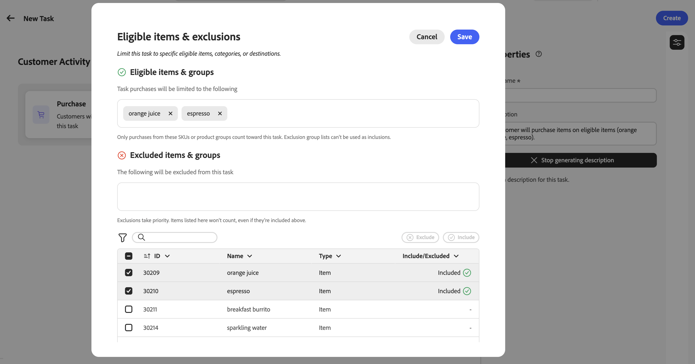

# 创建任务 {#create-tasks}

>[!BEGINSHADEBOX]

**目录**

[忠诚度挑战入门](get-started.md)

<table style="table-layout:fixed">
<tr style="border: 0;">
<td style="vertical-align:top;">

**创建和管理挑战**

* [访问和管理挑战和任务](access-loyalty-challenges.md)
* [创建挑战](create-challenges.md)
* **创建任务** ◀}︎**您在这里**
* [监测忠诚度挑战表现](loyalty-reporting.md)

</td>
<td style="vertical-align:top;">

**配置并集成**

* [配置忠诚度挑战](loyalty-admin.md)
* [忠诚度数据和数据集](loyalty-data-and-datasets.md)
* [忠诚度挑战API参考](https://developer.adobe.com/journey-optimizer-apis/references/loyalty-challenges){target="_blank"}

</td>
</tr>
</table>

>[!ENDSHADEBOX]

>[!AVAILABILITY]
>
>此功能当前处于&#x200B;**私人测试版**&#x200B;中。 有关发行周期和可用性阶段的完整详细信息，请参阅 [Journey Optimizer 发行周期](../rn/releases.md)。

任务定义客户在忠诚度挑战中必须完成的特定操作或里程碑以获取奖励。 您可以配置购买和支出任务，或配置用于跟踪贵组织已捕获的Adobe Experience Platform体验事件的&#x200B;**[!UICONTROL 自定义事件]**&#x200B;任务。

每项任务都是可衡量的操作，有助于完成挑战。 任务是可重复使用的组件，可以独立创建，然后添加到一个或多个挑战，或直接在挑战中创建。

## 创建任务 {#create-task}

>[!CONTEXTUALHELP]
>id="ajo_loyalty_task_create"
>title="创建任务"
>abstract="选择客户活动（购买、消费或自定义事件），然后配置该活动专属的属性。 在属性窗格中设置任务名称和描述。"

您可以从两个入口点创建任务。 无论从何处开始，配置过程都是相同的。

>[!BEGINTABS]

>任务清单中的[!TAB ]

选择&#x200B;**[!UICONTROL 任务]**&#x200B;选项卡，然后选择&#x200B;**[!UICONTROL 创建任务]**。 从清单中创建的任务将保存并可在多个难题中重复使用。

>从挑战中[!TAB 开始]

打开现有挑战或创建新挑战。 选择&#x200B;**[!UICONTROL 添加任务]**&#x200B;并单击&#x200B;**[!UICONTROL 新建]**&#x200B;按钮。 通过这种方式创建的任务会自动添加到您的挑战中，并保存到Tasks清单中，以供在其他挑战中重复使用。

>[!ENDTABS]

## 选择客户活动 {#choose-activity}

选择客户完成此任务必须执行的活动类型：

* **[!UICONTROL 购买]**：客户必须购买一个或多个项目才能完成此任务
* **[!UICONTROL 支出]**：客户必须支出指定的金额才能完成此任务
* **[!UICONTROL 自定义事件]**：客户必须执行由Adobe Experience Platform体验事件表示的活动。 例如，酒店签到、移动应用程序操作或审核提交。 必须已在Experience Platform中捕获基础事件，并通过&#x200B;**[!UICONTROL 忠诚度管理员]**&#x200B;菜单中的事件定义进行映射。 [了解如何配置事件定义](loyalty-admin.md#event-definitions)

要选择活动，请单击&#x200B;**+**图标，然后选择与结果目标最一致的客户活动。每种活动类型都有特定的可配置属性，以便进一步定义和形成任务需求。

## 定义任务属性 {#define-attributes}

根据选定的活动类型配置任务属性。 浏览以下选项卡以查看每种活动类型的可用属性：

>[!BEGINTABS]

>[!TAB 购买活动]

**购买**&#x200B;活动的可用属性：

* **[!UICONTROL 数量]**：输入完成此任务必须购买的项目数。
* **[!UICONTROL 符合条件的项目和排除项]**：定义计入任务完成的项目或项目组以及未计入任务完成的项目或项目组，或者选择&#x200B;**[!UICONTROL 自带数据]**&#x200B;以从外部数据获取符合条件的项目。 [了解详情](#eligible-items-exclusions)
* **[!UICONTROL 最小支出值金额]**：设置最低采购金额要求。
* **[!UICONTROL 最大事务数]**：限制可用于完成任务的事务数。

>[!TAB 支出活动]

**支出**&#x200B;活动的可用属性：

* **[!UICONTROL 金额]**：输入完成任务所需的总支出金额。
* **[!UICONTROL 符合条件的项目和排除项]**：定义计入任务完成和不计入任务完成的项目或项目组。 [了解有关合格项目和排除项的更多信息](#eligible-items-exclusions)
* **[!UICONTROL 最大事务数]**：指定允许满足支出要求的事务数。 您可以从参数图标激活此属性。

>[!TAB 自定义事件活动]

**[!UICONTROL 自定义事件]**&#x200B;活动的可用属性：

* **[!UICONTROL 自定义事件值]**：输入客户必须完成的自定义事件的值。 请使用逗号分隔每个值。 这些值必须与&#x200B;**[!UICONTROL 忠诚度管理员]**&#x200B;菜单中配置的事件定义匹配。 [了解如何配置事件定义](loyalty-admin.md#event-definitions)

>[!ENDTABS]

## 定义合格项和排除项 {#eligible-items-exclusions}

>[!CONTEXTUALHELP]
>id="ajo_loyalty_task_eligible_items_exclusion"
>title="合格项和排除项"
>abstract="对于&#x200B;**购买**&#x200B;和&#x200B;**支出**&#x200B;活动，请使用&#x200B;**[!UICONTROL 合格项目和排除项]**&#x200B;属性选择哪些项目和组计入任务完成以及哪些项目和组被排除。 在管理员配置的产品库存中搜索物料或组，然后根据需要包含或排除它们。"

<!-- SCREENSHOT: Eligible items & exclusions picker showing the item and group table with Include and Exclude actions -->

对于&#x200B;**购买**&#x200B;和&#x200B;**支出**&#x200B;活动，您可以使用&#x200B;**[!UICONTROL 合格项目和排除项]**&#x200B;部分来定义哪些项目和组符合条件以及哪些项目和组被排除。 这样，您就可以根据您的挑战目标来针对特定的产品、类别或地点。

选取器中可用的项目和组由管理员用户在&#x200B;**[!UICONTROL 忠诚度管理员]**&#x200B;菜单中定义。 管理员上传用于符合条件的项目的产品清单，并配置在营销人员构建任务时自动应用的组织范围排除项。 [了解如何配置产品清单](loyalty-admin.md#product-inventory)和[排除项](loyalty-admin.md#exclusions)

**[!UICONTROL 自定义事件]**&#x200B;任务不使用符合条件的项和排除项；完成受您配置的&#x200B;**[!UICONTROL 自定义事件值]**&#x200B;驱动。

例如，您可以将任务限制在特定产品类别中，或者将礼品卡或促销项目排除在任务完成计算之外。

### 为任务设置符合条件的项目

要定义合格项目，请从&#x200B;**[!UICONTROL 合格项目和排除项]**&#x200B;部分中选择&#x200B;**[!UICONTROL 添加]**。

在选取器中，选择应计入任务完成的项或组，然后选择&#x200B;**[!UICONTROL 包含]**。 必备项和组将添加到合格列表中。

如果未选择符合条件的物料或组，除非配置了排除项，否则购买不限于特定的库存集。

### 从任务中排除项目

要从任务中排除项目，请从&#x200B;**[!UICONTROL 合格项目和排除项]**&#x200B;部分中选择&#x200B;**[!UICONTROL 添加]**。

选择不应计入任务完成的项或组，然后选择&#x200B;**[!UICONTROL 排除]**。

全局排除列表中的项目将自动添加为排除项。 排除项优先于包含项：列为排除项的项不计算，即使它们也是包含组的一部分也是如此。

### 自带资格和排除数据 {#byod-personalization}

>[!AVAILABILITY]
>
>**[!UICONTROL 自带数据]**&#x200B;选项当前可供有限的组织使用，并将在未来版本中更广泛地提供。

除了在Journey Optimizer中选择项目和组外，您还可以在运行时使用&#x200B;**[!UICONTROL 自带数据]**&#x200B;选项从外部忠诚度挑战数据提高资格。

选择&#x200B;**[!UICONTROL 自带数据]**&#x200B;后，运行时将从与您的忠诚度挑战环境同步的数据中解析每位参与者的资格，而不是项目ID的列表。

要使用此选项，请在&#x200B;**[!UICONTROL 合格项目和排除项]**&#x200B;中选择个性化图标，然后选择&#x200B;**[!UICONTROL 自带数据]**。

>[!IMPORTANT]
>
>将此任务分配给质询时，选择&#x200B;**[!UICONTROL 标准]**&#x200B;作为质询类型。 请勿在挑战级别选择&#x200B;**[!UICONTROL 自带数据]**，因为该选项是为完全数据驱动的挑战保留的，在该挑战中，整个结构（包括任务和奖励）都由外部提供。

## 定义任务属性 {#define-task-properties}

在任务&#x200B;**[!UICONTROL 属性]**&#x200B;窗格中，配置基本任务信息：

* **[!UICONTROL 任务名称]**：输入任务的描述性名称。
* **[!UICONTROL 任务描述]**：根据配置的活动和属性自动生成描述。 要输入自定义说明，请关闭自动生成选项，然后在文本字段中输入说明。

配置所有属性和属性后，选择&#x200B;**[!UICONTROL 创建]**&#x200B;以保存任务。 任务将保存到Tasks清单中，如果是从挑战中创建的，则会自动添加到该挑战中。
