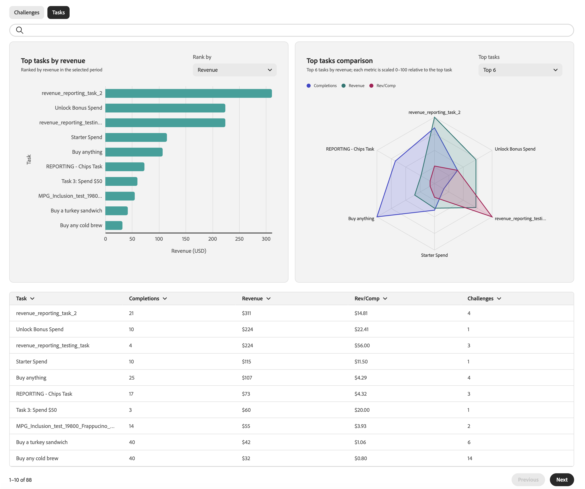

# 监测忠诚度挑战表现 {#loyalty-reporting}

>[!BEGINSHADEBOX]

**目录**

[忠诚度挑战入门](get-started.md)

<table style="table-layout:fixed">
<tr style="border: 0;">
<td style="vertical-align:top;">

**创建和管理挑战**

* [访问和管理挑战和任务](access-loyalty-challenges.md)
* [创建挑战](create-challenges.md)
* [创建任务](create-tasks.md)
* **监视忠诚度挑战表现** ◀︎**您在这里**

</td>
<td style="vertical-align:top;">

**配置并集成**

* [配置忠诚度挑战](loyalty-admin.md)
* [忠诚度数据和数据集](loyalty-data-and-datasets.md)
* [忠诚度挑战API参考](https://developer.adobe.com/journey-optimizer-apis/references/loyalty-challenges){target="_blank"}

</td>
</tr>
</table>

>[!ENDSHADEBOX]

>[!AVAILABILITY]
>
>此功能当前处于&#x200B;**私人测试版**&#x200B;中。 有关发行周期和可用性阶段的完整详细信息，请参阅 [Journey Optimizer 发行周期](../rn/releases.md)。

忠诚度挑战报表提供了挑战级别的功能板，以便您可以跟踪关键量度，如受众funnel表现、任务完成率、奖励发放和收入影响。 所有数据都来自Adobe Customer Journey Analytics，并显示在自定义的专门构建界面中。

<!--
A direct **Analyze in CJA** button will be added to the reporting interface before the feature reaches general availability.
-->

## 访问忠诚度报表 {#access-reports}

要打开忠诚度报告仪表板，请在Journey Optimizer中导航到&#x200B;**[!UICONTROL 忠诚度挑战(Beta)]**，然后从左侧导航中选择&#x200B;**[!UICONTROL 忠诚度报告]**。

报表界面提供了三个视图，每个视图提供不同级别的详细信息。 **[概述](#overview)**&#x200B;显示所有活动挑战的摘要。 在其下方，有两个选项卡允许您在更精细的视图之间切换：

* **[挑战](#challenges-view)**：具有深入分析功能的每个挑战细分，
* **[任务](#tasks-view)**：收入和完成度量的任务级视图。

您可以使用页面顶部的日期选取器调整所有视图的日期范围。 标准日期预设也可用。

## 概述 {#overview}

**概述**&#x200B;页面显示选定时段内所有活动挑战汇总的量度。

该页顶部显示以下度量：

**忠诚度会员** — 在选定期间处于活动状态的忠诚度计划会员的数量。
**挑战注册** — 所有挑战的新挑战注册总数。
**收入** — 期间与挑战活动关联的总收入。
**平均完成率** — 完成至少一项质询的已注册客户的百分比。

在这些量度下，**每日挑战参与**&#x200B;时间线显示了挑战参与度在此期间是如何演变的，并绘制了三个系列：

* **已启动**&#x200B;质询的客户，
* 移动到&#x200B;**进行中**&#x200B;状态的客户，
* **已完成**&#x200B;的客户的挑战。

## 挑战视图 {#challenges-view}

**挑战**&#x200B;选项卡按单个挑战划分性能。 每个质询都使用键列列出，如“类型”、“状态”、“注册”、“完成”等。 该列表按上次修改日期排序，一次显示十个挑战。 使用底部的&#x200B;**下一步**&#x200B;按钮进一步浏览。

从列表中选择任何质询以打开其详细信息视图。 此报表包含多个量度块，例如总收入、注册数、完成率和趋势图以及每日细分。

+++挑战报告示例

+++

## 任务视图 {#tasks-view}

**任务**&#x200B;选项卡提供了任务性能的跨质询视图。 您可以按收入在热门任务之间切换，按完成在热门任务之间切换，以重点关注与您最相关的量度。

该选项卡还突出显示按收入划分的前6个任务，快速查看哪些任务创造的价值最大。

在雷达图下方，任务列表显示了每个任务，带有关键列，如完成、收入和每个任务所属的挑战。 该列表按收入排序，一次显示十项任务。 使用&#x200B;**下一步**&#x200B;按钮进一步浏览。

