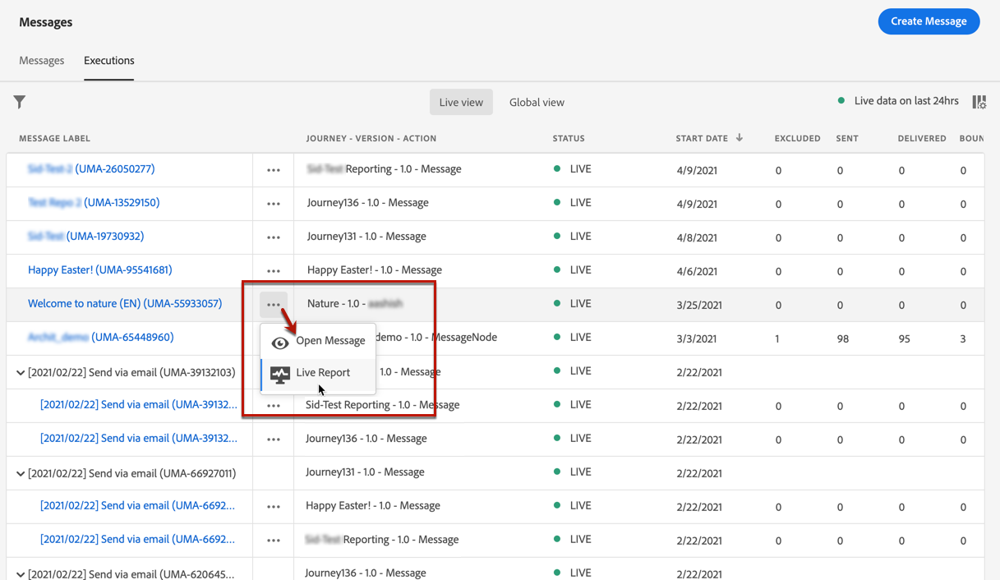

# 消息监测 {#monitor-message-execution}

为确保消息成功执行、发送和发送，[!DNL Journey Optimizer]提供了用于监视当前已发布和触发的消息的功能。 您可以从&#x200B;**[!UICONTROL Executions]**&#x200B;列表中实时查看消息在历程<!--and APIs-->中的执行情况。

要访问此列表，请从&#x200B;**[!DNL Journey Optimizer]**&#x200B;主页中选择&#x200B;**[!UICONTROL Messages]** ，然后单击&#x200B;**[!UICONTROL Executions]**&#x200B;选项卡。

此选项卡提供了两个视图：**[!UICONTROL Live view]**&#x200B;和&#x200B;**[!UICONTROL Global view]**。

* **[!UICONTROL Live view]**&#x200B;选项卡提供了由一个或多个[journeys](building-journeys/journey.md) **在过去24小时内仅**&#x200B;触发的所有已执行消息的&#x200B;**实时概述。**

   

   此列表每60秒自动刷新一次。 如果在过去24小时内没有执行特定消息，则所有列都将显示该消息的空值(0)。

* **[!UICONTROL Global view]**&#x200B;选项卡提供了自消息开始日期&#x200B;**以来由一个或多个[journeys](building-journeys/journey.md)**&#x200B;触发的所有已执行消息的&#x200B;**概述。**

   

   此列表每90分钟自动刷新一次。 自每个消息开始日期起，数据会随时间进行聚合。

如果消息已发布但尚未由历程触发，则它不会列在任何选项卡中。 仅列出以下元素：
* 已触发但尚未启动（待处理）的消息。
* 已触发且当前正在运行（进行中）的消息。

<!--For multichannel messages, one row per channel is displayed for each message. STILL VALID? looks like NOT-->

>[!NOTE]
>
>如果消息已在多个历程中使用，则每次执行时每个历程会显示一行。

<!---->

<!--If a message has been used in several journeys, the **[!UICONTROL Source]** column displays **[!UICONTROL Multiple]**.-->

默认情况下，会从最近的执行日期开始显示消息。 单击&#x200B;**[!UICONTROL Filters]**&#x200B;图标，以根据渠道、开始日期和/或结束日期搜索消息。

如果您位于&#x200B;**[!UICONTROL Live view]**&#x200B;中，则<!--**[!UICONTROL Quick action]**-->第二列可以打开相应的[消息](create-message.md)并访问[实时报表](reports/live-report.md)；如果您位于&#x200B;**[!UICONTROL Global view]**&#x200B;中，则可以访问[全局报表](reports/global-report.md)。

对于每次消息执行，都会显示许多指示器：

* **[!UICONTROL Message label]**:您在创建消息时定 [义的消息标题](create-message.md)。自动生成的执行ID显示在括号中。

   <!--**[!UICONTROL Execution ID]**: Automatically generated identifier.
  **[!UICONTROL Source]**: Name of the journey leveraging that message.-->

* **[!UICONTROL Journey - Version - Action]**:利用历程中消息的历程的名称、历程的版本以及利用历程中消息的操作的标签。

* **[!UICONTROL Status]**:消息执行状态。  <!--List all the possible statuses? For now only Live status? The user cannot stop or cancel the execution. TBC by Fred-->

* **[!UICONTROL Start date]**:从历程中执行消息的日期和时间。

* **[!UICONTROL Targeted]**:每次消息执行的目标用户档案数。

* **[!UICONTROL Excluded]**:由于排除规则而从初始目标中排除的用户档案数。

* **[!UICONTROL Sent]**:已发送的消息数。

* **[!UICONTROL Delivered]**:在收件人的邮箱（电子邮件）或设备（推送）中成功投放的邮件数量，不会生成退件或任何其他投放错误。

* **[!UICONTROL Bounces]**:由于投放失败而无法投放的消息数。[了解有关退回的更多信息](suppression-list.md)。

* **[!UICONTROL Opens]**:已打开的消息数。

* **[!UICONTROL Clicks]**:电子邮件中的链接点击次数。

   >[!NOTE]
   >
   >推送通知的点击不存在：当用户单击推送通知时，将打开应用程序，该应用程序只能被视为打开。

* **[!UICONTROL Errors]**:因技术故障无法发送的消息数。

* **[!UICONTROL Spam complaints]**:收件人标记为垃圾邮件的邮件数。请在[投放能力最佳实践指南](https://experienceleague.adobe.com/docs/deliverability-learn/deliverability-best-practice-guide/metrics-for-deliverability/complaints.html#metrics-for-deliverability){target=&quot;_blank&quot;}中了解有关投诉的更多信息。

单击每个超链接将打开相应的消息摘要视图。 [了解有关消息的更多信息](create-message.md)。
