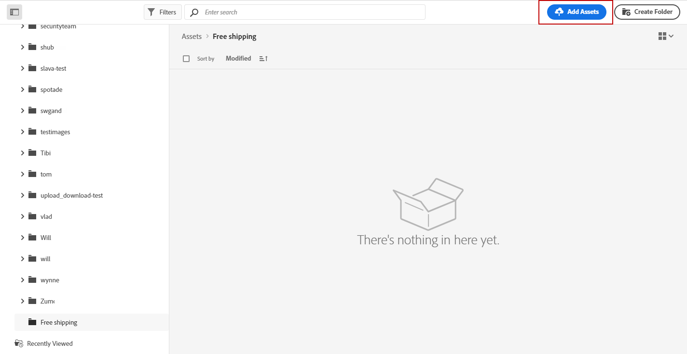
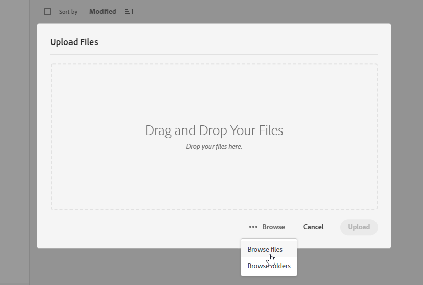
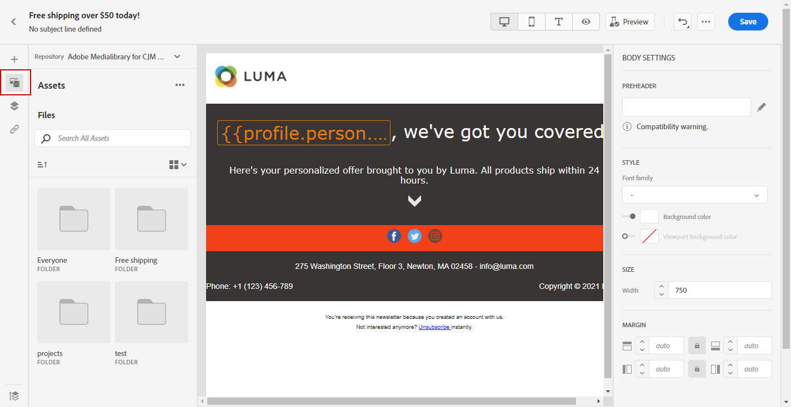
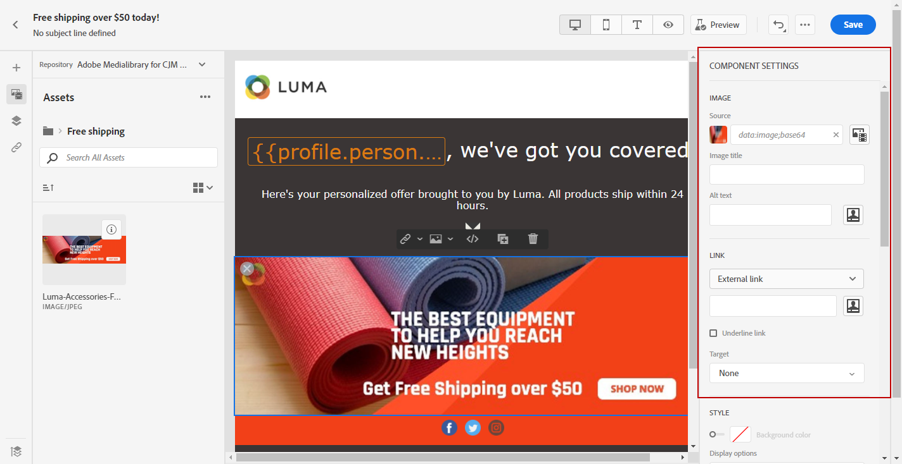

# 创建和管理资产  {#experience-manager-assets}

## 开始使用 [!DNL Assets Essentials] {#get-started-assets-essentials}

[!DNL Adobe Experience Manager Assets Essentials] 提供了一个可用于填充消息的集中资产存储库。 它可以直接从 [!DNL Adobe Journey Optimizer] 到 **[!UICONTROL Assets]** 中。 在设计电子邮件内容时，您还可以访问资产和文件夹。 [了解有关电子邮件设计的更多信息](design-emails.md).

使用之前 [!DNL Adobe Experience Manager Assets Essentials]，则必须将用户添加到 **Assets Essentials消费者用户** 或/和 **Assets Essentials用户** 产品配置文件。 [有关更多信息，请参阅Assets Essentials文档](https://experienceleague.adobe.com/docs/experience-manager-assets-essentials/help/deploy-administer.html){target=&quot;_blank&quot;}。

>[!NOTE]
>对于在2022年1月6日之前获取的Journey Optimizer产品，您必须部署 [!DNL Adobe Experience Manager Assets Essentials] 为贵组织。 在 [部署Assets Essentials](https://experienceleague.adobe.com/docs/experience-manager-assets-essentials/help/deploy-administer.html){target=&quot;_blank&quot;}部分。

## 上传和插入资产{#add-asset}

要在 [!DNL Assets Essentials]，则首先需要浏览或创建要存储到其中的文件夹。 然后，您便能够将它们插入到电子邮件内容中。

有关如何上传资产的更多信息，请参阅 [Adobe Experience Manager Assets Essentials文档](https://experienceleague.adobe.com/docs/experience-manager-assets-essentials/help/add-delete.html){target=&quot;_blank&quot;}。

1. 从 [!DNL Adobe Journey Optimizer] 主页，选择 **[!UICONTROL Assets]** 选项卡 **[!UICONTROL Content management]** 访问菜单 [!DNL Assets Essentials].

   

1. 从中央部分或树视图中双击文件夹以将其打开。

   您还可以单击 **[!UICONTROL Create folder]** 创建新文件夹。

   

1. 进入选定或创建的文件夹后，单击 **[!UICONTROL Add Assets]** 将新资产上传到您的文件夹。

   

1. 从 **[!UICONTROL Upload files]**，单击 **[!UICONTROL Browse]** 然后选择 **[!UICONTROL Browse files]** 或 **[!UICONTROL Browse folders]**.

   

1. 选择要上传的文件。 完成后，单击 **[!UICONTROL Upload]**。

   要了解有关如何管理资产的更多信息，请参阅 [页面](https://experienceleague.adobe.com/docs/experience-manager-assets-essentials/help/manage-organize.html).

1. 上传资产后，您现在可以通过Email designer将资产插入其中一条消息。

   您的资产还可以使用 **编辑** 模式 [!DNL Assets Essentials]. [了解详情](https://experienceleague.adobe.com/docs/experience-manager-assets-essentials/help/edit-images.html){target=&quot;_blank&quot;}.

   

1. 从 [!DNL Adobe Journey Optimizer]，选择 **[!UICONTROL Asset picker]** 电子邮件设计工具的左窗格。

   

1. 选择您的Assets文件夹。 您还可以在搜索栏中搜索资产或文件夹。

1. 将资产拖放到电子邮件内容中。

   

1. 您可以进一步自定义您的资产，例如，使用 **[!UICONTROL Components settings]**. [了解有关组件设置的更多信息](content-components.md)

   
