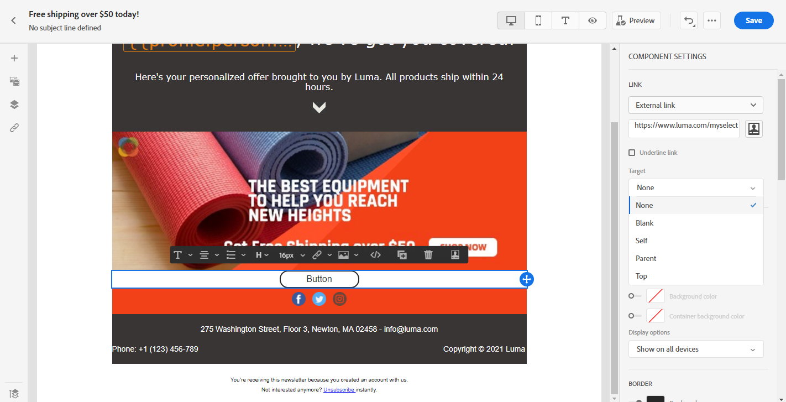
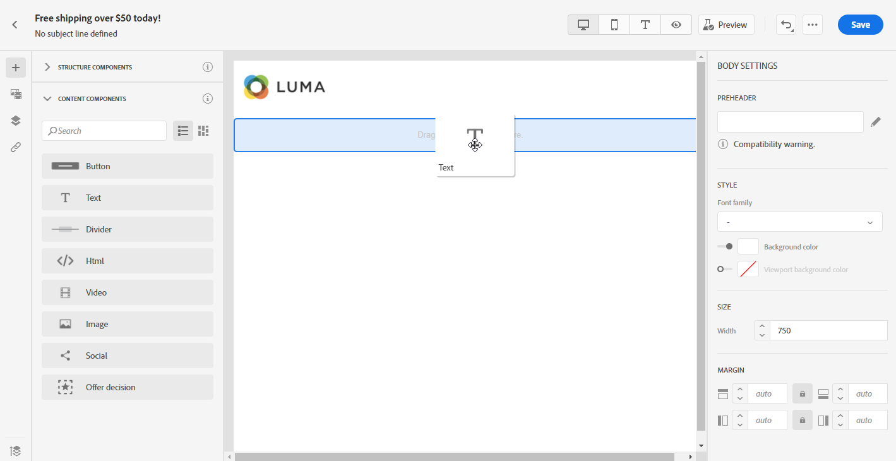
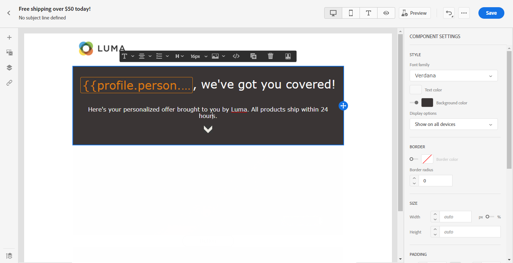

# 使用Email Designer内容组件 {#content-components}

>[!CONTEXTUALHELP]
>id="ac_content_components"
>title="关于内容组件"
>abstract="内容组件是空内容占位符，您可以使用这些占位符创建电子邮件的布局。"

从头开始创建电子邮件内容时， **[!UICONTROL Content components]** 允许您使用一旦放入电子邮件中即可使用的原始空组件进一步个性化电子邮件。
您可以添加任意数量的 **[!UICONTROL Content components]** 你需要 **[!UICONTROL Structure component]** 定义电子邮件的布局。

## 按钮 {#buttons}

使用 **[!UICONTROL Button]** 组件在电子邮件中插入多个按钮，并将电子邮件受众重定向到其他页面。

1. 从 **[!UICONTROL Content components]**，拖放 **[!UICONTROL Button]** 在 **[!UICONTROL Structure component]**.

   

1. 单击您新添加的按钮以个性化文本并有权访问 **[!UICONTROL Components Settings]** 电子邮件设计工具的右侧窗格中。

   

1. 在 **[!UICONTROL Link]** 字段 **[!UICONTROL Components Settings]**，在单击按钮时添加您希望受众被重定向到的URL。

1. 选择如何通过 **[!UICONTROL Target]** 下拉列表：

   * **[!UICONTROL None]**:在点击链接的同一帧中打开该链接（默认）。
   * **[!UICONTROL Blank]**:在新窗口或选项卡中打开链接。
   * **[!UICONTROL Self]**:在点击链接的同一帧中打开该链接。
   * **[!UICONTROL Parent]**:在父框架中打开链接。
   * **[!UICONTROL Top]**:在窗口的完整正文中打开链接。

   

1. 您现在可以通过更改 **[!UICONTROL Style]**, **[!UICONTROL Margin]** 和 **[!UICONTROL Border]** 例如。

## 文本 {#text}

使用 **[!UICONTROL Text]** 组件在电子邮件中插入文本。 您可以在 **[!UICONTROL Component Settings]**.

1. 在 **[!UICONTROL Content Components]**，拖放 **[!UICONTROL Text]** 在 **[!UICONTROL Structure component]**.

   

1. 单击您新添加的组件以个性化文本并有权访问 **[!UICONTROL Components Settings]** 电子邮件设计工具的右侧窗格中。

1. 使用以下工具栏中的选项更改文本：

   

   * **[!UICONTROL Change text style]**:在文本中应用粗体、斜体、下划线或者直线。
   * **更改对齐方式**:在文本的左对齐、右对齐、居中对齐或两端对齐之间进行选择。
   * **[!UICONTROL Create list]**:在文本中添加项目符号或编号列表。
   * **[!UICONTROL Set heading]**:在文本中最多添加6个标题级别。
   * **字体大小**:以像素为单位选择文本的字体大小。
   * **[!UICONTROL Edit image]**:向文本组件中添加图像或资产。 [了解有关资产管理的更多信息](assets-essentials.md).
   * **[!UICONTROL Show the source code]**:显示文本的源代码。 无法修改。
   * **[!UICONTROL Duplicate]**:添加文本组件的副本。
   * **[!UICONTROL Delete]**:从电子邮件中删除选定的文本组件。
   * **[!UICONTROL Add personalization]**:添加个性化字段以自定义用户档案数据的内容。 [了解有关内容个性化的更多信息](../personalization/personalize.md).

1. 为了获得更好的用户体验，您可以添加个性化字段以定位受众。 有关更多信息，请参阅此](../personalization/personalize.md)章节[。

1. 调整 **[!UICONTROL Text color]**, **[!UICONTROL Font family]** 和 **[!UICONTROL Size]** 在 **[!UICONTROL Components Settings]**.

   

## 除法器 {#divider}

使用 **[!UICONTROL Divider]** 用于插入划分线以组织电子邮件的布局和内容的组件。
您可以在 **[!UICONTROL Component Settings]**.

## HTML {#HTML}

使用 **[!UICONTROL HTML]** 复制并粘贴现有HTML的不同部分。 这使您能够创建免费的模块化HTML组件。

为了使外部内容与Email Designer兼容，Adobe建议从头开始创建消息，并将现有电子邮件中的内容复制到组件中。

1. 在 **[!UICONTROL Content Components]**，拖放 **[!UICONTROL HTML]** 在 **[!UICONTROL Structure component]**.

   

1. 单击新添加的组件，然后 **[!UICONTROL Show the source code]** 添加HTML。

   

1. 复制并粘贴要添加到电子邮件的HTML代码，然后单击 **[!UICONTROL Save]**.

1. 您现在可以通过更改 **[!UICONTROL Style]**, **[!UICONTROL Margin]** 和 **[!UICONTROL Border]** 例如，添加链接以将受众重定向到其他内容。

## 图像 {#image}

使用 **[!UICONTROL Image]** 组件，在电子邮件中插入来自计算机的图像文件。

1. 在 **[!UICONTROL Content Components]**，拖放 **[!UICONTROL Image]** 在 **[!UICONTROL Structure component]**.

   

1. 单击 **[!UICONTROL Browse]** ，以从资产中选择图像文件。

   要了解 [!DNL Assets Essentials]，请参阅 [Adobe Experience Manager Assets Essentials文档](https://experienceleague.adobe.com/docs/experience-manager-assets-essentials/help/introduction.html){target=&quot;_blank&quot;}。

1. 单击新添加的组件以开始配置 **[!UICONTROL Content Components]** 和 **[!UICONTROL Components Settings]** 电子邮件设计工具的右侧窗格中。

1. 设置图像属性：

   * **[!UICONTROL Image Title]** 用于为图像定义标题。
   * **[!UICONTROL Alt text]** 用于定义链接到图像的标题。 此属性对应于altHTML属性。

   

1. 您现在可以通过更改 **[!UICONTROL Style]**, **[!UICONTROL Margin]** 和 **[!UICONTROL Border]** 例如，添加链接以将受众重定向到其他内容。

## 视频 {#Video}

>[!CONTEXTUALHELP]
>id="ac_edition_video"
>title="视频设置"
>abstract="使用此组件可在电子邮件中插入视频。 请注意，视频并非适用于所有电子邮件客户端。 我们建议设置备用图像。"
>additional-url="https://www.emailonacid.com/blog/article/email-development/a_how_to_guide_to_embedding_html5_video_in_email/" text="其他信息"

使用 **[!UICONTROL Video]** 组件通过URL链接在电子邮件中插入视频。

1. 在 **[!UICONTROL Content Components]**，拖放 **[!UICONTROL Video]** 在 **[!UICONTROL Structure component]**.

   

1. 单击新添加的组件以开始配置 **[!UICONTROL Content Components]** 和 **[!UICONTROL Components Settings]** 电子邮件设计工具的右侧窗格中。

1. 在 **[!UICONTROL Video link]** 字段 **[!UICONTROL Components Settings]**，添加您的视频URL。

   

1. 您可以添加 **[!UICONTROL Poster image]** 指定要显示的图像，直到受众单击播放按钮为止。

1. 您现在可以通过更改 **[!UICONTROL Style]**, **[!UICONTROL Margin]** 和 **[!UICONTROL Border]** 例如。

## 社交 {#social}

使用 **[!UICONTROL Social]** 组件，在电子邮件中插入指向社交媒体页面的链接。

1. 在 **[!UICONTROL Content Components]**，拖放 **[!UICONTROL Social]** 在 **[!UICONTROL Structure component]**.

   

1. 单击新添加的组件以开始配置 **[!UICONTROL Content Components]** 和 **[!UICONTROL Components Settings]** 电子邮件设计工具的右侧窗格中。

1. 在 **[!UICONTROL Social]** 字段 **[!UICONTROL Components Settings]**，选择要添加或删除的社交媒体。

   

1. 在 **[!UICONTROL Size of images]** 字段。

1. 单击每个社交媒体图标以配置 **[!UICONTROL URL]** 受众将被重定向到的页面。

   

1. 您还可以根据需要在 **[!UICONTROL Image]** 字段。

1. 您现在可以通过更改 **[!UICONTROL Style]**, **[!UICONTROL Margin]** 和 **[!UICONTROL Border]**.

## 选件决策 {#offer-decision}

使用 **[!UICONTROL Offer decision]** 组件，将决策（以前称为选件活动）插入消息。 决策将利用决策管理来选择最佳选件，以提供给您的客户。

相关主题：

* [决策管理入门](../offers/get-started/starting-offer-decisioning.md).
* [在消息中添加个性化优惠](deliver-personalized-offers.md).
