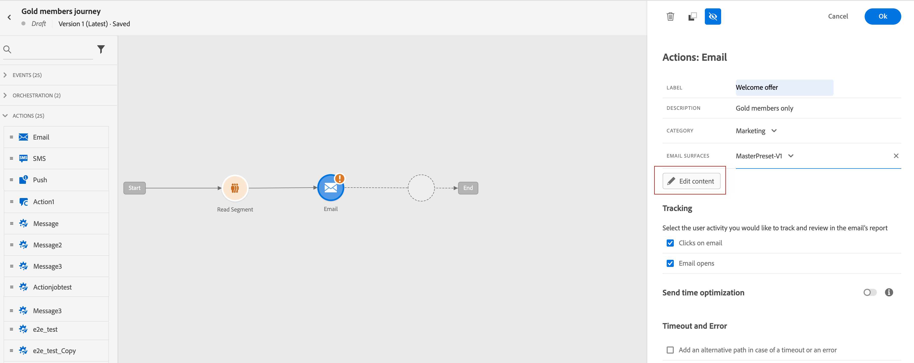

# 创建电子邮件 {#configure-email}

>[!CONTEXTUALHELP]
>id="ajo_message_email"
>title="电子邮件创建"
>abstract="只需三个简单步骤即可定义电子邮件参数。"

可以创建电子邮件：

* 在 **历程**:在历程中添加电子邮件活动并定义基本设置后，请使用 **[!UICONTROL 操作：电子邮件]** 用于创建推送通知内容的右窗格。

   有关如何配置历程的更多信息，请参阅此 [页面](../building-journeys/journey-gs.md).

   

* 在 **Campaign**:创建营销活动后，选择电子邮件作为您的操作并定义基本设置。

   有关如何配置营销活动的更多信息，请参阅此 [页面](../campaigns/create-campaign.md#configure).

   

## 定义电子邮件内容{#email-content}

使用 [!DNL Journey Optimizer] 将Designer发送到 [从头开始设计电子邮件](../design/create-email-content.md). 如果您已有内容，则可以 [在Email Designer中导入它](../design/existing-content.md)或 [代码您自己的内容](../design/code-content.md) in [!DNL Journey Optimizer].

[!DNL Journey Optimizer] 附带一组 [内置模板](../design/email-templates.md) 来帮助你开始。 任何电子邮件也可另存为模板。

使用 [!DNL Journey Optimizer] 表达式编辑器来使用用户档案数据个性化您的消息。 有关个性化的更多信息，请参考[此部分](../personalization/personalize.md)。

利用 [!DNL Journey Optimizer] 动态内容功能。 [动态内容入门](../personalization/get-started-dynamic-content.md)

## 电子邮件跟踪{#email-tracking}

如果要通过打开和/或单击链接来跟踪收件人的行为，请启用以下选项： **[!UICONTROL 电子邮件打开]** 和 **[!UICONTROL 单击电子邮件]**.

了解有关跟踪的更多信息(位于 [此部分](../design/message-tracking.md).

## 验证电子邮件内容{#email-content-validate}

使用左侧的预览部分控制电子邮件的呈现，并使用测试用户档案检查个性化设置。 有关详细信息，请参阅[此部分](../design/preview.md)。

您还必须检查编辑器上部的警报。  其中一些是简单的警告，但其他警告可能会阻止您使用消息。 有关详细信息，请参阅[此部分](alerts.md)。

>[!NOTE]
>
>的 **[!UICONTROL 从电子邮件]** 和 **[!UICONTROL 从名称]** 由 **[!UICONTROL 曲面]** 在 [创建消息](get-started-content.md).

