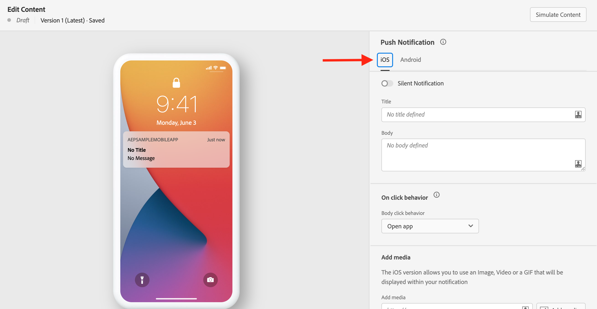

# 创建推送通知 {#create-push-notification}

>[!CONTEXTUALHELP]
>id="ajo_message_push"
>title="推送消息创建"
>abstract="添加推送消息，然后使用表达式编辑器对其进行个性化设置。"

推送通知可帮助您随时联系移动设备应用程序用户 — 尤其是当他们未主动使用您的应用程序时。 推送通知可帮助您实现各种用例，例如提供有关您的服务的更新、要求用户采取行动、提醒用户进行新交易等。 设备平台要求最终用户在收到或查看您的通知之前选择加入。 最早可在应用程序在安装后首次启动后或在后续会话或工作流中（视情况而定）收到用户选择加入。

[!DNL Journey Optimizer] 支持推送通知，并帮助您以行业领先的吞吐率发送高度相关的通知。 推送通知可能包含个性化和基于历程的上下文，以便利用您的品牌对Adobe Experience Cloud的数据分析。

可以创建推送通知：

* 在 **历程**:在历程中添加推送活动并定义基本设置后，请使用 **[!UICONTROL Actions: Push]** 用于创建推送通知内容的右窗格。

   有关如何配置历程的更多信息，请参阅此 [页面](../building-journeys/journey-gs.md).

* 在 **Campaign**:创建营销活动后，选择推送通知作为您的操作并定义基本设置。

   有关如何配置营销活动的更多信息，请参阅此 [页面](../campaigns/create-campaign.md#configure).

使用专用选项卡定义的推送通知设置 **iOS** 和 **Android** 操作系统。

如果您是首次创建推送通知，请确保配置了推送渠道。 [了解详情](../configuration/push-gs.md)。

>[!NOTE]
>
>的 **[!UICONTROL Compose Message]** 部分对这两个 **[!UICONTROL iOS]** 和 **[!UICONTROL Android]** 选项卡。 此部分中的任何更改都将应用于这两个设置。

## 标题与正文 {#push-title-body}

要撰写消息，请单击 **[!UICONTROL Title]** 和 **[!UICONTROL Body]** 字段。 使用表达式编辑器定义内容和个性化数据。 在的表达式编辑器中了解有关个性化的更多信息 [此部分](../personalization/personalize.md)

使用设备预览部分可视化推送通知在iOS和Android设备上的显示方式。

## 点击行为 {#on-click-behavior}

>[!CONTEXTUALHELP]
>id="ajo-message-push-onclick"
>title="关于点击行为"
>abstract="选择收件人单击推送通知正文时的行为。"

您可以选择用户单击推送通知正文时的行为。

* 要打开应用程序，请选择 **[!UICONTROL Open app]** 选项。 在 [通道表面](../configuration/channel-surfaces.md) （即消息预设）。
* 要将用户重定向到应用程序中的特定内容段，请选择 **[!UICONTROL Deeplink]** 选项。  特定内容可以是特定视图、页面的特定部分或特定选项卡。 选择选项后，在关联的字段中输入深层链接。
* 要将用户重定向到外部URL，请使用 **[!UICONTROL Web URL]** 选项。 选择选项后，在关联的字段中输入URL。

## 添加媒体 {#add-media-push}

在iOS版本的推送通知中，您可以添加将在通知中显示的图像、视频或GIF。

在Android版本中，您只能添加图像图标和用于扩展通知的图像。

有两个选项可用。 您可以：

* 使用 **[!UICONTROL Add media]** 按钮以在 **[!DNL Adobe Experience Manager Assets Essentials]**.

   了解如何使用 **[!DNL Adobe Experience Manager Assets Essentials]** in [本页](../design/assets-essentials.md).

* 或在 **[!UICONTROL Add media]** 字段。 在这种情况下，您可以向URL添加个性化。

添加后，媒体会显示在通知正文的右侧。

## 添加按钮 {#add-buttons-push}

通过向推送内容添加按钮来创建可操作的通知。

如果设备屏幕已锁定，则不会显示以下按钮：只有 **标题** 和 **消息** 显示。 如果其设备已解锁，则收件人将看到这些按钮。

在iOS版本中，最多可添加四个按钮。 在Android版本中，最多可以添加三个按钮。

>[!NOTE]
>
>对于iOS，请使用 **[!UICONTROL iOS category]** 字段将操作与通知类别关联。

1. 使用 **[!UICONTROL Add button]** 要定义设置，请执行以下操作：标签和关联的操作。 可能的操作与 [点击行为](#on-click-behavior).

1. 使用 **[!UICONTROL Expand view]** 图标来预览个性化按钮。

## 发送无提示通知 {#silent-notification}

>[!CONTEXTUALHELP]
>id="ajo_message_push_silent_notification"
>title="关于无提示通知"
>abstract="在不干扰用户的情况下发送通知，通知不会显示在通知中心或通知栏中。"

无提示推送通知（或后台通知）是交付给应用程序的隐藏指令。 例如，它用于通知您的应用程序新内容的可用性或在后台启动下载。

选择 **[!UICONTROL Silent Notification]** 用于静默通知应用程序的选项：在这种情况下，通知会直接转给应用程序。 设备屏幕上未显示任何警报。

使用 **[!UICONTROL Custom data]** 部分添加键值对。

## 自定义数据

在 **[!UICONTROL Custom data]** 部分，则可以根据移动应用程序配置将自定义变量添加到有效负载。 有关如何在Adobe Experience Platform中设置推送通知和AdobeLaunch的更多信息，请参阅 [此部分](../configuration/push-gs.md)

## 高级选项 {#advanced-options-push}

您可以配置 **[!UICONTROL Advanced options]** ，以获取推送通知。 以下列出了可用参数：

| 参数 | 描述 |
|---------|---------|
| **[!UICONTROL Collapsible]** (iOS/Android) | 可折叠的消息是一种消息，如果消息已过时，则可以用新消息替换该消息。 可折叠消息的常见用例是消息，用于告知移动设备应用程序从服务器同步数据。 例如，一个可更新用户最新得分的体育应用程序。 只有最新的消息才相关。 另一方面，通过不可折叠的消息，非常的消息对客户端应用程序很重要，需要发送。 |
| **[!UICONTROL Custom sound]** (iOS/Android) | 移动终端在收到通知时要播放的声音。 需要在应用程序中捆绑声音。 |
| **[!UICONTROL Badges]** (iOS/Android) | 标记用于直接在应用程序图标上显示新的未读信息数。 当用户打开或从应用程序中读取新内容时，标记值将消失。在设备上收到通知时，可能会刷新或增加相关应用程序的标记值。 例如，如果您存储的是客户的未读文章数，则可以利用个性化功能为每个客户发送唯一的未读文章标记值。 如需更多个性化信息，请参阅 [此部分](../personalization/personalize.md). |
| **[!UICONTROL Notification group]**  (仅限iOS) | 将通知组与推送通知关联。 从iOS 12开始，通知组允许您将消息线程和通知主题合并到线程ID中。 例如，品牌可能会在一个组ID下发送营销通知，而在一个或多个不同ID下保留更多操作类型通知。 为了说明这一点，您可以具有groupID:123 “查看新的Sweaters春季系列”和groupID:456 “您的包已送达”通知组。 在本例中，所有投放通知都将捆绑在组ID下：456。 |
| **[!UICONTROL Notification channel]** （仅限Android） | 将通知渠道关联到推送通知。 从Android 8.0（API级别26）开始，必须将所有通知分配给渠道才能显示。 有关更多信息，请参阅 [Android开发人员文档](https://developer.android.com/guide/topics/ui/notifiers/notifications#ManageChannels). |
| **[!UICONTROL Add content-availability flag]** (仅限iOS) | 发送推送负载中的可用内容标志，以确保应用程序在收到推送通知后立即唤醒，这意味着应用程序将能够访问有效载荷数据。  即使应用程序在后台运行且无需任何用户交互（例如点按推送通知），这项操作仍可正常运行。 但是，如果应用程序未运行，则不适用此设置。 有关更多信息，请参阅 [Apple 开发人员文档](https://developer.apple.com/library/content/documentation/NetworkingInternet/Conceptual/RemoteNotificationsPG/CreatingtheNotificationPayload.html)。 |
| **[!UICONTROL Add mutable-content flag]** (仅限iOS) | 发送推送负载中的可变内容标记，并将允许推送通知内容由iOS SDK中提供的通知服务应用程序扩展进行修改。 有关更多信息，请参阅 [Apple 开发人员文档](https://developer.apple.com/library/content/documentation/NetworkingInternet/Conceptual/RemoteNotificationsPG/ModifyingNotifications.html)。 然后，您可以利用移动应用程序扩展进一步修改从发送的推送通知的内容或演示 [!DNL Journey Optimizer]. 例如，用户可以利用此选项解密数据、更改通知的正文或标题文本、向通知添加线程标识符等。 |
| **[!UICONTROL Notification visibility]** （仅限Android） | 定义推送通知的可见性。  <b>私有</b> 将在所有锁屏上显示通知，但在安全的锁屏上隐藏敏感或隐私信息。  <b>公共</b> 将在所有锁屏上全部显示通知。  <b>密码</b> 不会在安全的锁屏上显示通知的任何部分。  有关更多信息，请参阅 [Android开发人员文档](https://developer.android.com/reference/android/app/Notification). |
| **[!UICONTROL Notification priority]** （仅限Android） | 将推送通知的重要性从“低”定义为“最大”。 这可确定发送推送通知时“侵入”的程度。 有关更多信息，请参阅 [Android开发人员文档](https://developer.android.com/guide/topics/ui/notifiers/notifications#importance) |
| **[!UICONTROL Delivery priority]** （仅限Android） | 为推送通知设置高优先级或普通优先级。 有关消息优先级的更多信息，请参阅 [Google 开发人员文档](https://firebase.google.com/docs/cloud-messaging/concept-options#setting-the-priority-of-a-message)。 |

## 验证推送通知{#push-preview}

定义消息内容后，即可使用测试用户档案进行预览和测试。 如果插入 [个性化内容](../personalization/personalize.md)，则可以使用测试用户档案数据检查此内容在消息中的显示方式。

要显示推送通知在移动设备上的显示方式，请单击 **[!UICONTROL Simulate content]** 选项卡。 进一步了解 [此部分](../design/preview.md).

您还必须检查编辑器上部的警报。  其中一些是简单的警告，但其他警告可能会阻止您使用消息。 有关详细信息，请参阅[此部分](alerts.md)。

**相关主题**

<!--
* [Understand push notification flow](push-gs.md)
-->

* [配置推送渠道](../configuration/push-gs.md)
* [创建新消息](get-started-content.md)
* [在历程中添加消息](../building-journeys/journeys-message.md)
