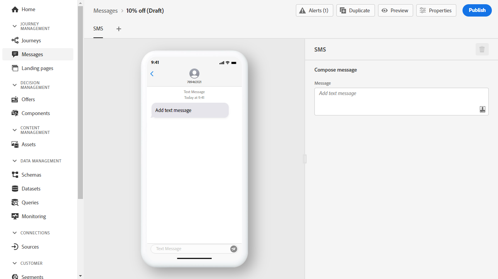

# 创建短信消息 {#create-sms}

>[!CONTEXTUALHELP]
>id="ajo_message_sms"
>title="创建短信"
>abstract="添加文本消息，然后使用表达式编辑器对其进行个性化设置。"

>[!CAUTION]
>
> 短信渠道目前仅供选定用户抢先试用。 如果要利用此功能，请联系您的Adobe客户经理。

一旦 [已创建消息](get-started-content.md)，则使用 **[!UICONTROL SMS]** 选项卡，以定义短信渠道的设置和内容。

要开始个性化短信消息，请执行以下步骤：

1. 单击 **[!UICONTROL Add text message]** 字段来打开表达式编辑器。

   

1. 使用表达式编辑器定义内容和个性化数据。 在的表达式编辑器中了解有关个性化的更多信息 [此部分](../personalization/personalize.md)

   >[!NOTE]
   >
   > 短信消息的长度限制为160个字符。

   

1. 单击 **[!UICONTROL Save]** 当您的个性化消息准备就绪时。

1. 单击 **[!UICONTROL Preview]** 以可视化在移动设备上显示短信消息的方式。 如需详细信息，请参阅[此部分](../design/preview.md)。

1. 消息准备就绪后，您可以将其发布，以供使用 **[!UICONTROL Publish]** 按钮。 此操作将发布消息的新版本，该版本将用于您的历程中的下一次执行。

您的短信消息现在可用于历程。 [了解如何创建历程](../building-journeys/journey-gs.md).

**相关主题**

* [配置短信渠道](../configuration/sms-configuration.md)
* [创建新消息](get-started-content.md)
* [在历程中添加消息](../building-journeys/journeys-message.md)
