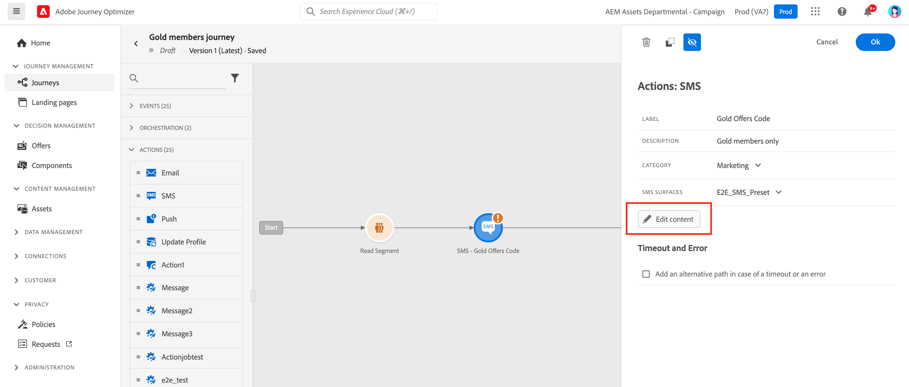

# 创建短信消息 {#create-sms}

>[!CONTEXTUALHELP]
>id="ajo_message_sms"
>title="创建短信"
>abstract="添加文本消息，然后使用表达式编辑器对其进行个性化设置。"

使用 [!DNL Journey Optimizer] 在客户的移动设备上向客户发送短信。 您可以从短信编辑器创建、个性化和预览文本格式的消息。

一旦 [添加了短信](get-started-content.md) 活动，并定义基本设置，请使用 **[!UICONTROL Actions: SMS]** 用于创建短信消息内容的右窗格。

如果您是首次创建短信消息，请确保已配置短信渠道。 [了解详情](../configuration/sms-configuration.md)。

## 定义短信内容{#sms-content}

要开始个性化短信消息，请执行以下步骤：

1. 单击 **[!UICONTROL Message]** 字段来打开表达式编辑器。

   

1. 使用表达式编辑器定义内容。 您可以使用任何属性来个性化内容，例如配置文件名称或城市。 在的表达式编辑器中了解有关个性化的更多信息 [此部分](../personalization/personalize.md).

1. 单击 **[!UICONTROL Save]** 并在预览中查看您的消息。

   

## 验证短信{#sms-preview}

>[!NOTE]
>
> 为了更好地交付，您应始终使用提供商支持的格式的电话号码。 例如， Twilio和Sinch仅支持E.164格式的电话号码。

定义消息内容后，即可使用测试用户档案进行预览和测试。 如果插入 [个性化内容](../personalization/personalize.md)，则可以使用测试用户档案数据检查此内容在消息中的显示方式。

要可视化显示您的短信消息在移动设备上的显示方式，请单击 **[!UICONTROL Simulate content]** 选项卡。 进一步了解 [此部分](../design/preview.md).

您还必须检查编辑器上部的警报。  其中一些是简单的警告，但其他警告可能会阻止您使用消息。 有关详细信息，请参阅[此部分](alerts.md)。

## 选择启用和选择禁用{#sms-opt-in-out}

对于所有营销消息，短信必须包含一种让收件人轻松退订的方法。 取消订阅后，用户档案将自动从未来营销消息的受众中删除。 对于事务型消息，不必添加退订链接。

短信收件人可以使用选择启用和选择禁用关键词进行回复。 根据行业标准和法规，Adobe Journey Optimizer会自动处理传入消息中的以下关键词：开始、停止和停止。 这些关键词会触发短信提供商的标准自动回复。

要详细了解本机入站关键词支持（开始、停止和停止）如何用于短信，请参阅以下视频。

>[!VIDEO](https://video.tv.adobe.com/v/344026?quality=12)

<!--
## How-to video

Learn how to configure, author, and include SMS messaging into your customer journeys.

>[!VIDEO](https://video.tv.adobe.com/v/344460?quality=12)
-->
**相关主题**

* [配置短信渠道](../configuration/sms-configuration.md)
* [短信报告](../reports/journey-global-report.md#sms-global)
* [创建新消息](get-started-content.md)
* [在历程中添加消息](../building-journeys/journeys-message.md)
