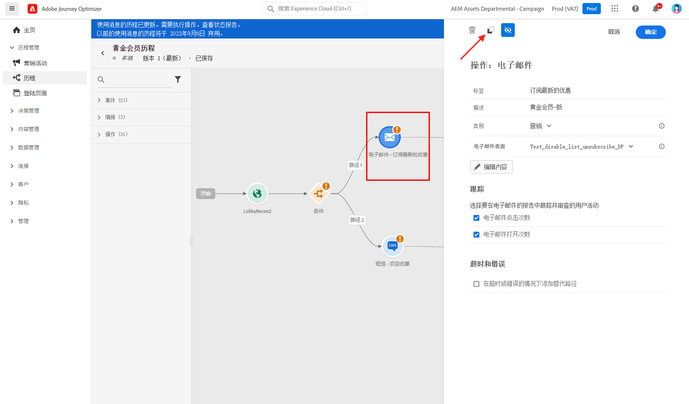

# 消息入门 {#get-started-contents-messages}

使用 [!DNL Journey Optimizer]，在一个单一位置利用资产和内容等多类资源，并创建和发布个性化的推送通知和电子邮件消息。

* 利用[!DNL Journey Optimizer] **电子邮件设计功能**&#x200B;来创建或导入响应式电子邮件。

* 利用 **Adobe Experience Manager Assets Essentials** 构建您自己的资产数据库，并丰富您的电子邮件。

* 根据客户的用户档案属性创建&#x200B;**个性化的推送和电子邮件消息**&#x200B;以增强客户体验。

* 根据这些内容&#x200B;**创建推送和电子邮件消息**，然后发布。

## 访问消息 {#access-messages}

可通过左侧导航栏的 **[!UICONTROL Messages]** 快捷方式访问消息。将列出所有消息，并按发布日期（适用于已发布的消息）或创建日期（适用于草稿消息）排序。

>[!NOTE]
>
>用户可以访问、创建、编辑和/或发布消息，具体取决于其产品用户档案。[在此部分中](../administration/permissions.md)了解有关用户权限的更多信息。

* 使用 **[!UICONTROL Show recents]** 切换开关可以添加您最近 5 天访问的消息的直达链接。

   

* 使用过滤器图标可仅显示草稿、已发布或正在发布的消息。您还可以按消息标签进行搜索，如下所示：

   

* 您可以使用快速操作菜单中的专用图标存档未使用的消息以清除消息列表。

   

   使用过滤器图标显示所有已存档的消息，然后单击 **[!UICONTROL Unarchive]** 图标，从已存档消息列表中删除项目。

   >[!NOTE]
   >
   >无法打开已存档的消息。必须先取消存档。

## 创建新消息 {#create-new-message}

要创建新消息，请执行以下步骤：

1. 访问消息列表，然后单击 **[!UICONTROL Create Message]**。

1. 定义消息的属性。

   

   * 输入 **[!UICONTROL Title]**（必填项）和 **[!UICONTROL Description]**。

   * 选择 **[!UICONTROL Message category]**：营销或事务性。

   * 选择要用于该消息的渠道：电子邮件和/或推送通知。您必须至少选择一个渠道才能创建消息。

   * 选择用于消息的 **[!UICONTROL Preset]**。

      预设包含根据您的品牌发送电子邮件和/或推送通知所需的所有参数。[进一步了解预设](../configuration/message-presets.md)。
   >[!CAUTION]
   >
   >您必须为选定的类别和渠道选择有效的消息预设。

   请注意，您可以使用消息界面中的 **[!UICONTROL Properties]** 按钮随时访问和修改消息的标题、描述和预设。

1. 单击 **[!UICONTROL Create]** 确认消息创建。您的消息会以 **[!UICONTROL Draft]** 状态添加至消息列表中。

   每个所选渠道都对应一个选项卡。使用这些选项卡为每个渠道配置内容。可以通过选择某个选项卡并单击右侧的 **[!UICONTROL Delete channel]** 按钮来删除该选项卡。

   

   您现在可以创建消息的内容并调整设置。以下部分提供了有关电子邮件和推送通知配置的详细信息：

   * [创建电子邮件](create-email.md)
   * [创建推送通知](create-push.md)

   >[!NOTE]
   >   
   >您可以使用表达式编辑器，使用用户档案数据对消息进行个性化设置。有关个性化的更多信息，请参考[此部分](../personalization/personalize.md)。

1. 使用左侧的预览部分控制消息的呈现，并使用测试用户档案检查个性化设置。有关详细信息，请参阅[此部分](../design/preview.md)。

   

1. 检查编辑器上部的警报。其中一些是简单的警告，但其他警报可能会阻止您发布消息。有关详细信息，请参阅[此部分](alerts.md)。

1. 您现在可以通过单击 **[!UICONTROL Publish]** 按钮发布消息，或将其保存为草稿并稍后发布。有关如何发布消息的更多信息，请参阅[此部分](publish-manage-message.md)。

## 复制消息 {#duplicate-message}

要通过现有消息创建消息，请执行以下步骤。

1. 打开要复制的消息。

1. 使用消息界面的 **[!UICONTROL Duplicate]** 按钮。

   

   所有设置和配置都将复制到新消息中。

1. 您可以在确认复制之前重命名消息。

   

1. 创建新消息后，窗口底部会显示确认消息。

您还可以使用快捷操作菜单中的专用图标，从消息列表中复制消息。

适用同样的确认过程。

