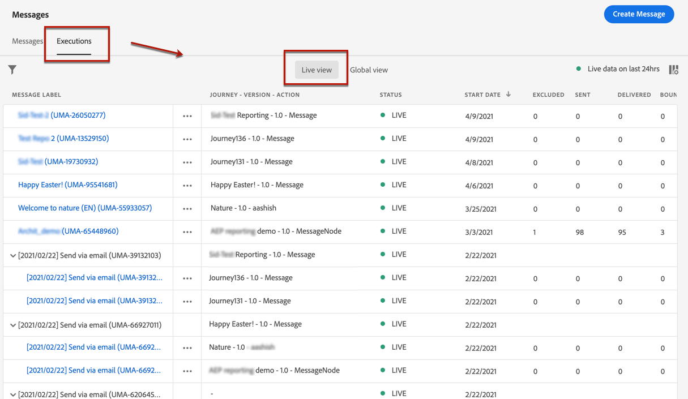
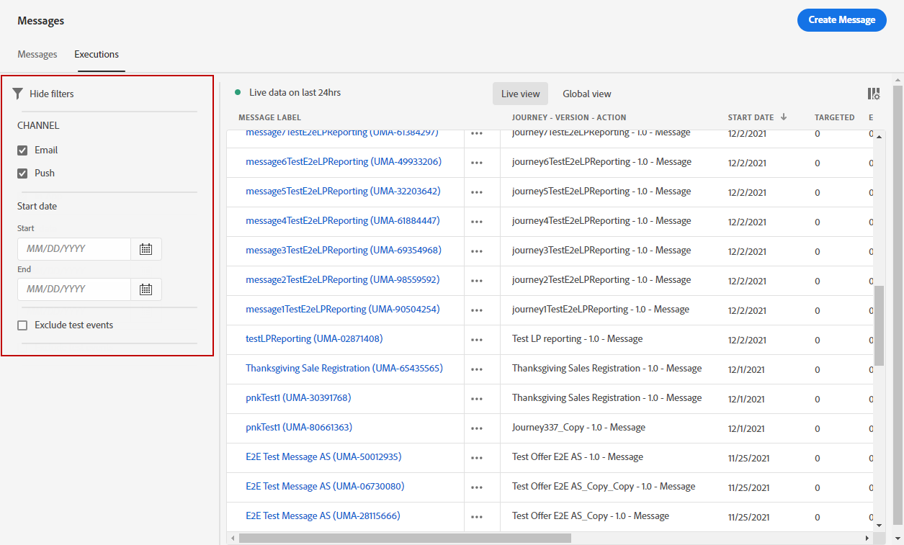

# 消息监测 {#monitor-message-execution}

为确保消息的执行、发送和发送成功， [!DNL Journey Optimizer] 提供了用于监视当前已发布和触发的消息的功能。 您可以查看消息在历程中的执行情况 <!--and APIs--> 实时从 **[!UICONTROL Executions]** 列表。

要访问此列表，请从 **[!DNL Journey Optimizer]** 主页，选择 **[!UICONTROL Messages]**，然后单击 **[!UICONTROL Executions]** 选项卡。

此选项卡提供了两个视图： **[!UICONTROL Live view]** 和 **[!UICONTROL Global view]**.

* 的 **[!UICONTROL Live view]** 选项卡提供 **所有已执行消息的实时概述** 由一个或多个 [历程](../building-journeys/journey.md) **过去24小时里**.

   

   此列表每60秒自动刷新一次。 如果在过去24小时内没有执行特定消息，则所有列都将显示该消息的空值(0)。

* 的 **[!UICONTROL Global view]** 选项卡提供 **所有已执行消息的概述** 由一个或多个 [历程](../building-journeys/journey.md) **自消息开始日期起**.

   

   此列表每90分钟自动刷新一次。 自每个消息开始日期起，数据会随时间进行聚合。

如果消息已发布但尚未由历程触发，则它不会列在任何选项卡中。 仅列出以下元素：
* 已触发但尚未启动（待处理）的消息。
* 已触发且当前正在运行（进行中）的消息。

>[!NOTE]
>
>如果消息已在多个历程中使用，则每次执行时每个历程会显示一行。

默认情况下，会从最近的执行日期开始显示消息。 单击 **[!UICONTROL Filters]** 图标，以根据渠道、开始日期和/或结束日期搜索消息。

的 <!--**[!UICONTROL Quick action]**-->第二列可以打开相应的 [消息](create-message.md) 和 [实时报表](../reports/live-report.md) 如果您在 **[!UICONTROL Live view]**，或 [全局报告](../reports/global-report.md) 如果您在 **[!UICONTROL Global view]**.

对于每次消息执行，都会显示许多指示器：

* **[!UICONTROL Message label]**:您定义的消息标题 [创建消息](create-message.md). 自动生成的执行ID显示在括号中。

   <!--**[!UICONTROL Execution ID]**: Automatically generated identifier.
  **[!UICONTROL Source]**: Name of the journey leveraging that message.-->

* **[!UICONTROL Journey - Version - Action]**:利用历程中消息的历程的名称、历程的版本以及利用历程中消息的操作的标签。

* **[!UICONTROL Status]**:消息执行状态。

* **[!UICONTROL Start date]**:从历程中执行消息的日期和时间。

* **[!UICONTROL Targeted]**:每次消息执行的目标用户档案数。

* **[!UICONTROL Excluded]**:由于排除规则而从初始目标中排除的用户档案数。

* **[!UICONTROL Sent]**:已发送的消息数。

* **[!UICONTROL Delivered]**:在收件人的邮箱（电子邮件）或设备（推送）中成功投放的邮件数量，不会生成退件或任何其他投放错误。

* **[!UICONTROL Bounces]**:由于投放失败而无法投放的消息数。 [了解有关退回的更多信息](suppression-list.md).

* **[!UICONTROL Opens]**:已打开的消息数。

* **[!UICONTROL Clicks]**:电子邮件中的链接点击次数。

   >[!NOTE]
   >
   >推送通知的点击不存在：当用户单击推送通知时，将打开应用程序，该应用程序只能被视为打开。

* **[!UICONTROL Errors]**:因技术故障无法发送的消息数。

* **[!UICONTROL Spam complaints]**:收件人标记为垃圾邮件的邮件数。 在 [投放能力最佳实践指南](https://experienceleague.adobe.com/docs/deliverability-learn/deliverability-best-practice-guide/metrics-for-deliverability/complaints.html#metrics-for-deliverability){target=&quot;_blank&quot;}。

您可以选择要在表中显示的列。 要执行此操作，请单击 **[!UICONTROL Customize table]** 图标，然后选择要显示的列。

在 **全局视图** 只有这样，您才能选择是要将数据显示为数字、百分比，还是两者兼有。 单击 **数据格式** 下拉列表来切换这三个选项。

单击每个超链接将打开相应的消息摘要视图。 [了解有关消息的更多信息](create-message.md).
