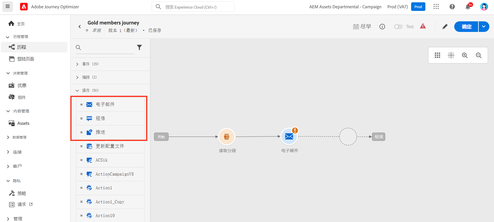
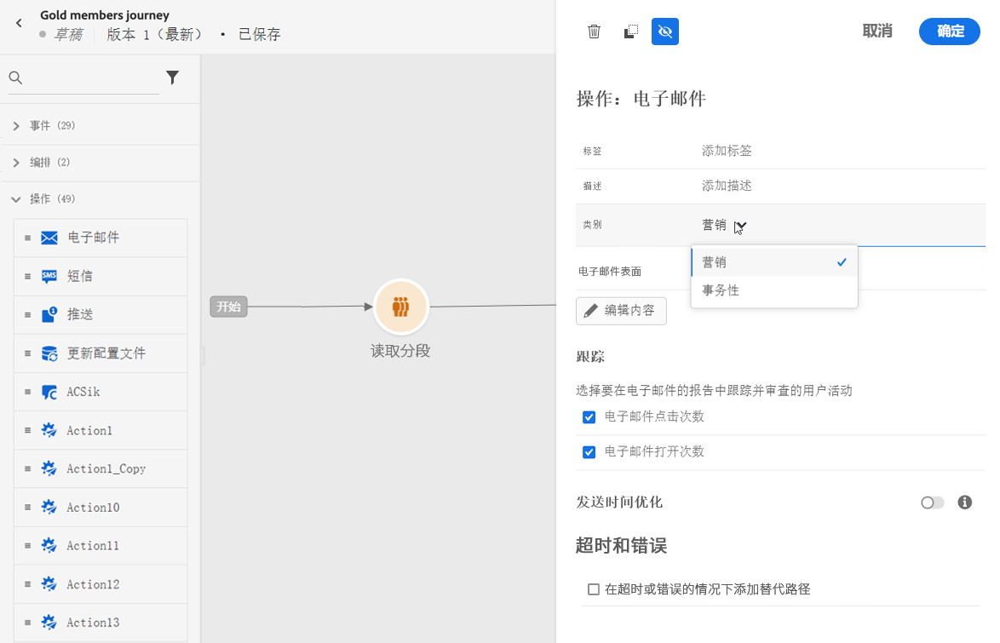
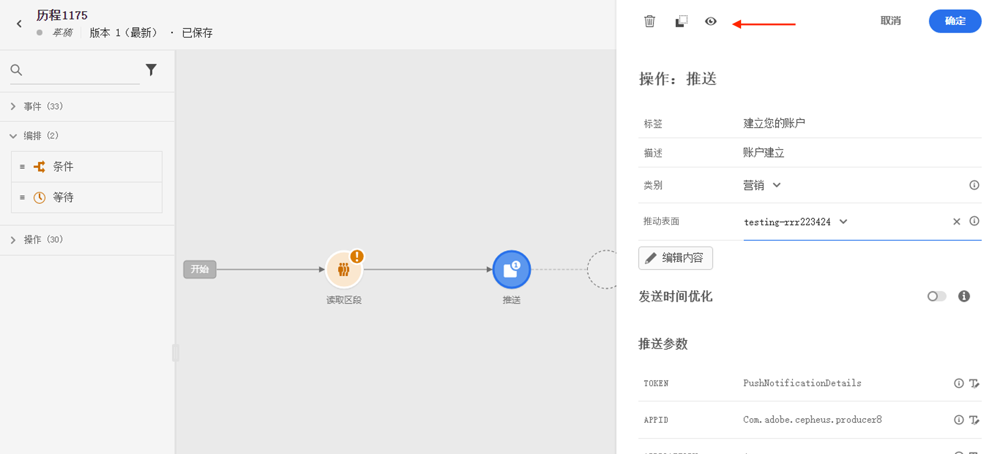
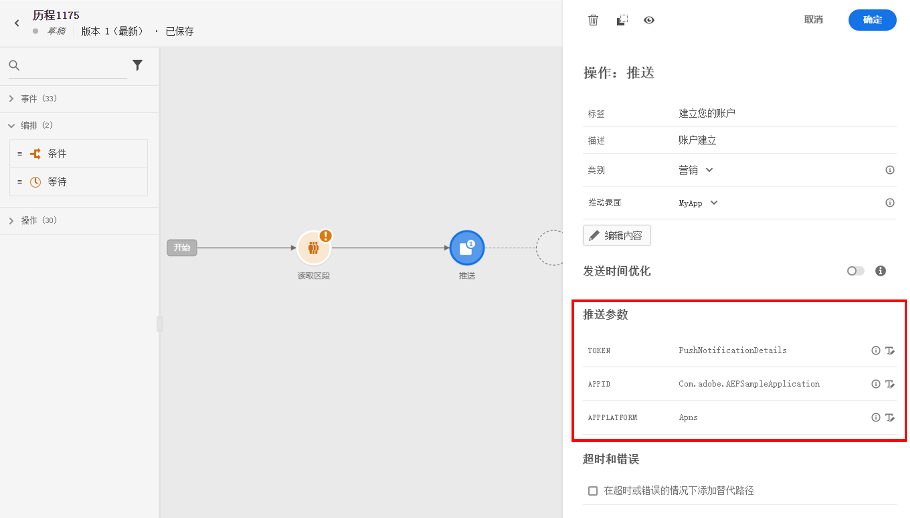
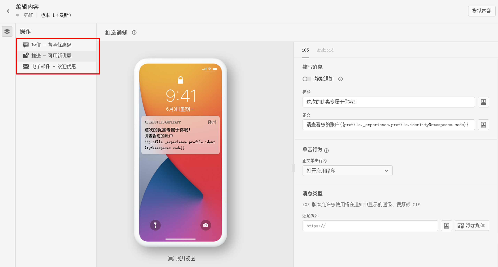
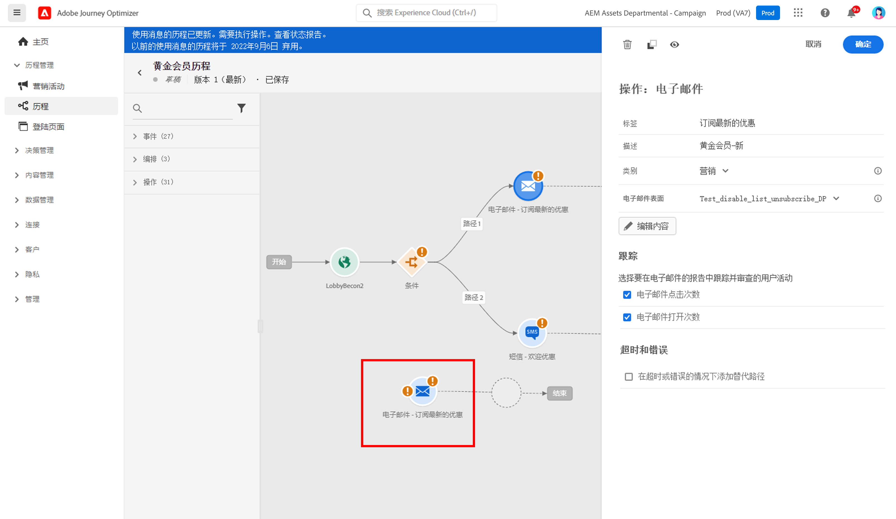
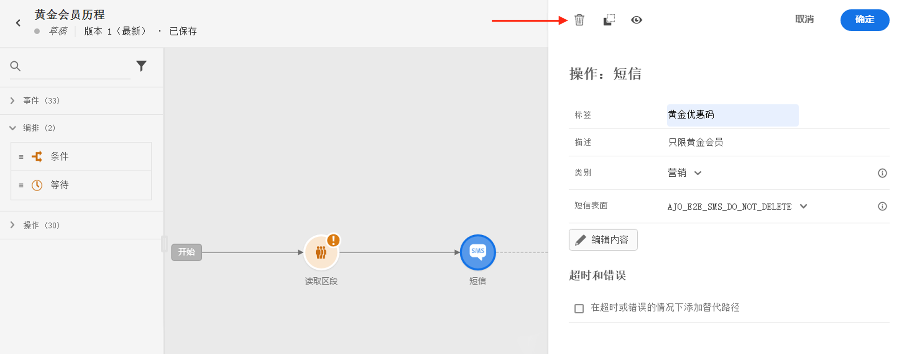

# 在历程中添加消息{#messages-in-journeys}

>[!CONTEXTUALHELP]
>id="ajo_message_category"
>title="消息类别"
>abstract="为商业消息选择营销型，或为非商业消息选择事务型（如订单确认、密码重置通知或投放信息）"

>[!CONTEXTUALHELP]
>id="ajo_message_surface"
>title="渠道平面"
>abstract="渠道平面是该渠道的一个实例，具有用于通过营销活动或历程成功投放操作的所有设置。它由系统管理员定义。"

在您的历程中，使用渠道操作来设计要发送给受众的消息并对消息进行个性化设置。在历程画布中添加电子邮件、短信或推送操作时，您将创建触发发送。 当联系人触发该渠道操作时，Adobe Journey Optimizer 会自动发送消息。

>[!NOTE]
>您还可以创建营销活动以发送设置了计划的消息。 [在此部分中](../campaigns/get-started-with-campaigns.md)了解详情。

要在历程中添加消息，请在历程画布中添加推送、短信或电子邮件活动。

1. 通过[事件](../building-journeys/general-events.md)或[读取区段](../building-journeys/read-segment.md)活动开始您的历程。

1. 从调板的&#x200B;**操作**&#x200B;部分，拖放&#x200B;**电子邮件**、**短信**&#x200B;或&#x200B;**推送**&#x200B;活动到画布中。

   

1. 输入标签和描述。

1. 选择消息&#x200B;**[!UICONTROL 类别]**：为商业消息选择&#x200B;**营销型**，或为非商业消息选择&#x200B;**事务型**（如订单确认、密码重置通知或投放信息）。

   

   >[!CAUTION]
   >
   >* 如果您为特定渠道和类别定义[频率规则](../configuration/frequency-rules.md)，在选择该渠道和类别时，会自动将它们应用于消息。当前频率规则仅可用于&#x200B;**[!UICONTROL 营销型]**&#x200B;类别。
   >
   >* 营销消息必须包括 [选择退出链接](../privacy/opt-out.md#opt-out-management). 这对事务型消息并不是必需的，因为可以将这些消息发送到从营销通信内容中取消订阅的用户档案。

1. 选择渠道&#x200B;**[!UICONTROL 界面]**（即消息预设）来发送消息。

   平面是由[系统管理员](../start/path/administrator.md)定义的配置。它包含用于发送消息的所有技术参数，如标头参数、子域、移动应用程序等。[了解详情](../configuration/channel-surfaces.md)。

   >[!CAUTION]
   >
   >必须为所选消息类别和渠道选择有效的渠道平面。

   您可以使用消息界面中的&#x200B;**[!UICONTROL 属性]**&#x200B;按钮随时访问和修改消息的标签、描述和界面。

1. 创建消息内容。

   在以下页面中了解创建消息内容的详细步骤：

   * [创建电子邮件](create-email.md)
   * [创建推送通知](create-push.md)
   * [创建短信消息](create-sms.md)

## 启用发送时间优化{#sto-in-journeys}

对于电子邮件和推送通知，您可以启用&#x200B;**[!UICONTROL 发送时间优化]**。

使用&#x200B;**[!UICONTROL 发送时间优化]**&#x200B;安排每个用户的个性化发送时间，以增加消息的打开率和点击率。[了解详情](../messages/send-time-optimization.md)。

## 高级参数{#adv-settings}

默认情况下，高级参数处于只读和隐藏状态。

要访问高级参数，请单击消息窗格顶部的&#x200B;**[!UICONTROL 显示只读字段]**&#x200B;图标。

高级参数将显示在消息窗格的底部。这些参数由[系统管理员](../start/path/administrator.md)在与消息相关的[渠道平面](../configuration/channel-surfaces.md)（即消息预设）中定义。

对于推送通知，您可以显示以下参数：令牌、应用程序 ID、应用程序平台。

对于电子邮件，您可以显示主电子邮件地址。

对于特定用途，您可以在特定上下文中覆盖这些值。要强制使用某个值，请单击字段右侧的&#x200B;**启用参数覆盖**&#x200B;图标。此选项可能非常有用，例如在下列操作中：

* 测试电子邮件，可添加您的电子邮件地址。发布历程后，将向您发送电子邮件。
* 请参阅列表中订阅者的电子邮件地址。在[此用例](../building-journeys/message-to-subscribers-uc.md)中了解更多。

单击同一图标可隐藏高级设置。

## 浏览消息{#browse-message}

在历程中使用多条消息时，您可以在 **Edit Content** 屏幕中进行切换。

然后，您可以[检查警报](alerts.md)并从单个视图中[模拟](../design/preview.md)每个内容。

## 复制消息 {#duplicate-message}

您可以从历程画布复制现有消息。

为此，请执行以下步骤：

1. 选择要复制的消息。

1. 使用&#x200B;**[!UICONTROL 操作]**&#x200B;窗格中的&#x200B;**[!UICONTROL 复制]**&#x200B;按钮。

   

1. 按 **crtl+V** 来粘贴消息。

   消息将添加到历程画布。 所有设置和配置都将被复制到新消息中。

   

1. 重命名消息以便能够将初始消息与副本区分开（例如在编辑消息时），如下所示：

   

>[!NOTE]
>
>对于电子邮件，您还可以将现有消息转换为模板。[了解详情](../design/email-templates.md)。

## 删除消息{#delete-message}

要删除消息，请使用渠道操作活动窗格顶部的垃圾桶图标。

使用&#x200B;**[!UICONTROL 确认]**&#x200B;按钮进行验证。
