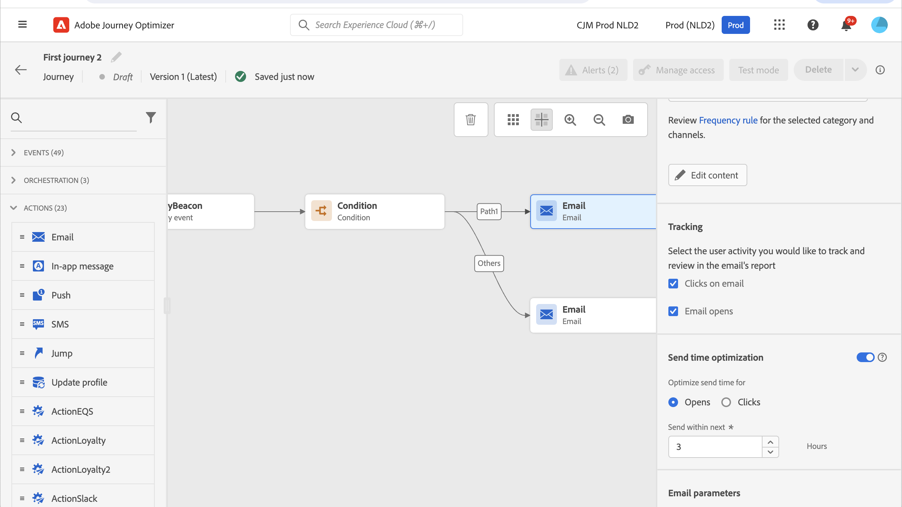

## 发送时间优化{#send-time-optimization}

>[!CONTEXTUALHELP]
>id="jo_bestsendtime_disabled"
>title="关于发送时间优化"
>abstract="Adobe Journey Optimizer的“发送时间优化”功能由Adobe的AI服务提供支持，可根据历史打开率和点击率预测发送电子邮件或推送消息以最大化参与度的最佳时间。"

Adobe Journey Optimizer的“发送时间优化”功能由Adobe的AI服务提供支持，可根据历史打开率和点击率预测发送电子邮件或推送消息以最大化参与度的最佳时间。 使用我们的机器学习模型为每个用户安排个性化发送时间，以提高消息的打开率和点击率。

发送时间优化模型可摄取您的Adobe Journey Optimizer数据，并查看用户级别的打开（用于电子邮件和推送）和点击（用于电子邮件）率，以确定客户何时最可能参与您的消息传送。 发送时间优化需要至少一个月的消息跟踪数据才能做出明智的建议。 对于每个用户，系统将使用以下分数自动选择最佳时间：

* 一周中每天的最佳时刻，以最大限度地提高参与度
* 一周中最好的一天，以最大程度地提高参与度
* 一周中最佳时刻的最佳时刻，以最大限度地提高参与度

无论您是在说打分还是培训，模型都会有所不同。 培训最初每周进行，然后每季度进行。 评分最初是每周，然后是每月。

* 培训 — 用于打分的算法的开发
* 评分 — 根据训练好的模型将评分应用于个人用户档案

此信息与用户的用户档案一起存储，并在历程执行时被引用，以告知Adobe Journey Optimizer何时发送消息。

>[!CAUTION]
>
>* 此功能与拆分模式不兼容。

### 激活发送时间优化{#activate-send-time-optimization}

>[!CONTEXTUALHELP]
>id="jo_bestsendtime_email"
>title="激活发送时间优化"
>abstract="通过选择相应的单选按钮，选择是优化电子邮件打开次数还是电子邮件点进次数。 您还可以通过在下一个选项中为“发送”输入值，将系统使用的发送时间括起来。"

>[!CONTEXTUALHELP]
>id="jo_bestsendtime_push"
>title="激活发送时间优化"
>abstract="推送消息默认为打开选项，因为点击不适用于推送消息。 您还可以通过在下一个选项中为“发送”输入值，将系统使用的发送时间括起来。"

通过选择 **发送时间优化** 从活动参数切换。

对于电子邮件消息，选择是优化电子邮件打开次数，还是通过选择相应的单选按钮来优化电子邮件点进次数。 推送消息默认为打开选项，因为点击不适用于推送消息。

您还可以通过为 **在下一个** 选项。 如果选择“6小时”作为值， [!DNL Journey Optimizer] 将检查每个用户配置文件，并在历程执行时间后的六小时内选取最佳发送时间。
