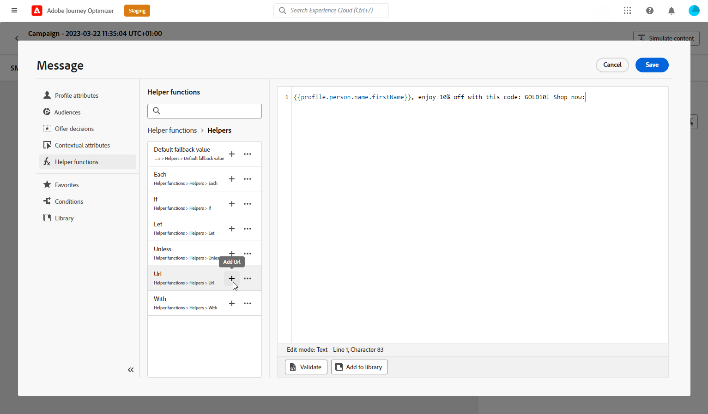

# 设计移动消息 {#design-mobile}

您可以使用Adobe Journey Optimizer设计和发送文本(SMS)、富通信(RCS)和多媒体(MMS)消息。 您首先需要在历程或营销策划中添加移动消息操作，然后定义移动消息的内容，如下所述。 Adobe Journey Optimizer还提供了在发送之前测试移动消息的功能，以便您检查渲染、个性化属性和所有其他设置。

根据行业标准和法规，所有SMS/MMS营销消息都必须包含一种让用户档案轻松取消订阅的方法。 要实现此目的，短信配置文件可以使用选择启用和选择禁用关键词进行回复。 [了解如何管理选择退出](../privacy/opt-out.md#opt-out-decision-management)

## 定义RCS内容{#rcs-content}

RCS允许您通过受支持设备上的本机消息传递应用程序，发送包含图像、视频、轮播和交互式按钮的富视觉化消息。 消息由已验证的品牌发件人发送。 当配置文件的设备或运营商不支持RCS时，Journey Optimizer会自动回退到标准短信。

每个RCS消息都需要&#x200B;**[!UICONTROL 默认回退文本]**：一个纯文本的SMS版本，该版本已传送到其设备或运营商不支持RCS的配置文件。 如果没有营销活动，则无法激活该营销活动。

在编写回退文本时，请牢记以下事项：

* **保持简洁。** SMS消息每个区段限制为160个字符；较长的消息将被拆分为多个部分，并且可能会产生额外费用。
* **包含密钥URL。** 如果RCS消息通过操作按钮链接到URL，请在回退文本中添加一个缩短的URL，以便短信配置文件仍然可以到达目的地。
* **避免仅RCS引用。** 不要提到纯短信中不提供的视觉效果、轮播或交互式功能。
* 支持&#x200B;**Personalization。** 您可以在回退文本中使用个性化令牌，以保持两个版本中的消息保持一致。

要定义RCS消息内容，请执行以下步骤。

1. 在创作面板中，选择您的&#x200B;**[!UICONTROL 内容类型]**：

   +++ 文本

   纯文本正文，带有可选的交互按钮。 最适合通知、警报、提醒以及不需要视觉效果的对话流程。

   +++

   +++ 媒体

   带有可选文本和交互式按钮的独立图像或视频。 当单个视觉对象（产品图像、横幅或视频剪辑）是消息的焦点时，可使用该视觉对象。

   1. 在“标题”菜单中，输入指向要显示的图像或视频的&#x200B;**[!UICONTROL 媒体URL]**。

   1. 如果媒体是视频文件，可以选择输入&#x200B;**[!UICONTROL 缩略图URL]**。

   +++

   +++ 卡片

   一种结构化的卡片，将图像或视频、标题、正文文本和操作按钮组合在一起。 使用它以品牌格式呈现产品、选件或内容项目。

   1. 输入&#x200B;**[!UICONTROL 标题]**&#x200B;和&#x200B;**[!UICONTROL 描述]**。

   1. 输入指向要显示的图像或视频的&#x200B;**[!UICONTROL 媒体URL]**。

   1. 如果媒体是视频文件，可以选择输入&#x200B;**[!UICONTROL 缩略图URL]**。

   +++

   +++ 轮播

   一条消息中包含一系列可水平滚动的丰富卡片，每个卡片都有自己的图像、标题、描述和按钮。 非常适用于产品目录或促销活动。 至少需要2张卡。

   1. 选择&#x200B;**[!UICONTROL 卡宽度]**&#x200B;以控制每个卡的显示宽度。
   1. 对于每个卡片，输入&#x200B;**[!UICONTROL 标题]**&#x200B;和&#x200B;**[!UICONTROL 描述]**。

   1. 输入指向该卡的图像或视频的&#x200B;**[!UICONTROL 媒体URL]**。

   1. （可选）选择&#x200B;**[!UICONTROL 媒体高度]**&#x200B;并添加建议的操作按钮。

   +++

   +++ 位置

   将地图pin发送到一组坐标，在配置文件的消息传递线程中显示为内联地图预览。 用它来共享商店地址、活动地点或服务区。

   1. 输入位置的小数&#x200B;**[!UICONTROL 纬度]**&#x200B;和&#x200B;**[!UICONTROL 经度]**。

   1. （可选）输入&#x200B;**[!UICONTROL 位置名称]**&#x200B;以作为标签显示在映射pin上。

   +++

1. 在&#x200B;**[!UICONTROL 消息文本]**&#x200B;字段中，输入消息内容。 您可以使用个性化定制每个用户档案的文本。 请注意，字符限制因消息类型而异：富媒体（单个）为3,072个字符，基本RCS为160个字符。

1. 使用&#x200B;**[!UICONTROL Personalization编辑器]**&#x200B;定义内容、添加个性化和动态内容。 您可以使用任何属性，例如配置文件名称或城市。 您还可以定义条件规则。

1. （可选）添加&#x200B;**[!UICONTROL 建议的操作]**&#x200B;交互式按钮，让用户档案只需点击一下即可执行操作。

1. 为您的&#x200B;**[!UICONTROL 操作]**&#x200B;输入&#x200B;**[!UICONTROL 标签]**。

1. 选择您的&#x200B;**[!UICONTROL 操作类型]**：

   * **[!UICONTROL 回复]**：代表配置文件将预定义的文本回复发送回RCS代理。 使用它捕获意图、推动对话流或触发下游历程事件。 不需要其他字段，回复文本与按钮标签匹配。

   * **[!UICONTROL 打开URL]**：将配置文件重定向到网页、深层链接或应用程序内目标。 支持个性化令牌和UTM跟踪参数，例如`https://www.example.com/offers?id={{profile.userId}}`。

   * **[!UICONTROL 拨打电话号码]**：使用预先填写的指定电话号码打开设备拨号器，以便配置文件呼叫。

   * **[!UICONTROL 查看位置]**：在指定位置打开设备的默认映射应用程序。 提供要显示的位置的小数&#x200B;**[!UICONTROL 纬度]**&#x200B;和&#x200B;**[!UICONTROL 经度]**。

1. 在&#x200B;**[!UICONTROL 默认回退文本]**&#x200B;字段中，输入消息的纯文本SMS版本。 这是必需的，并且会传送到其设备或运营商不支持RCS的用户档案。

1. 在发送&#x200B;**[!UICONTROL 打开URL]**&#x200B;操作时，从&#x200B;**[!UICONTROL Webview]**&#x200B;下拉列表中选择&#x200B;**[!UICONTROL Webview]**&#x200B;的大小。

1. 单击&#x200B;**[!UICONTROL 保存]**&#x200B;并在预览中检查您的消息。 您现在可以测试和检查您的邮件内容，如[此部分](send-mobile-message.md)中所详述。

## 定义 SMS 内容{#sms-content}

>[!CONTEXTUALHELP]
>id="ajo_message_sms_content"
>title="定义 SMS 内容"
>abstract="使用个性化编辑器定义内容并合并动态元素，自定义和个性化您的移动设备消息。"

要配置消息内容，请执行以下步骤。 有关MMS的设置详情，请参阅[此部分](#mms-content)。

1. 在历程或营销策划配置屏幕中，单击&#x200B;**[!UICONTROL 编辑内容]**&#x200B;按钮以配置移动消息内容。

1. 单击&#x200B;**[!UICONTROL 消息]**&#x200B;字段以打开个性化编辑器。

   

1. 使用[AI Assistant为文本生成](../content-management/generative-text.md)生成针对受众定制的互动移动消息。

1. 使用个性化编辑器定义内容、添加个性化和动态内容。 您可以使用任何属性，例如配置文件名称或城市。 您还可以定义条件规则。 浏览到以下页面，了解有关个性化编辑器中的[个性化](../personalization/personalize.md)和[动态内容](../personalization/get-started-dynamic-content.md)的更多信息。

1. 定义内容后，您可以在消息中添加跟踪的URL。 为此，请访问&#x200B;**[!UICONTROL 帮助程序功能]**&#x200B;菜单并选择&#x200B;**[!UICONTROL 帮助程序]**。

   要使用URL缩短功能，您必须首先配置子域，然后该子域将链接到您的配置。 [了解详情](mobile-subdomains.md)

   >[!NOTE]
   >
   > 要访问和编辑SMS子域，您必须对生产沙盒具有&#x200B;**[!UICONTROL 管理SMS子域]**&#x200B;权限。 可在[此部分](../administration/high-low-permissions.md)中详细了解权限。

   

1. 在&#x200B;**[!UICONTROL 帮助程序函数]**&#x200B;菜单中，单击&#x200B;**[!UICONTROL URL函数]**，然后选择&#x200B;**[!UICONTROL 添加URL]**。

   

   <!--The URL shortening function cannot be used within a fragment. TBC-->

1. 在`originalUrl`字段中，粘贴要缩短的URL并单击&#x200B;**[!UICONTROL 保存]**。

   >[!CAUTION]
   >
   > 短URL的生命周期设置为30天。 在此时段之后，这些短URL将不再可访问，并且将显示消息：`404 short-code not found`。

1. 通过&#x200B;**[!UICONTROL 决策]**&#x200B;菜单，您可以使用&#x200B;**决策**&#x200B;个性化并优化移动消息的内容。 此功能允许您使用优先级得分、公式或AI模型来动态选择并向客户显示最佳内容。

   有关如何在Mobile消息中创建和使用决策策略的更多信息，请参阅[此章节](../experience-decisioning/create-decision.md)。

1. 单击&#x200B;**[!UICONTROL 保存]**&#x200B;并在预览中检查您的消息。 您现在可以测试和检查您的邮件内容，如[此部分](send-mobile-message.md)中所详述。

## 定义彩信内容{#mms-content}

您可以通过发送多媒体消息服务(MMS)消息，启用视频、图片、音频剪辑和GIF等媒体的共享来增强通信。 此外，MMS允许在消息中最多包含1600个字符的文本。

>[!NOTE]
>
> [此页面](../start/guardrails.md#sms-guardrails)上列出了MMS渠道的一些限制。

要创建MMS内容，请执行以下步骤：

1. 按照[此部分](#create-sms-journey-campaign)中的说明创建移动消息。

1. 编辑你的短信内容，如[此部分](#sms-content)中所述。

1. 启用MMS选项以将媒体添加到短信内容。

   

1. 向媒体添加&#x200B;**[!UICONTROL 标题]**。

1. 在&#x200B;**[!UICONTROL 媒体]**&#x200B;字段中输入媒体的URL。

   

1. 单击&#x200B;**[!UICONTROL 保存]**&#x200B;并在预览中检查您的消息。 您现在可以测试和检查消息内容，如下所述。

执行测试并验证内容后，即可向受众发送移动设备消息。 这些步骤在[此页面](send-mobile-message.md)上详述
