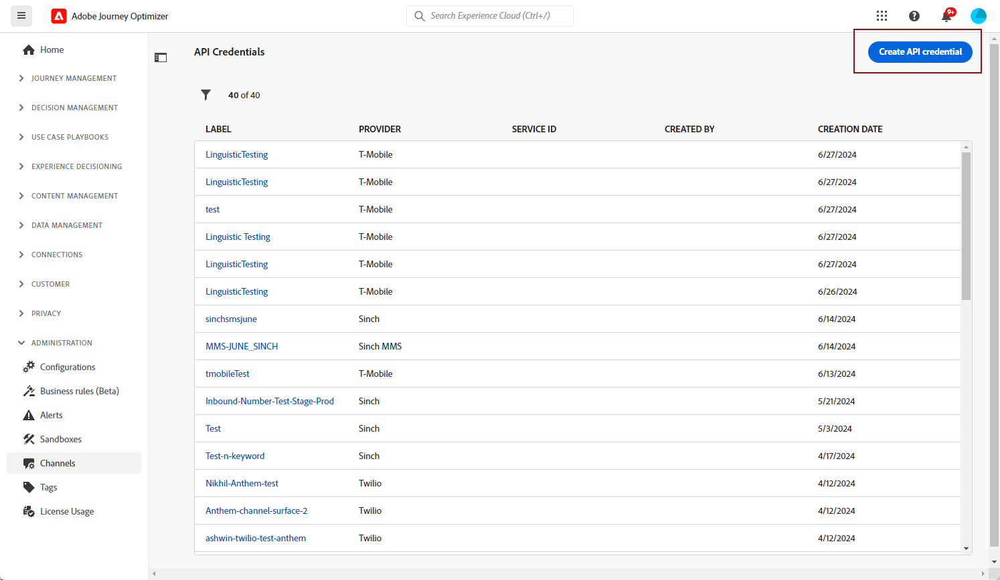
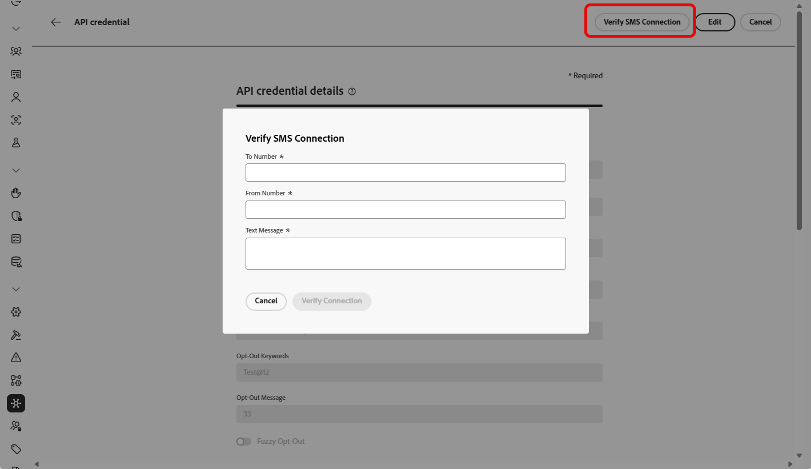
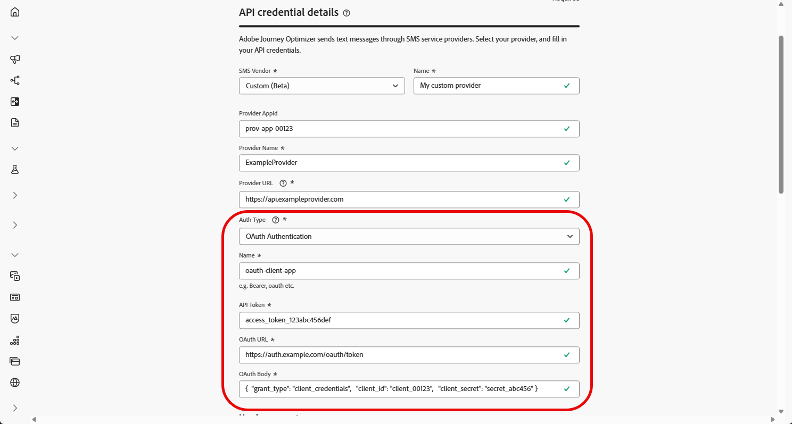
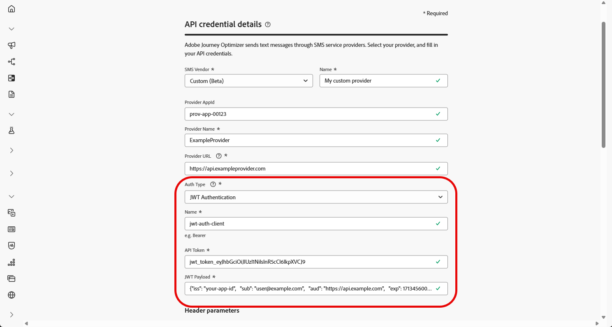

# 配置自定义提供商 {#sms-configuration-custom}

>[!BEGINSHADEBOX]

**在此页面上：**&#x200B;了解如何通过创建API凭据、选择身份验证方法以及配置标头、有效负载和入站设置来在Adobe Journey Optimizer中集成自定义消息传递提供程序，以发送SMS和RCS消息。

>[!ENDSHADEBOX]

>[!CONTEXTUALHELP]
>id="ajo_admin_sms_api_byop_provider_url"
>title="提供程序 URL"
>abstract="指定您计划连接的外部 API 的 URL。 此 URL 是访问 API 的特性和功能的端点。"

>[!CONTEXTUALHELP]
>id="ajo_admin_sms_api_byop_header_parameters"
>title="标头参数"
>abstract="指定附加标头的标签、类型和值，以启用正确的身份验证、内容格式和有效的 API 通信。 "

>[!CONTEXTUALHELP]
>id="ajo_admin_sms_api_byop_provider_payload"
>title="提供程序负载"
>abstract="提供请求负载以确保发送正确的数据以供处理和生成响应。"

>[!CONTEXTUALHELP]
>id="ajo_admin_sms_api_byop_response_msg_id_extractor"
>title="提供程序负载"
>abstract="指定 Journey Optimizer 如何从提供程序的发送响应中提取唯一的消息 ID。  字段匹配：输入字段名称（如 messageId）。 AJO 将扫描响应，然后返回第一个匹配值。  点表示法：输入此字段的路径（例如 messages.0.id）。 为数组使用数值区段。 无 $ 前缀。  如果您的提供程序支持传递一个回调数据字段的方式，请留空。"

此功能使您能够集成和配置自己的报文传送提供商，在默认选项（Sinch、Twilio和Infobip）之外提供灵活性。 这能够实现移动设备消息的无缝创作、交付、报告和同意管理。

通过自定义提供商配置，您可以直接在Journey Optimizer中连接第三方消息服务，自定义动态内容的消息负载，以及管理选择加入/选择退出偏好设置以确保短信和RCS渠道之间的合规性。

要配置自定义提供商，请执行以下步骤：

1. [创建API凭据](#api-credential)
1. [创建 Webhook](mobile-webhook.md)
1. [创建渠道配置](mobile-configuration-surface.md)
1. [通过短信渠道操作创建历程或营销活动](create-mobile-message.md)

## 创建API凭据 {#api-credential}

要在Journey Optimizer中使用Adobe提供的现成可用的自定义提供商（例如Sinch、Infobip、Twilio）发送移动设备消息，请执行以下步骤：

1. 在左边栏中，导航到&#x200B;**[!UICONTROL 管理]** `>` **[!UICONTROL 渠道]**，选择&#x200B;**[!UICONTROL SMS设置]**&#x200B;下的&#x200B;**[!UICONTROL API凭据]**&#x200B;菜单，然后单击&#x200B;**[!UICONTROL 创建新API凭据]**&#x200B;按钮。

   

1. 配置您的SMS API凭据，如下所述：

   * **[!UICONTROL SMS供应商]**：自定义。

   * **[!UICONTROL 名称]**：输入API凭据的名称。

   * **[!UICONTROL 提供程序AppId]**：输入您的SMS提供程序提供的应用程序ID。

   * **[!UICONTROL 提供商名称]**：输入短信提供商的名称。

   * **[!UICONTROL 提供程序URL]**：输入短信提供程序的URL。

   * **[!UICONTROL 身份验证类型&#x200B;]**：选择授权类型，并根据所选的身份验证方法[完成相应的字段](#auth-options)。

     

1. 启用&#x200B;**[!UICONTROL mTLS支持]**&#x200B;选项，该选项可确保客户端和服务器在建立安全连接之前相互进行身份验证。

   要仅使用mTLS，请从&#x200B;**[!UICONTROL 身份验证类型]**&#x200B;下拉列表中选择&#x200B;**[!UICONTROL 无身份验证]**，然后启用&#x200B;**[!UICONTROL mTLS支持]**。

   请注意，mTLS仅适用于SMS提供商（消息发送）端点。 OAuth令牌端点不得使用mTLS。 在测试之前，请确保在令牌端点上禁用了mTLS。

   >[!IMPORTANT]
   >
   >通过从[MTLS公共证书API](https://experienceleague.adobe.com/zh-hans/docs/experience-platform/data-governance/mtls-api/public-certificate-endpoint)下载公共证书并将其添加到服务器信任存储区（预期的客户端CN： `ajo-sms.aep-mtls.adobe.com`），将SMS发送端点配置为信任Adobe Experience Platform证书颁发机构链，否则Journey Optimizer将忽略客户端证书，SMS投放失败。

1. 在&#x200B;**[!UICONTROL 标头]**&#x200B;部分中，单击&#x200B;**[!UICONTROL 添加新参数]**&#x200B;以指定将发送到外部服务的请求消息的HTTP标头。

   默认情况下，**Content-Type**&#x200B;和&#x200B;**Charset**&#x200B;标头字段已设置，无法删除。

   

1. 添加您的&#x200B;**[!UICONTROL 提供程序负载]**&#x200B;以验证和自定义您的请求负载。

   对于RCS消息，此有效负载稍后将在[内容设计](create-mobile-message.md#sms-content)期间使用。

   >[!NOTE]
   >
   >配置具有基本或持有者身份验证的自定义SMS提供商时，必须在JSON有效负载中包含`authOption`参数。 此外，**提供程序有效负载**&#x200B;必须引用模板变量`{{fromNumber}}`、`{{toNumber}}`和`{{message}}`。

1. 选择&#x200B;**[!UICONTROL 对入站]**&#x200B;使用自定义数据集，将此凭据的入站SMS路由到您从下拉列表选择的预创建的数据集。 [了解有关对入站关键字使用自定义数据集的更多信息](custom-dataset-inbound-keywords.md)

   >[!NOTE]
   >
   >数据集架构必须是&#x200B;**[!UICONTROL XDM ExperienceEvent]**，并且至少包括以下字段组：
   >* Adobe CJM ExperienceEvent — 消息交互详细信息
   >* Adobe CJM ExperienceEvent — 消息执行详细信息
   >* Adobe CJM ExperienceEvent — 消息配置文件详细信息
   >
   >必须为配置文件启用架构和数据集。

1. 完成API凭据配置后，单击&#x200B;**[!UICONTROL 提交]**。

1. 在&#x200B;**[!UICONTROL API凭据]**&#x200B;菜单中，单击以删除您的API凭据。

   

1. 要修改现有凭据，请找到所需的API凭据，然后单击&#x200B;**[!UICONTROL 编辑]**&#x200B;选项以进行必要更改。

   

1. 单击现有API凭据中的&#x200B;**[!UICONTROL 验证SMS连接]**，通过向指定设备发送示例消息来测试和验证SMS API凭据。

1. 填写&#x200B;**数字**&#x200B;和&#x200B;**消息**&#x200B;字段，然后单击&#x200B;**[!UICONTROL 验证连接]**。

   >[!IMPORTANT]
   >
   >消息的结构必须与提供商的有效负荷格式保持一致。

   

创建和配置API凭据后，现在需要为Webhook[&#128279;](#webhook)设置入站设置，以发送短信消息。

### 自定义 SMS 提供商的身份验证选项 {#auth-options}

>[!CONTEXTUALHELP]
>id="ajo_admin_sms_api_byop_auth_type"
>title="身份验证类型"
>abstract="指定访问 API 所需的身份验证方法，这可确保与外部服务进行安全和授权的通信。"

>[!BEGINTABS]

>[!TAB API密钥]

创建API凭据后，完成API密钥身份验证所需的字段：

* **[!UICONTROL 名称]**&#x200B;：输入API密钥配置的名称。
* **[!UICONTROL API令牌]**&#x200B;：输入您的SMS提供商提供的API令牌。

>[!TAB MAC身份验证]

创建API凭据后，完成MAC身份验证所需的字段：

* **[!UICONTROL 名称]**&#x200B;：输入MAC身份验证配置的名称。
* **[!UICONTROL API令牌]**&#x200B;：输入您的SMS提供商提供的API令牌。
* **[!UICONTROL API密钥]**：输入您的SMS提供商提供的API密钥。 此密钥用于生成MAC（消息身份验证代码）以进行安全通信。
* **[!UICONTROL Mac授权哈希格式]**：选择MAC身份验证的哈希格式。

>[!TAB OAuth身份验证]

创建API凭据后，完成OAuth身份验证所需的字段：

* **[!UICONTROL 名称]**&#x200B;：输入OAuth身份验证配置的名称。

* **[!UICONTROL API令牌]**&#x200B;：输入您的SMS提供商提供的API令牌。

* **[!UICONTROL OAuth URL]**&#x200B;：输入用于获取OAuth令牌的URL。

* **[!UICONTROL OAuth主体]**&#x200B;：提供JSON格式的OAuth请求主体，包括`grant_type`、`client_id`和`client_secret`等参数。

Journey Optimizer会在自定义SMS连接器到期时动态刷新OAuth令牌。

>[!TAB JWT身份验证]

创建API凭据后，完成JWT身份验证所需的字段：

* **[!UICONTROL 名称]**&#x200B;：输入JWT身份验证配置的名称。

* **[!UICONTROL API令牌]**&#x200B;：输入您的SMS提供商提供的API令牌。

* **[!UICONTROL JWT有效负载]**&#x200B;：输入包含JWT所需声明的JSON有效负载，如颁发者、主题、受众和到期日期。

>[!ENDTABS]

## 操作方法视频 {#video}

>[!VIDEO](https://video.tv.adobe.com/v/3431625)

