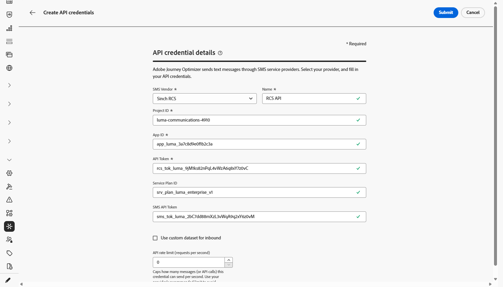

# 配置 Sinch 提供程序 {#sms-configuration-sinch}

在将Sinch提供程序与Journey Optimizer结合使用时，您可以找到三个不同的选项：

* **SMS配置**：设置您的Sinch API凭据以无缝发送SMS消息。

* **MMS配置**：对于多媒体消息(MMS)，请配置Sinch MMS API凭据。 请注意，跟踪和响应入站消息由短信配置处理。 MMS设置仅用于MMS消息的出站投放。

* **RCS配置**：设置您的Sinch API凭据以无缝发送RCS消息。

要配置Sinch提供程序，请执行以下步骤：

1. [创建API凭据](#create-api)
1. [创建 Webhook](mobile-webhook.md)
1. [创建渠道配置](mobile-configuration-surface.md)
1. [通过短信渠道操作创建历程或营销活动](create-mobile-message.md)

## 配置短信的API凭据{#create-api}

要配置您的Sinch提供商以使用Journey Optimizer发送短信消息和彩信，请执行以下步骤：

1. 在左边栏中，浏览到&#x200B;**[!UICONTROL 管理]** > **[!UICONTROL 渠道]** `>` **[!UICONTROL SMS设置]**&#x200B;并选择&#x200B;**[!UICONTROL API凭据]**&#x200B;菜单。 单击&#x200B;**[!UICONTROL 创建新API凭据]**&#x200B;按钮。

1. 配置您的SMS API凭据，如下所述：

   +++ 用于配置的短信凭据列表

   | 配置字段 | 描述 |
   |---|---|
   | SMS供应商 | Sinch |
   | 名称 | 选择API凭据的名称。 |
   | 服务ID和API令牌 | 访问API页面，您可以在SMS选项卡下找到凭据。 请参阅[Sinch文档](https://developers.sinch.com/docs/sms/getting-started/){target="_blank"}以了解详情。 |
   | 入站编号 | 添加唯一的入站编号或短代码。 这允许您在不同沙盒中使用相同的API凭据，每个沙盒具有自己的入站编号或短代码。 |
   | 覆盖URL | 输入您的自定义URL以替换SMS投放报告、反馈数据、入站消息或事件通知的默认端点。 Sinch会将所有相关更新发送到此URL，而不是预定义的更新。 |

   +++

<!--
1. Choose how user consent should be tracked for messaging:

    * **[!UICONTROL Sender short code]**: Inbound keyword consent is keyed to your **sender short code** only. Use when one inbound number is enough to represent consent.

    * **[!UICONTROL Sender short code + profile number]**: Consent is keyed to the **sender short code** and the profile **mobile number**. Use when profiles can have several numbers, or when opt-in/out must apply per sender and recipient pair.
-->

1. 选择&#x200B;**[!UICONTROL 对入站]**&#x200B;使用自定义数据集，将此凭据的入站SMS路由到您从下拉列表选择的预创建的数据集。 [了解有关对入站关键字使用自定义数据集的更多信息](../mobile/custom-dataset-inbound-keywords.md)

   >[!NOTE]
   >
   >数据集架构必须是&#x200B;**[!UICONTROL XDM ExperienceEvent]**，并且至少包括以下字段组：
   >* Adobe CJM ExperienceEvent — 消息交互详细信息
   >* Adobe CJM ExperienceEvent — 消息执行详细信息
   >* Adobe CJM ExperienceEvent — 消息配置文件详细信息
   >
   >必须为配置文件启用架构和数据集。

1. 完成API凭据配置后，单击&#x200B;**[!UICONTROL 提交]**。

1. 在&#x200B;**[!UICONTROL API凭据]**&#x200B;菜单中，单击bin图标以删除您的API凭据。

1. 要修改现有凭据，请找到所需的API凭据，然后单击&#x200B;**[!UICONTROL 编辑]**&#x200B;选项以进行必要更改。

1. 单击现有API凭据中的&#x200B;**[!UICONTROL 验证SMS连接]**，通过向指定设备发送示例消息来测试和验证SMS API凭据。

1. 填写&#x200B;**数字**&#x200B;和&#x200B;**消息**&#x200B;字段，然后单击&#x200B;**[!UICONTROL 验证连接]**。

   >[!IMPORTANT]
   >
   >消息的结构必须与提供商的有效负荷格式保持一致。

   

创建和配置API凭据后，您现在需要创建[您的Webhook](mobile-webhook.md)和RCS消息的通道配置。 [了解详情](mobile-configuration-surface.md)

## 为MMS配置API凭据{#sinch-mms}

>[!IMPORTANT]
>
> 除了MMS设置之外，您还需要创建专门用于跟踪入站消息和管理同意请求的Sinch API凭据。

要配置Sinch MMS以使用Journey Optimizer发送MMS，请执行以下步骤：

1. 在左边栏中，浏览到&#x200B;**[!UICONTROL 管理]** > **[!UICONTROL 渠道]** `>` **[!UICONTROL SMS设置]**&#x200B;并选择&#x200B;**[!UICONTROL API凭据]**&#x200B;菜单。 单击&#x200B;**[!UICONTROL 创建新API凭据]**&#x200B;按钮。

1. 配置您的MMS API凭据，如下所述：

   * **[!UICONTROL SMS供应商]**： Sinch MMS。

   * **[!UICONTROL 名称]**：输入API凭据的名称。

   * **[!UICONTROL 项目ID]**、**[!UICONTROL 应用程序ID]**&#x200B;和&#x200B;**[!UICONTROL API令牌]**：请按照以下步骤收集您的MMS API凭据。

      * 对于&#x200B;**[!UICONTROL 项目ID]**&#x200B;和&#x200B;**[!UICONTROL 应用程序ID]**：访问Sinch仪表板上Sinch项目的[对话API概述](https://dashboard.sinch.com/convapi/overview)页面。
      * 对于&#x200B;**[!UICONTROL API令牌]**：获取Sinch项目的[访问密钥](https://community.sinch.com/t5/Customer-Dashboard/Sinch-Access-Keys/ta-p/12638)，并生成Sinch项目&#x200B;**访问密钥**&#x200B;中的&#x200B;**Base64 API令牌**。

1. 完成API凭据配置后，单击&#x200B;**[!UICONTROL 提交]**。

1. 在&#x200B;**[!UICONTROL API凭据]**&#x200B;菜单中，单击bin图标以删除您的API凭据。

1. 要修改现有凭据，请找到所需的API凭据，然后单击&#x200B;**[!UICONTROL 编辑]**&#x200B;选项以进行必要更改。

创建和配置API凭据后，您现在需要创建[您的Webhook](mobile-webhook.md)和RCS消息的通道配置。 [了解详情](mobile-configuration-surface.md)

## 为RCS配置API凭据

<!---->

Journey Optimizer通过Sinch支持RCS（富通信服务）消息传递，允许使用经过验证的企业个人资料以及品牌元素（如徽标和发件人名称）发送基本消息。

本地RCS创作需要Sinch RCS。 Twilio、Infobip和其他提供程序必须使用[自定义提供程序集成](mobile-configuration-custom.md)。

请注意，当用户档案的设备不支持RCS或暂时无法通过RCS访问时，消息会自动回退到短信。

要配置Sinch RCS以使用Journey Optimizer发送RCS，请执行以下步骤：

1. 在左边栏中，浏览到&#x200B;**[!UICONTROL 管理]** > **[!UICONTROL 渠道]** `>` **[!UICONTROL SMS设置]**&#x200B;并选择&#x200B;**[!UICONTROL API凭据]**&#x200B;菜单。 单击&#x200B;**[!UICONTROL 创建新API凭据]**&#x200B;按钮。

1. 配置您的RCS API凭据，如下所述：

   * **[!UICONTROL SMS供应商]**： Sinch RCS。

   * **[!UICONTROL 名称]**：输入API凭据的名称。

   * **[!UICONTROL 项目ID]**、**[!UICONTROL 应用程序ID]**&#x200B;和&#x200B;**[!UICONTROL API令牌]**：输入您Sinch RCS帐户中的项目ID、应用程序ID和API令牌。

   * **[!UICONTROL 服务计划ID]**：输入与您的Sinch帐户关联的服务计划ID。

   * **[!UICONTROL SMS API令牌]**：输入来自Sinch帐户的SMS API令牌。

   

1. （可选）启用&#x200B;**[!UICONTROL 为入站]**&#x200B;使用自定义数据集选项以在自定义数据集中存储入站RCS消息。 [了解详情](../mobile/custom-dataset-inbound-keywords.md)

1. 设置&#x200B;**[!UICONTROL API速率限制（每秒请求数）]**&#x200B;以限制每秒最大API调用数，使用提供商的推荐值以避免限制，或者将无限制请求限制为0。

1. 完成API凭据配置后，单击&#x200B;**[!UICONTROL 提交]**。

1. 在&#x200B;**[!UICONTROL API凭据]**&#x200B;菜单中，单击bin图标以删除您的API凭据。

1. 要修改现有凭据，请找到所需的API凭据，然后单击&#x200B;**[!UICONTROL 编辑]**&#x200B;选项以进行必要更改。

创建和配置API凭据后，您现在需要创建[您的Webhook](mobile-webhook.md)和RCS消息的通道配置。 [了解详情](mobile-configuration-surface.md)

<!--
### Basic RCS Messages

>[!AVAILABILITY]
>
> Basic RCS messages is only available upon Adobe RCS add-on offering.

1. **Set up your branded RCS agent**

    Create a branded RCS agent in the Sinch Dashboard. [Learn more on branded RCS agent](https://community.sinch.com/t5/RCS/Getting-Started-with-RCS-using-Conversation-API/ta-p/17844)

1. **Set up your [Custom API credentials](mobile-configuration-custom.md)**
    
    Once your RCS agent is approved, you need to set up your Sinch API credentials, which include your access key, secret, and service plan ID. These credentials will be used by Journey Optimizer to authenticate and send messages through Sinch's platform.

1. **Create a [channel configuration](mobile-configuration-surface.md) for your RCS messages**

    Configure a channel surface in Journey Optimizer by linking your Sinch credentials and defining the messaging parameters. This setup enables you to compose and send RCS messages from Journey Optimizer.

1. **Create and personalize your [SMS message](../mobile/create-mobile-message.md)**

    Your messages automatically falls back to SMS when the profile's device does not support RCS or is temporarily unreachable via RCS.
-->

