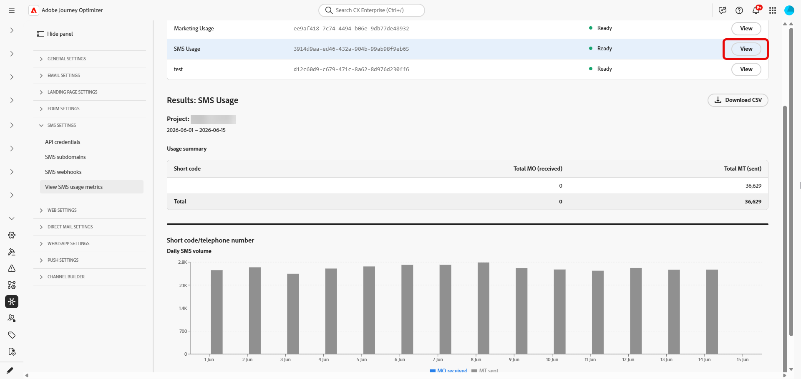

# 生成短信使用情况报告 {#sms-usage-report}

>[!CONTEXTUALHELP]
>id="ajo_admin_sms_usage_metrics"
>title="短信使用量度"
>abstract="生成短信使用情况报告，以便核对消息发送量与供应商账单。 报告会按天汇总每个短代码或电话号码对应的移动终端接收（MT）和移动终端发送（MO）数量。"

>[!BEGINSHADEBOX]

**在此页面上：**&#x200B;在Adobe Journey Optimizer中生成SMS使用情况报告，以使用Sinch MMS API凭据和可下载的CSV输出协调移动端终止(MT)和移动端发起(MO)的卷，以及供应商计费。

>[!ENDSHADEBOX]

通过Adobe Journey Optimizer购买短信时，可以使用短信使用情况量度。 报告汇总了过去&#x200B;**90天**&#x200B;内按短代码或电话号码汇总的发送和接收流量（按天汇总）。

要查看使用情况度量，管理员必须：

1. [创建仅用于从Sinch检索使用数据的Sinch MMS API凭据](mobile-configuration-sinch.md#sinch-mms)。

   使用报告需要将&#x200B;**[!UICONTROL SMS供应商]**&#x200B;的API凭据设置为&#x200B;**Sinch MMS**。 此凭据将Journey Optimizer连接到Sinch，以便可以检索使用情况数据。 它不同于用于发送短信或彩信消息的Sinch凭据，尽管字段值来自相同的Sinch项目。

1. [配置和检索SMS使用情况报告](#configure-sms-usage-report)。

这些步骤需要&#x200B;**[!UICONTROL 管理短信设置]**&#x200B;权限。 [了解有关权限的更多信息](../administration/high-low-permissions.md#administration-permissions)。

## 配置并查看短信使用情况报告 {#configure-sms-usage-report}

>[!CONTEXTUALHELP]
>id="ajo_admin_sms_usage_report_name"
>title="报告名称"
>abstract="输入一个便于您日后在列表中识别此报告的标签，例如“2026 年 5 月账单审核”。"

>[!CONTEXTUALHELP]
>id="ajo_admin_sms_usage_credential"
>title="短信凭据"
>abstract="选择要在此报告中显示发送和接收流量的 Sinch API 凭据。 要添加或更新凭据，请转到&#x200B;**管理** > **渠道** > **API 凭据**，然后选择&#x200B;**短信供应商** > **Sinch MMS**。"

>[!CONTEXTUALHELP]
>id="ajo_admin_sms_usage_start_date"
>title="开始日期"
>abstract="报告所包含日期范围的开始日期。 仅提供最近 90 天的使用数据。"

SMS使用情况报告通过短代码显示源自移动设备(MO)和终止移动设备(MT)的卷，以支持Journey Optimizer中供应商计费和消息传送活动之间的对账。

1. 在左边栏中，浏览到&#x200B;**[!UICONTROL 管理]** > **[!UICONTROL 渠道]** > **[!UICONTROL 短信设置]**。

1. 访问&#x200B;**[!UICONTROL 查看短信使用量度]**&#x200B;菜单，然后单击&#x200B;**[!UICONTROL 配置新报表]**。

   

1. 配置报表：

   * **[!UICONTROL 报表名称]**：输入有助于识别报表的标签。
   * **[!UICONTROL SMS凭据]**：选择您之前为SMS使用情况报告创建的&#x200B;**Sinch MMS** API凭据。
   * **[!UICONTROL 开始日期]**&#x200B;和&#x200B;**[!UICONTROL 结束日期]**：设置报表的日期范围。 仅提供最近 90 天的使用数据。

     

1. 单击&#x200B;**[!UICONTROL 配置报表]**&#x200B;提交请求。

1. 在&#x200B;**[!UICONTROL 提交的报表]**&#x200B;列表中，找到您配置的报告，然后单击&#x200B;**[!UICONTROL 检索报表]**。

   生成报告时，状态更改为&#x200B;**挂起**。

1. 报告状态更新为&#x200B;**[!UICONTROL 就绪]**&#x200B;后，单击&#x200B;**[!UICONTROL 查看]**&#x200B;以打开报告。 该报告包括：

   * **使用情况摘要**：所选日期的移动设备发起的(MO)和移动终止的(MT)消息总数，按短代码细分。

   * **每日短信卷**：按日划分的短信卷，按短代码划分。

     

1. 要导出报告，请单击&#x200B;**[!UICONTROL 下载CSV]**。 Journey Optimizer会为您正在查看的报表下载一个CSV文件。
