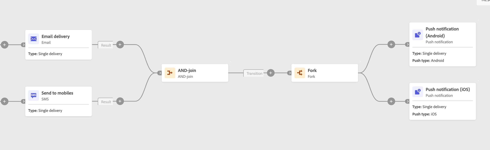

# AND-join {#join}

>[!CONTEXTUALHELP]
>id="ajo_orchestration_and-join"
>title="AND-join 活动"
>abstract="**和加入**&#x200B;活动允许您同步一个精心组织的市场活动的多个执行分支。 一旦完成所有之前的活动，即会触发该活动。这样，您可以确保在继续执行精心组织的市场活动之前，某些活动已经完成。"

**AND-连接**&#x200B;活动是&#x200B;**流量控制**&#x200B;活动。它允许您同步已编排市场活动的多个执行分支。

一旦激活所有集客过渡，换言之，一旦完成所有先行工作，此活动就会触发其所有叫客过渡。这样，在继续执行精心策划的活动之前，您可以确保某些活动已经完成。

## 配置 AND-join 活动{#and-join-configuration}

>[!CONTEXTUALHELP]
>id="ajo_orchestration_and-join_merging"
>title="合并选项"
>abstract="选择您要参加的活动。在&#x200B;**主要集合**&#x200B;下拉列表中，选择要保留的集客过渡群体。"

请按照以下步骤操作，配置 **AND-连接**&#x200B;活动：

1. 添加多项活动（例如渠道活动），来构成至少两个不同的执行分支。
1. 向任何分支添加一个 **AND-连接**&#x200B;活动。
1. 在&#x200B;**合并选项**&#x200B;部分中，选中您之前希望加入的所有活动。
1. 在&#x200B;**主集**&#x200B;下拉列表中，选择您要保留的集客过渡群体。叫客过渡只能包含集客过渡群体之一。

## 示例{#and-join-example}

以下示例显示了两个经过精心组织的市场活动分支，其中具有电子邮件和SMS发送。 当两个集客过渡均启用时，将触发 AND-连接。只有在两次投放完成后才会发送推送通知。

{zoomable="yes"}
