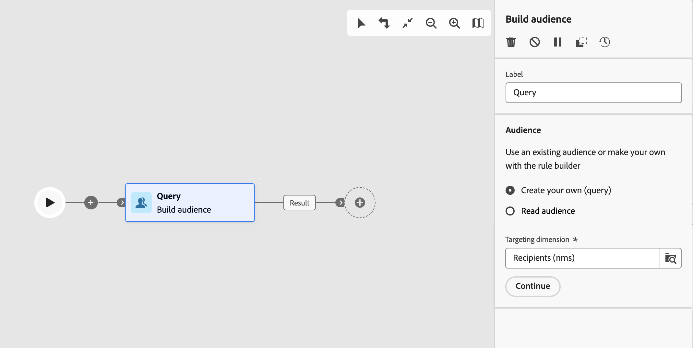

# 构建受众 {#build-audience}

>[!CONTEXTUALHELP]
>id="ajo_orchestration_build_audience"
>title="构建受众活动"
>abstract="利用&#x200B;**构建受众**&#x200B;活动，可定义将进入编排营销活动的受众。 在编排营销活动的上下文中发送消息时，未在渠道活动中定义消息受众，但在&#x200B;**构建受众**&#x200B;活动中定义。"

**生成受众**&#x200B;活动是一个&#x200B;**定位**&#x200B;活动。利用此活动，可定义将进入编排营销活动的受众。 在编排营销活动的上下文中发送消息时，未在渠道活动中定义消息受众，但在&#x200B;**构建受众**&#x200B;活动中定义。

要定义受众群体，您可以：

* 选择 Adobe Experience Platform 受众。
* 通过定义和组合筛选条件，使用查询建模器构建新受众。

>[!NOTE]
>
>无法使用构建受众活动定位从文件加载的受众。 为此，您需要先使用&#x200B;**加载文件**&#x200B;活动，然后再使用&#x200B;**协调**&#x200B;活动。

<!--
The **Build audience** activity can be placed at the beginning of the workflow or after any other activity. Any activity can be placed after the **Build audience**.
-->

## 配置构建受众活动 {#build-audience-configuration}

>[!CONTEXTUALHELP]
>id="ajo_orchestration_build_audience_audienceselector"
>title="受众"
>abstract="选择您的受众，就像设计新投放时使用受众一样。"

请按照以下步骤配置&#x200B;**生成受众**&#x200B;活动：

1. 添加一个&#x200B;**生成受众**&#x200B;活动。
1. 定义一个标签。
1. 定义受众类型：**创建您自己的**&#x200B;或&#x200B;**读取受众**。
1. 按照以下选项卡中详述的步骤配置受众。

>[!BEGINTABS]

>[!TAB 创建您自己的（查询）]

要创建自己的查询，请执行以下步骤：

1. 选择&#x200B;**创建您自己的（查询）**。
1. 选择&#x200B;**定位维度**。通过定位维度，可定义操作面向的群体：收件人、合同受益人、操作人员、订阅者等。默认情况下从收件人中选择目标。
1. 单击&#x200B;**继续**。
1. 使用查询建模器定义查询，与设计新电子邮件时创建受众的方式相同。

>[!TAB 读取受众]

要选择现有受众，请执行以下步骤：

1. 选择&#x200B;**读取受众**。
1. 单击&#x200B;**继续**。
1. 选择您的受众，就像设计新投放时使用受众一样。

>[!ENDTABS]

## 示例{#build-audience-examples}

以下是包含两个&#x200B;**构建受众**&#x200B;活动的编排营销活动示例。 第一个示例针对扑克玩家受众，然后是电子邮件投放。第二个示例针对 VIP 客户受众，然后是短信投放。

