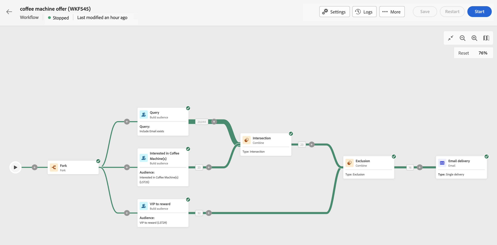

# 计划并开始您精心策划的营销活动 {#start-monitor}

>[!CONTEXTUALHELP]
>id="ajo_campaign_publication"
>title="发布精心策划的营销活动"
>abstract="要开始您的营销活动，您必须发布它。确保在发布之前清除所有警告。"

创建经过编排的任务并设计好要在画布中执行的任务后，您就可以发布它并监控其执行方式。

## 计划选项

>[!CONTEXTUALHELP]
>id="ajo_orchestration_scheduler"
>title="调度程序活动"
>abstract="您可以使用营销活动&#x200B;**调度程序**&#x200B;来计划协同营销活动何时开始。应将此活动视为已安排的一次开始。只能将它用作协同营销活动的第一个活动。"

作为营销活动经理，您可以将营销活动计划为在特定时间自动启动，从而为营销通信提供精确的时间和准确的定位数据。

### 最佳实践 {#scheduler-best-practices}

* 请勿将编排好的营销活动安排为每15分钟运行一次以上，因为它可能会影响整体系统性能，并在数据库中创建块。
* 如果要在编排的营销活动中发送一次性消息，可将其设置为运行&#x200B;**一次**。
* 如果要在编排的活动中发送定期消息，则需要使用&#x200B;**计划**&#x200B;选项并设置执行频率。 循环投放活动不允许您定义计划。

### 配置营销活动计划 {#scheduler-configuration}

>[!CONTEXTUALHELP]
>id="ajo_orchestration_schedule_validity"
>title="调度程序有效期"
>abstract="可定义调度程序的有效期。它可为永久（默认），也可一直有效至特定日期。"

>[!CONTEXTUALHELP]
>id="ajo_orchestration_schedule_options"
>title="调度程序选项"
>abstract="定义调度程序的频率。可在特定时刻执行它、每天、每周或每月执行它一次或多次。"

按照以下步骤配置&#x200B;**编排的活动计划**：

1. 在编排的活动画布顶部选择&#x200B;**尽快**&#x200B;按钮。

1. 配置&#x200B;**执行频率**：

   * **一次**：编排的活动只执行一次。

   * **每日**：编排的活动在特定时间执行，每天执行一次。

   * **一天数次：**&#x200B;编排的活动每天定期执行多次。 您可以设置在特定时间执行或定期执行。

   * **每周**：在指定的时间执行编排的营销活动，每周执行一次或多次。

   * **每月**：在指定的时间执行编排的营销活动，每月执行一次或多次。 您可以选择需要执行编排的活动的月份。 您还可以设置在月份的指定周日期（如每月的第二个星期二）执行。

     {width="50%" align="left"}

1. 根据所选频率定义执行详情。详情字段根据使用的频率（时间、重复频率、指定天数等）而有所不同。

1. 单击&#x200B;**预览启动时间**&#x200B;以检查您的编排活动接下来十次执行的计划。

1. 定义计划程序的有效期：

   * **永久（永不过期）**：根据指定的频率执行编排的营销活动，对时间范围或迭代次数没有任何限制。

   * **有效期**：按照指定的频率执行编排的营销活动，直到达到特定日期为止。 您需要指定开始日期和结束日期。

1. 选择&#x200B;**确认**&#x200B;以保存您的设置。 执行频率显示在编排的活动画布上方。

>[!TIP]
>
>如果要立即启动编排的营销活动，请尽快保留&#x200B;**默认值**。

## 示例 {#scheduler-example}

在下方的示例中，将活动配置为从2025年10月1日至2026年1月1日，编排的活动每天在早上9点和12点运行两次。

{width="50%" align="left"}

## 启动编排的营销活动 {#start}

要启动编排的营销活动，请导航到&#x200B;**[!UICONTROL 营销活动]**&#x200B;菜单的&#x200B;**[!UICONTROL 编排]**&#x200B;选项卡，选择要启动的营销活动，然后单击画布右上角的&#x200B;**[!UICONTROL 播放]**&#x200B;按钮。

运行编排的活动后，画布中的每个活动都会按顺序执行，直到达到编排的活动结束为止。

您可以使用可视流量实时跟踪目标用户档案的进度。 这允许您快速识别每个活动的状态以及它们之间转换的用户档案数。

{zoomable="yes"}

## 编排的活动过渡 {#transitions}

在编排的活动中，通过过渡从一个活动传输到另一个活动的数据存储在临时工作表中。 可以为每个过渡显示此数据。 要实现此目的，请选择过渡以在屏幕右侧打开其属性。

* 单击&#x200B;**[!UICONTROL 预览架构]**&#x200B;以显示工作表的架构。
* 单击&#x200B;**[!UICONTROL 预览结果]**&#x200B;以可视化在所选过渡中传输的数据。

{zoomable="yes"}

## 监测活动执行 {#activities}

通过每个活动框右上角的视觉指示器，可检查其执行情况：

| 视觉指示器 | 描述 |
|-----|------------|
| {zoomable="yes"}{width="70%"} | 当前正在执行活动。 |
| {zoomable="yes"}{width="70%"} | 该活动需要您注意。 这可能涉及确认发送投放或采取必要操作。 |
| {zoomable="yes"}{width="70%"} | 活动遇到错误。 要解决此问题，请打开编排的活动日志以了解更多信息。 |
| {zoomable="yes"}{width="70%"} | 已成功执行活动。 |

## 监测日志和任务 {#logs-tasks}

>[!CONTEXTUALHELP]
>id="ajo_campaign_logs"
>title="日志和任务"
>abstract="**日志和任务**&#x200B;屏幕提供了编排的活动执行的历史记录，记录了所有用户操作和遇到的错误。"

监测日志和任务是分析编排的营销活动并确保其正常运行的关键步骤。 可从操作工具栏中提供的&#x200B;**[!UICONTROL 日志]**&#x200B;图标以及每个活动的属性窗格中访问它们。

**[!UICONTROL 日志和任务]**&#x200B;菜单提供编排的活动执行的历史记录，记录所有用户操作和遇到的错误。

{zoomable="yes"}

提供了两种类型的信息：

* **[!UICONTROL 日志]**&#x200B;选项卡包含所有编排的营销活动的执行历史记录。 它按时间顺序对执行的操作和执行错误进行索引。
* **[!UICONTROL 任务]**&#x200B;选项卡详细列出了活动的执行顺序。

在这两个选项卡中，您可以选择显示的列及其顺序，应用过滤器，并使用搜索字段快速查找所需信息。

## 编排的活动执行命令 {#execution-commands}

右上角的操作栏提供了一些命令，允许您管理编排的活动执行。 您可以：

* **[!UICONTROL 开始]** / **[!UICONTROL 继续]**&#x200B;执行   经过编排的营销活动，该营销活动随后会呈现进行中状态。 如果暂停了编排的营销活动，则会恢复该营销活动，否则会启动该营销活动并激活初始活动。

* **[!UICONTROL 暂停]**&#x200B;执行编排的营销活动，该活动随后会呈现“已暂停”状态。 在恢复之前，不会激活任何新活动，但不会暂停正在进行的操作。

* **[!UICONTROL 停止]**&#x200B;正在执行的编排营销活动，该活动随后将呈现“已完成”状态。 如果可能，正在执行的操作会被中断。 您无法从已停止的同一位置恢复编排的营销活动。
