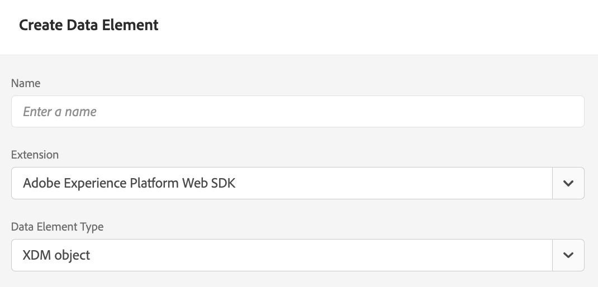

# 使用Edge Decisioning API提供优惠 {#edge-decisioning-api}

## 快速入门和先决条件 {#edge-overview-and-prerequisites}

[Adobe Experience Platform Web SDK](https://experienceleague.adobe.com/docs/experience-platform/edge/home.html?lang=zh-Hans#video-overview)是客户端JavaScript库，它允许Adobe Experience Cloud客户通过Experience PlatformEdge Network与Experience Cloud中的各种服务进行交互。

Experience PlatformWeb SDK支持在Adobe查询个性化解决方案，包括决策管理，从而允许您检索和呈现使用API或优惠库创建的个性化优惠。 有关更多详细说明，请参阅有关[创建选件](../../get-started/starting-offer-decisioning.md)的文档。

有两种方式可使用[Platform Web SDK](https://experienceleague.adobe.com/docs/experience-platform/edge/home.html?lang=zh-Hans#video-overview)实施决策管理。 一种方法是面向开发人员的，需要了解网站和编程。 另一种方法是使用Adobe Experience Platform用户界面设置选件，该选件只需要在HTML页面的标题中引用一个小型脚本。

有关如何使用Adobe Experience Platform Web SDK提供个性化优惠的更多信息，请参阅有关[决策管理](https://experienceleague.adobe.com/docs/experience-platform/edge/personalization/offer-decisioning/offer-decisioning-overview.html?lang=zh-Hans#enabling-offer-decisioning)的Adobe Experience Platform文档。

## Adobe Experience Platform Web SDK {#aep-web-sdk}

Platform Web SDK取代了以下SDK：

* Visitor.js
* AppMeasurement.js
* AT.js
* DIL.js

SDK未组合这些库，并且是从头开始的新实施。 要使用它，您必须首先执行以下步骤：

1. 确保您的组织具有使用SDK的相应权限，并且您已正确配置这些权限。

   <!-- For more detailed instructions, refer to the documentation on using the [Adobe Experience Platform Web SDK](). -->

1. [在Adobe Experience Cloud中帐户的“数据收集”选项卡中配置数据流](https://experienceleague.adobe.com/docs/experience-platform/edge/fundamentals/datastreams.html?lang=zh-Hans)。

1. 安装SDK。 有多种方法可用于执行此操作，这些方法将在[安装SDK页面](https://experienceleague.adobe.com/docs/experience-platform/edge/fundamentals/installing-the-sdk.html?lang=zh-Hans)中介绍。 本页将继续使用每种不同的实施方法。

要使用SDK，您必须定义[架构](../../../data/get-started-schemas.md)和[数据流](../../../data/get-started-datasets.md)。

<!-- ****TODO - Configure schema**** -->

要个性化优惠，您必须单独配置个性化/用户档案。

<!-- Refer to the [doc](www.link.com) for detailed instructions.  -->

要配置SDK以进行决策管理，请执行以下两个步骤之一：

## 选项1 — 使用Launch安装标记扩展和实施

此选项对于编码体验较少的人更加友好。

1. [创建标记属性](https://experienceleague.adobe.com/docs/experience-platform/tags/admin/companies-and-properties.html?lang=zh-Hans)

1. [添加嵌入代码](https://experienceleague.adobe.com/docs/core-services-learn/implementing-in-websites-with-launch/configure-launch/launch-add-embed.html?lang=zh-Hans)

1. 通过从“数据流”下拉列表中选择配置，使用您创建的数据流安装和配置Adobe Experience Platform Web SDK扩展。 请参阅有关[扩展](https://experienceleague.adobe.com/docs/experience-platform/tags/ui/extensions/overview.html?lang=zh-Hans)的文档。

   

   

1. 创建必要的[数据元素](https://experienceleague.adobe.com/docs/experience-platform/tags/ui/data-elements.html?lang=zh-Hans)。 您必须至少创建一个Platform Web SDK标识映射和一个Platform Web SDK XDM对象数据元素。

   

   

1. 创建您的[规则](https://experienceleague.adobe.com/docs/experience-platform/tags/ui/rules.html?lang=zh-Hans)：

   添加Platform Web SDK发送事件操作，并将相关的decisionScopes添加到该操作的配置中

   

   

1. [创建并发布](https://experienceleague.adobe.com/docs/experience-platform/tags/publish/libraries.html?lang=zh-Hans)一个包含所有已配置的相关规则、数据元素和扩展的库。

## 选项2 — 使用预建的独立版本手动实施

以下是使用Web SDK预建独立安装来使用决策管理所需的步骤。 本指南假定这是您首次实施SDK，因此所有步骤可能都不适用于您。 本指南还假定您有一些开发经验。

在您的HTML页的`<head>`部分中包含选项2中的以下JavaScript代码片段：[此页面](https://experienceleague.adobe.com/docs/experience-platform/edge/fundamentals/installing-the-sdk.html?lang=zh-Hans)上的预建独立版本。

```
javascript
    <script>
        !function(n,o){o.forEach(function(o){n[o]||((n.__alloyNS=n.__alloyNS||
        []).push(o),n[o]=function(){var u=arguments;return new Promise(
        function(i,l){n[o].q.push([i,l,u])})},n[o].q=[])})}
        (window,["alloy"]);
    </script>
    <script src="https://cdn1.adoberesources.net/alloy/2.6.4/alloy.js" async></script>
```

您需要在Adobe帐户中拥有两个ID才能设置SDK配置：edgeConfigId和orgId。 edgeConfigId与您的数据流ID相同，您应在先决条件中配置此ID。

要查找您的edgeConfigID/数据流ID，请转到数据收集并选择您的数据流。 要查找您的orgId，请转到您的个人资料。

按照此页面上的说明在JavaScript中配置SDK。 您始终将在配置函数中使用edgeConfigId和orgId。 此文档还介绍了您的配置中存在的可选参数。 最终配置可能如下所示：

```
javascript
    alloy("configure", {
        "edgeConfigId": "12345678-0ABC-DEF-GHIJ-KLMNOPQRSTUV",                            
        "orgId":"ABCDEFGHIJKLMNOPQRSTUVW@AdobeOrg",
        "debugEnabled": true,
        "edgeDomain": "edge.adobedc.net",
        "clickCollectionEnabled": true,
        "idMigrationEnabled": true,
        "thirdPartyCookiesEnabled": true,
        "defaultConsent":"in"  
    });
```

安装Debugger Chrome扩展以便用于调试。 可在此处找到： <https://chrome.google.com/webstore/detail/adobe-experience-platform/bfnnokhpnncpkdmbokanobigaccjkpob>

接下来，在Debugger中登录您的帐户。 然后，转到日志并确保已连接到正确的工作区。 现在，从优惠中复制决策范围的base64编码版本。

编辑网站时，请包含带有配置的脚本和`sendEvent`函数，以将决策范围发送到Adobe。

**示例**：

```
javascript
    alloy("sendEvent", {
        "decisionScopes": 
        [
        "eyJ4ZG06YWN0aXZpdHlJZCI6Inhjb3JlOm9mZmVyLWFjdGl2aXR5OjE0ZWE4MDhhZjJjZDM1NzQiLCJ4ZG06cGxhY2VtZW50SWQiOiJ4Y29yZTpvZmZlci1wbGFjZW1lbnQ6MTRjNGFmZDI2OTXXXXXXXXXX"
        ]
    });
```

有关如何处理响应的示例，请参阅以下内容：

```
javascript
    alloy("sendEvent", {
        "decisionScopes":
        [
        "eyJ4ZG06YWN0aXZpdHlJZCI6Inhjb3JlOm9mZmVyLWFjdGl2aXR5OjE0ZWE4MDhhZjJjZDM1NzQiLCJ4ZG06cGxhY2VtZW50SWQiOiJ4Y29yZTpvZmZlci1wbGFjZW1lbnQ6MTRjNGFmZDI2OTXXXXXXXXXX"
        ]
    }).then(function(result) {
        Object.entries(result).forEach(([key, value]) => {
            console.log(key, value);
        });
    });
```

您可以使用Debugger验证是否已成功连接到Edge网络。

>[!NOTE]
>
>如果日志中未显示与边缘的连接，则可能需要禁用广告拦截器。

请参阅如何创建选件和使用的格式。 根据决策中符合的标准，系统会向您返回一个选件，其中包含您在Adobe Experience Platform中创建该选件时指定的信息。

在此示例中，要返回的JSON是：

```
json
{
   "name":"ABC Test",
   "description":"This is a test offer", 
   "link":"https://sampletesting.online/",
   "image":"https://sample-demo-URL.png"
}
```

处理响应对象并解析所需的数据。 由于你可以在一个`sendEvent`调用中发送多个决策范围，因此你的响应可能略有不同。

```
json
    {
        "id": "abrxgl843d913",
        "scope": "eyJ4ZG06YWN0aXZpdHlJZCI6Inhjb3JlOm9mZmVyLWFjdGl2aXR5OjE0ZWE4MDhhZjJjZDM1NzQiLCJ4ZG06cGxhY2VtZW50SWQiOiJ4Y29yZTpvZmZlci1wbGFjZW1lbnQ6MTRjNGFmZDI2OTVlNWRmOSJ9",
        "items": 
        [
            {
                "id": "xcore:fallback-offer:14ea7f1ea26ebd0a",
                "etag": "1",
                "schema": "https://ns.adobe.com/experience/offer-management/content-component-json",
                "data": {
                    "id": "xcore:fallback-offer:14ea7f1ea26ebd0a",
                    "format": "application/json",
                    "language": [
                        "en-us"
                    ],
                    "content": "{\"name\":\"ABC Test\",\"description\":\"This is a test offer\", \"link\":\"https://sampletesting.online/\",\"image\":\"https://sample-demo-URL.png\"}"
                }
            }
        ]
    }
]
}
```

```
json
{
    "propositions": 
    [
    {
        "renderAttempted": false,
        "id": "e15ecb09-993e-4b66-93d8-0a4c77e3d913",
        "scope": "eyJ4ZG06YWN0aXZpdHlJZCI6Inhjb3JlOm9mZmVyLWFjdGl2aXR5OjE0ZWE4MDhhZjJjZDM1NzQiLCJ4ZG06cGxhY2VtZW50SWQiOiJ4Y29yZTpvZmZlci1wbGFjZW1lbnQ6MTRjNGFmZDI2OTVlNWRmOSJ9",
        "items": 
        [
            {
                "id": "xcore:fallback-offer:14ea7f1ea26ebd0a",
                "etag": "1",
                "schema": "https://ns.adobe.com/experience/offer-management/content-component-json",
                "data": {
                    "id": "xcore:fallback-offer:14ea7f1ea26ebd0a",
                    "format": "application/json",
                    "language": [
                        "en-us"
                    ],
                    "content": "{\"name\":\"Claire Hubacek Test\",\"description\":\"This is a test offer\", \"link\":\"https://sampletesting.online/\",\"image\":\"https://sample-demo-URL.png\"}"
                }
            }
        ]
    }
    ]
}
```

在此示例中，在网页中处理和使用特定于选件的详细信息所需的路径是： `result['decisions'][0]['items'][0]['data']['content']`

要设置JS变量，请执行以下操作：

```
javascript
const offer = JSON.parse(result['decisions'][0]['items'][0]['data']['content']);

let offerURL = offer['link'];
let offerDescription = offer['description'];
let offerImageURL = offer['image'];

document.getElementById("offerDescription").innerHTML = offerDescription;
document.getElementById('offerImage').src = offerImageURL;
```

<!--## Limitations

Some offer constraints are currently not supported with the mobile Experience Edge workflows, for example Capping. The Capping field value specifies the number of times an offer can be presented across all users. For more details, see [Add constraints to an offer](../../offer-library/add-constraints.md#capping).-->
