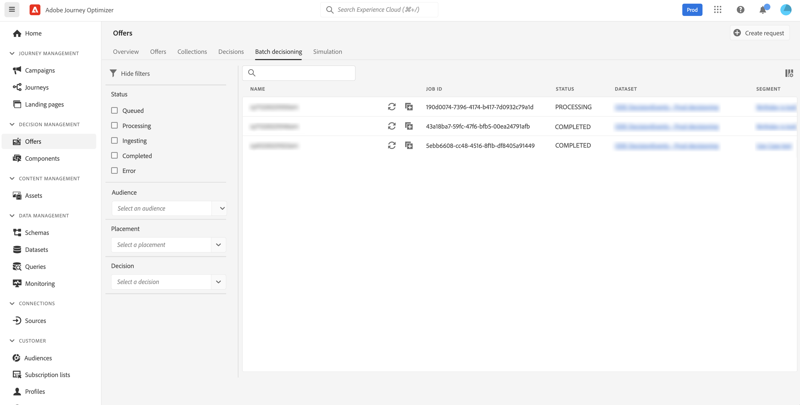

# 批量决策 {#deliver}

## 批量决策入门 {#start}

Journey Optimizer允许您向给定Adobe Experience Platform区段中的所有用户档案提供选件决策。

为此，您需要在Journey Optimizer中创建一个作业请求，其中将包含有关要定位的区段和要使用的选件决策的信息。 然后，区段中每个用户档案的选件内容会放置在Adobe Experience Platform数据集中，该数据集可用于自定义批量工作流。

也可以使用API执行批量交付。 有关更多信息，请参阅 [Batch Decisioning API文档](api-reference/offer-delivery-api/batch-decisioning-api.md).

## 先决条件 {#prerequisites}

在配置作业请求之前，请确保已创建：

* **数据集** 在Adobe Experience Platform。 此数据集将用于使用“ODE DecisionEvents”架构存储决策结果。 在 [数据集文档](https://experienceleague.adobe.com/docs/experience-platform/catalog/datasets/overview.html).

* **区段** 在Adobe Experience Platform。 应评估区段，然后对其进行更新。 了解如何在 [Segmentation Service文档](http://www.adobe.com/go/segmentation-overview-en)

   >[!NOTE]
   >
   >批处理作业在每天发生一次的配置文件快照之外运行。 批量决策会限制频率并始终从最新快照加载用户档案。

* **决定** 在Adobe Journey Optimizer。 [了解如何创建决策](offer-activities/create-offer-activities.md)

<!-- in API doc, remove these info and add ref here-->

## 创建作业请求

要创建新作业请求，请执行以下步骤。

1. 在 **[!UICONTROL Offers]** 菜单，打开 **[!UICONTROL Batch decisioning]** ，然后单击 **[!UICONTROL Create request]**.

   

1. 命名作业请求，然后选择应将作业数据发送到的数据集。

1. 选择要定位的Adobe Experience Platform区段。

1. 选择一个或多个用于将选件交付到区段的选件决策范围：
   1. 从列表中选择版面。
   1. 此时将显示所选版面的可用决策。 选择您选择的决策并单击 **[!UICONTROL Add]**.
   1. 重复该操作，以根据需要添加任意数量的决策范围。

   

1. 默认情况下，每个用户档案会返回一个决策范围选件。 您可以使用 **[!UICONTROL Request offer per profile]** 选项。 例如，如果您选择2，则将显示选定决策范围的2个最佳选件。

   >[!NOTE]
   >
   >每个决策范围最多可请求30个选件。

1. 如果要在数据集中包含选件内容，请切换 **[!UICONTROL Include content]** 选项。 默认情况下，此选项处于禁用状态。

1. 单击 **[!UICONTROL Create]** 执行作业请求。

## 监控批处理作业

所有请求的批处理作业均可从 **[!UICONTROL Batch decisioning]** 选项卡。 此外，搜索和筛选工具还可帮助您优化列表。

### 作业请求状态

创建作业请求后，批处理作业会经历多种状态：

>[!NOTE]
>
>要确保您获得有关作业请求状态的最新信息，请使用作业旁边的椭圆按钮刷新作业请求。

1. **[!UICONTROL Queued]**:作业请求已创建并进入处理队列。 每个数据集一次最多可以运行5个批处理作业。 具有相同输出数据集的任何其他批处理请求都会添加到队列中。 在上一个作业完成运行后，将选取已排队的作业进行处理。
1. **[!UICONTROL Processing]**:正在处理作业请求
1. **[!UICONTROL Ingesting]**:已执行作业请求，结果数据正在选定数据集中摄取，
1. **[!UICONTROL Completed]**:已执行作业请求，结果数据现已存储到选定的数据集中。

   >[!NOTE]
   >
   >您可以通过在作业列表中单击其名称来访问存储了作业结果的数据集。

如果执行作业请求时出错，将获取 **[!UICONTROL Error]** 状态。 尝试复制批处理作业以创建新请求。 [了解如何复制批处理作业](#duplicate)

### 批处理作业处理时间

每个批处理作业的端到端时间是从创建工作量到输出数据集中提供决策结果的持续时间。

区段大小是影响端到端批处理决策时间的主要因素。 如果符合条件的选件启用了全局频率上限，则完成批量决策需要额外的时间。 以下是其各自区段大小的端对端处理时间的一些近似值，包括符合条件选件的频度上限和不频率上限：

为符合条件的选件启用频率上限：

| 区段大小 | 端到端处理时间 |
|--------------|----------------------------|
| 一万个用户档案或更少 | 7 分钟 |
| 100万个用户档案或以下 | 30 分钟 |
| 1 500万个用户档案或更少 | 50 分钟 |

未对符合条件的选件设置频率上限：

| 区段大小 | 端到端处理时间 |
|--------------|----------------------------|
| 一万个用户档案或更少 | 6 分钟 |
| 100万个用户档案或以下 | 8 分钟 |
| 1 500万个用户档案或更少 | 16 分钟 |

## 复制作业请求 {#duplicate}

您可以重复使用现有作业的信息来创建新请求。

要执行此操作，请单击复制图标，根据需要编辑作业信息，然后单击 **[!UICONTROL Create]** 以创建新请求。

