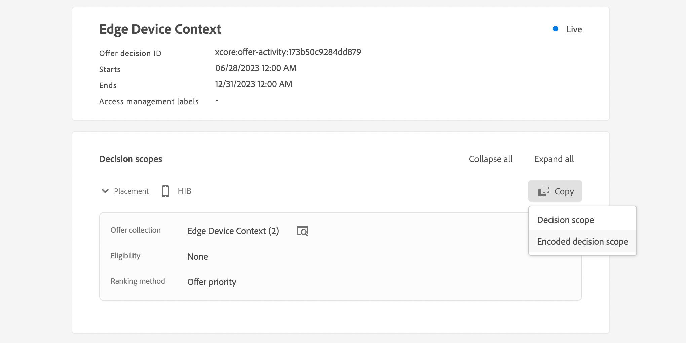

# 上下文数据和 Edge Decisioning 请求 {#edge}

本节指导您在Edge Decisioning请求中传递上下文数据，并在资格规则中使用这些数据。 我们将探索一个端到端用例，以演示如何根据客户使用的设备类型提供个性化优惠。

此用例涉及几个关键步骤：

1. [设置先决条件](#prerequisites)：确保已完成所有必要步骤以在您的请求中传递上下文数据。
1. [在资格规则中使用上下文数据](#rules)：创建根据用户的设备类型确定要显示的选件的规则。
1. [设计特定于设备的选件](#offers)：为每个设备类型创建量身定制的选件，并将其链接到相应的规则。
1. [创建优惠收藏集](#collection)：将所有优惠分组到一个静态收藏集中。
1. [配置决策](#decision) ：创建一个新决策，该决策利用优惠决策引擎根据用户的设备类型挑选要呈现给用户的最佳优惠。
1. [在Edge Decisioning请求中传递上下文数据](#request)：通过API请求传递上下文数据，以检索并向用户展示相应的选件。

>[!BEGINSHADEBOX]

若要更进一步，您还可以将上下文数据用于&#x200B;**排名公式**，或动态&#x200B;**个性化优惠呈现**。 例如，您可以创建单个选件，并使用个性化字段根据上下文数据调整其表示形式。 例如，如果用户有iphone，则显示给定图像，对于ipad用户则显示另一个图像。 有关更多信息，请参阅以下部分：

* [排名公式 — 根据上下文数据提升优惠](../offers/ranking/create-ranking-formulas.md#context-data)
* [根据上下文数据个性化呈现](../offers/offer-library/add-representations.md#context-data)

>[!ENDSHADEBOX]

## 在Edge Decisiong请求中传递上下文数据的先决条件 {#prerequisites}

与使用Decisioning API以相当自由的格式传递上下文不同，Edge Decisioning上下文有效负载需要符合XDM Experience Event。 为此，需要将上下文定义为用于数据收集的“XDM体验事件”的一部分。

1. 定义体验事件架构。 在此用例中，创建了“选件上下文”架构，并且选件上下文字段是“选件上下文”字段组的一部分。 实际上，字段组将添加到用于与“Edge收集网络”数据流关联的数据收集的体验事件架构中。

   >[!NOTE]
   >
   >选件上下文体验事件架构需要包含在配置文件中，并将“CUSTOMER_ID”字段用作主标识。

   在此示例中，“选件上下文”字段组有两个属性：语言和deviceType。 这些属性将用于优惠排名和资格规则。

   {width="60%" align="center" zoomable="yes"}

   了解如何在Adobe Experience Platform [体验数据模型(XDM)指南](https://experienceleague.adobe.com/en/docs/experience-platform/xdm/home){target="_blank"}中使用架构

1. 创建数据集（此处为“选件上下文”），并确保已为配置文件启用它。

1. 从&#x200B;**[!UICONTROL 数据收集]** > **[!UICONTROL 数据流]**&#x200B;菜单创建新的数据流。 了解如何在Adobe Experience Platform [数据流指南](https://experienceleague.adobe.com/en/docs/experience-platform/datastreams/configure){target="_blank"}中创建和配置数据流

   在本例中，我们创建了一个“选件上下文”数据流，并选中了“选件内容”事件架构。

   

1. 编辑新创建的数据流并选择“Adobe Experience Platform”作为服务，选择“选件上下文”作为事件数据集。

   

1. 保存数据流并复制其ID。 此ID将用于您的API请求端点中。 [了解如何构建API调用](#request)

   

## 在资格规则中使用上下文数据 {#rules}

创建资格规则，以根据用户的设备类型确定要显示的选件：


* iphone设备规则：

   * 规则名称：“Edge上下文规则 — iphone”
   * 配置： deviceType = &#39;iphone&#39;
   * PQL语法：

     ```
     select _Any1 from xEvent where _Any1._experienceplatform.offerContextData.deviceType.equals("iphone", false)
     ```

* ipad设备规则：

   * 规则名称：“Edge上下文规则 — ipad”
   * 配置： deviceType = &#39;ipad&#39;
   * PQL语法

     ```
     select _Any1 from xEvent where _Any1._experienceplatform.offerContextData.deviceType.equals("ipad", false)
     ```

## 创建优惠 {#offers}

为每个设备类型创建一个选件，并将其链接到之前创建的相应资格规则：

* 面向iphone用户的选件：

   * 选件名称：“Edge上下文 — iPhone选件内容”
   * 关联的规则：“Edge上下文规则 — iphone”

* 面向ipad用户的优惠：

   * 选件名称：Edge上下文 — iPad选件内容：
   * 关联的规则：“Edge上下文规则 — ipad”

此外，还要创建一个备用选件（此处为“上下文备用内容”），以便在未满足特定设备条件时显示。

## 在收藏集中添加优惠 {#collection}

将之前创建的选件添加到此处“Edge设备上下文”的静态收藏集。 此收藏集将是优惠决策挑选符合条件的优惠展示给客户的地方。


## 创建优惠决策 {#decision}

创建一个新决策，该决策利用优惠决策引擎在选择了“上下文回退”优惠作为回退优惠的情况下，根据用户的设备类型选择要呈现给用户的最佳优惠。


>[!NOTE]
>
>要更进一步，您可以利用上下文数据将排名公式分配给您的决策。 添加信息

## 在Edge Decisioning请求中传递上下文数据 {#request}

### 终结点

在端点中，使用之前创建的[数据流](#prerequisites)的ID。

`https://edge.adobedc.net/ee/irl1/v1/interact?configId=f3c47f2a-c484-4908-87a5-a82b55039e22`

### 负载

以下是传递上下文数据的请求示例。

* 有关设备类型的信息在`xdm:ContextData`节点中传递。
* 在`decisionScopes`节点中，复制并粘贴之前配置的[优惠决策](#decision)的决策范围。

  +++从何处检索决策范围

  

+++

```
{
    "events": [{
        "xdm": {
            "identityMap": {
                "customerId": [{
                    "id": "0000158216",
                    "authenticatedState": "authenticated",
                    "primary": true
                }]
            },
            "_experienceplatform": {
                "identity": {
                    "core": {
                        "customerId": "0000158216"
                    }
                },
                "offerContextData" : {
                    "language" : "NL",
                    "deviceType" : "iphone"
                }
            }
        }
    }],
    "query": {
        "personalization": {
            "decisionScopes": ["eyJ4ZG06YWN0aXZpdHlJZCI6Inhjb3JlOm9mZmVyLWFjdGl2aXR5OjE3M2I1MGM5Mjg0ZGQ4NzkiLCJ4ZG06cGxhY2VtZW50SWQiOiJ4Y29yZTpvZmZlci1wbGFjZW1lbnQ6MTZhMzQxZWQ4ZDYyMzc2MSJ9"]
        }
    }
}
```

### 响应

以下是示例响应：

```
{
    "requestId": "14a2d3f5-a6fa-494e-b42c-cc65a845284a",
    "handle": [
        {
            "payload": [
                {
                    "id": "1eafc831-4819-4800-8e25-c9e9f0838e09",
                    "scope": "eyJ4ZG06YWN0aXZpdHlJZCI6Inhjb3JlOm9mZmVyLWFjdGl2aXR5OjE3M2I1MGM5Mjg0ZGQ4NzkiLCJ4ZG06cGxhY2VtZW50SWQiOiJ4Y29yZTpvZmZlci1wbGFjZW1lbnQ6MTZhMzQxZWQ4ZDYyMzc2MSJ9",
                    "activity": {
                        "id": "xcore:offer-activity:173b50c9284dd879",
                        "etag": "1",
                        "name": "Edge Device Context"
                    },
                    "placement": {
                        "id": "xcore:offer-placement:16a341ed8d623761",
                        "etag": "1",
                        "name": "HIB",
                        "channel": "https://ns.adobe.com/xdm/channel-types/mobile",
                        "componentType": "https://ns.adobe.com/experience/offer-management/content-component-json"
                    },
                    "items": [
                        {
                            "id": "xcore:personalized-offer:173b4e05676d87f5",
                            "etag": "3",
                            "name": "Edge Context - iPhone Offer",
                            "priority": 0,
                            "schema": "https://ns.adobe.com/experience/offer-management/content-component-json",
                            "data": {
                                "id": "xcore:personalized-offer:173b4e05676d87f5",
                                "format": "application/json",
                                "language": [
                                    "en-gb"
                                ],
                                "content": "{\n    \"name\" : \"iphone offer\"\n}"
                            }
                        }
                    ]
                }
            ],
            "type": "personalization:decisions",
            "eventIndex": 0
        },
        {
            "payload": [],
            "type": "activation:pull",
            "eventIndex": 0
        },
        {
            "payload": [],
            "type": "personalization:decisions",
            "eventIndex": 0
        },
        {
            "payload": [
                {
                    "scope": "Target",
                    "hint": "37",
                    "ttlSeconds": 1800
                },
                {
                    "scope": "AAM",
                    "hint": "6",
                    "ttlSeconds": 1800
                },
                {
                    "scope": "EdgeNetwork",
                    "hint": "irl1",
                    "ttlSeconds": 1800
                }
            ],
            "type": "locationHint:result"
        },
        {
            "payload": [
                {
                    "key": "kndctr_907075E95BF479EC0A495C73_AdobeOrg_identity",
                    "value": "CiY0MDAwMDgyMjMzNTEzNzU1OTcwMjQ0NDcyNjU1MTAyMDEwNDQ3MVIRCNnE4Y6QMRABGAEqBElSTDHwAdnE4Y6QMQ==",
                    "maxAge": 34128000
                },
                {
                    "key": "kndctr_907075E95BF479EC0A495C73_AdobeOrg_cluster",
                    "value": "irl1",
                    "maxAge": 1800
                }
            ],
            "type": "state:store"
        }
    ]
}
```
