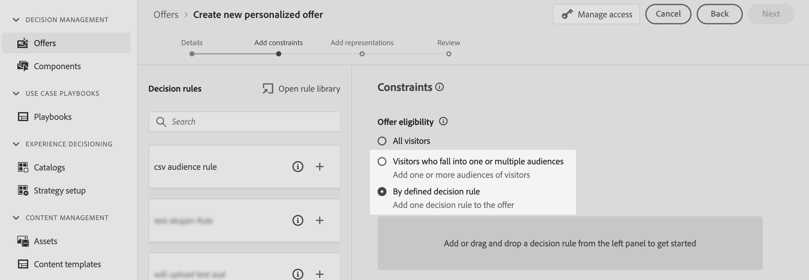

# 利用自定义上传受众进行决策 {#custom-upload-decisioning}

借助Journey Optimizer，您可以将数据从使用自定义上传（CSV文件）创建的受众运用到Adobe Experience Platform中，以支持您的决策管理工作流。 当配置文件上不需要数据，但在决策中仍然必须提供数据时，此功能尤为有用。

可以在决策管理中利用来自自定义上传受众的数据：

1. 优惠和决策中的资格标准。
2. 个性化优惠呈现中的内容。

有关自定义上传受众的更多信息，请参阅以下章节：
* [受众和Journey Optimizer入门](../audience/about-audiences.md)
* [在Adobe Experience Platform中导入受众](https://experienceleague.adobe.com/en/docs/experience-platform/segmentation/ui/audience-portal#import-audience){target="_blank"}

## 必读 {#must-read}

* 此功能仅在&#x200B;**决策管理**&#x200B;中受支持，在Decisioning（以前称为“Experience Decisioning”）中不受支持。
* 它只能通过&#x200B;**Decisioning API (Hub)**&#x200B;请求提供，**Edge Decisioning API**&#x200B;或&#x200B;**批量决策**不支持它。
 
## 使用自定义上传受众作为资格标准 {#eligibilty}

您可以将自定义上传受众用作优惠或决策级别的资格标准。 添加后，这些标准可以从资格中排除优惠或优惠集合。 以下是您可以利用自定义上传受众来优化优惠和决策资格的各种位置：

* 使用自定义上传受众创建决策规则：

   1. 在创作规则时，访问&#x200B;**受众**&#x200B;选项卡并在列表中搜索CSV受众。 将受众拖放到规则画布中。
   1. 使用&#x200B;**属性**&#x200B;选项卡并导航到链接到所选受众的扩充架构，以访问来自CSV文件的所有数据并在您的规则中使用这些数据。 这允许您使用CSV文件中的字段来优化规则。 [了解如何创建决策规则](../offers/offer-library/creating-decision-rules.md)
   1. 保存规则。 创建规则后，即可在优惠和决策级别使用它来优化其资格。

  

* 使用自定义上传受众作为选件限制。 [了解如何向优惠添加约束](../offers/offer-library/add-constraints.md)

  在创作选件时，在&#x200B;**添加约束**&#x200B;步骤，您可以：

   * 使用自定义上传受众来定义选件资格，
   * 利用自定义上传受众应用规则。

  

* 在决策级别使用自定义上传受众。

  设置决策时，在&#x200B;**添加决策范围**&#x200B;步骤中，您可以使用自定义上传受众作为优惠集合的评估标准。 [了解如何定义决策范围](../offers/offer-activities/create-offer-activities.md#add-decision-scopes)

  

## 使用自定义上传受众使优惠呈现个性化

自定义上传受众也可用于通过引用CSV文件中的数据来个性化优惠呈现的内容。 [了解如何向优惠添加呈现](../offers/offer-library/add-representations.md)

为了能够利用自定义上传受众的属性进行个性化，您首先需要添加自定义受众作为限制。 为此，在创作选件时，请在&#x200B;**添加约束**&#x200B;步骤中将受众添加为约束或选择利用自定义上传受众的规则。

将受众添加为限制后，您可以使用其属性来个性化呈现内容。 为此，请访问&#x200B;**配置文件属性**&#x200B;选项卡并搜索自定义上传受众。 从受众中选择相关属性以个性化选件内容。

