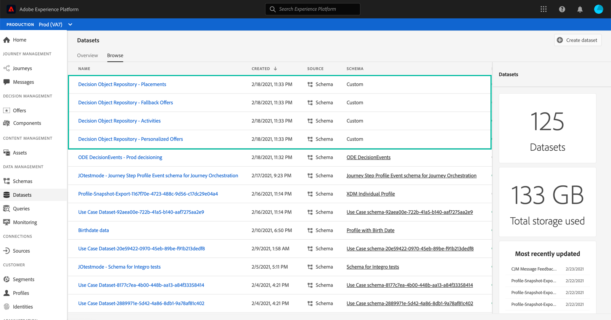

# 访问导出的优惠目录 {#access-exported-catalog}

可在Adobe Experience Platform **[!UICONTROL Datasets]**&#x200B;菜单中访问导出的选件目录。 系统会为选件库的每个对象创建一个数据集。

单击某个数据集以访问其详细信息。

通过&#x200B;**[!UICONTROL Preview dataset]**&#x200B;按钮，可显示数据集中最近一次成功的批处理。 左窗格提供有关已导出的数据类型的信息。

有关如何浏览和使用数据集的更多信息，请参阅[Adobe Experience Platform数据集文档](https://experienceleague.adobe.com/docs/experience-platform/catalog/datasets/user-guide.html?lang=en#getting-started)。
