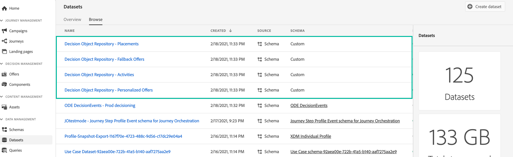

# 访问导出的优惠目录 {#access-exported-catalog}

可在Adobe Experience Platform中访问导出的选件目录 **[!UICONTROL Datasets]** 菜单。 系统会为选件库的每个对象创建一个数据集。

单击某个数据集以访问其详细信息。

的 **[!UICONTROL Preview dataset]** 按钮，可显示数据集中最新成功的批次。 左窗格提供有关已导出的数据类型的信息。

有关如何浏览和使用数据集的更多信息，请参阅 [本页](../../start/get-started-datasets.md).
