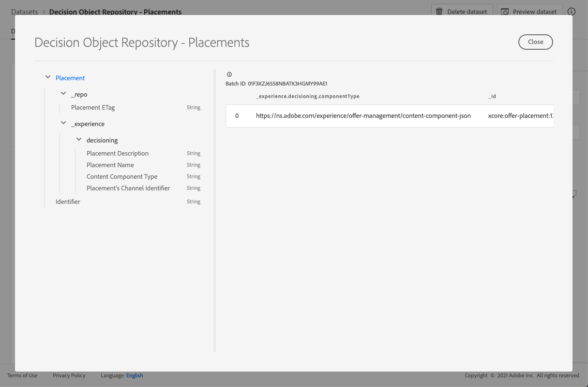

# 放置环境数据集 {#placements-dataset}

每次修改选件时，都会更新自动生成的投放位置数据集。

数据集中最近成功的批次显示在右侧。 数据集的架构的分层视图显示在左窗格中。

>[!NOTE]
>
>在[本节](../export-catalog/access-dataset.md)中了解如何访问选件库每个对象的导出数据集。

以下是可用于&#x200B;**[!UICONTROL 决策对象存储库 — 投放位置]**&#x200B;数据集中的所有字段的列表。

<!--A placement describes a location or place in a personalized message. It is used to set technical constraints for content that the personalization decision supplies. The placement also represents a request to produce certain types of metrics when an experience event is produced where this placement is involved. For instance, the placement facilitates a personalized clickable image inside an email shown to an end-user. The placement may for instance request from the assembled experience that the click on its image gets reported in an experience event with a metric https://ns.adobe.com/xdm/data/metrics/web/linkclicks and a reference to this placement.-->

+++ 标识符

**字段：**_id
**标题：**标识符
**描述：**记录的唯一标识符。
**类型：**&#x200B;字符串

+++

+++ 体验(_E)

**字段：**体验(_E)
**类型：**&#x200B;对象

+++

+++ _experience > decisioning

**字段：**决策
**类型：**&#x200B;对象

+++

+++ _experience >决策>投放的渠道标识符

**字段：** channelID
**标题：**投放位置的渠道标识符
**描述：**提出建议的渠道。 该值为有效的通道URI。 请参阅https://ns.adobe.com/xdm/channels/channel。
**类型：**&#x200B;字符串

+++

+++ _experience >决策>内容组件类型

**字段：**组件类型
**标题：**内容组件类型
**描述：**枚举的URI集，其中每个值映射到为内容组件指定的类型。 内容表示的一些使用者希望@type值是对描述内容组件的其他属性的架构的引用。
**类型：**&#x200B;字符串

+++

+++ _experience >决策>内容类型

**字段：**内容类型
**类型：**&#x200B;数组

+++

+++_体验>决策>内容类型> MIME媒体类型

**标题：** MIME媒体类型
**描述：**该投放位置中应有的组件的媒体类型约束。 一个组件可能有多种媒体类型，例如不同的图像格式。
**类型：**&#x200B;字符串

+++

+++ _experience > decisioning >投放位置描述

**字段：**描述
**标题：**版面描述
**描述：**它用于传达关于如何在整个消息传递中使用动态内容的可读意图。 网页中的特定空间是\“横幅\”，通常是通过描述而不是通过正式方法传递的。
**类型：**&#x200B;字符串

+++

+++ _experience >决策>投放位置名称

**字段：**名称
**标题：**位置名称
**描述：**在人机交互中引用该投放位置的已分配名称。
**类型：**&#x200B;字符串

+++

+++ _repo

**字段：**_repo
**类型：**&#x200B;对象

+++

+++ _repo >版面ETag

**字段：** etag
**标题：**版面ETag
**描述：**拍摄快照时决策选项对象所处的修订版本。
**类型：**&#x200B;字符串

+++
