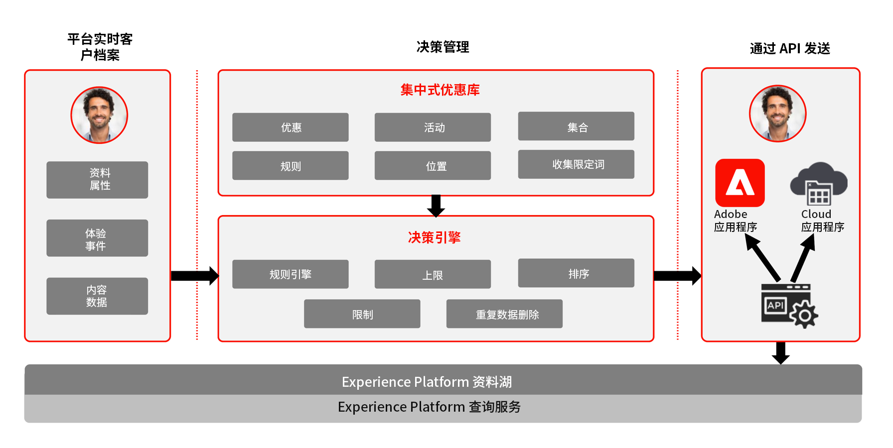
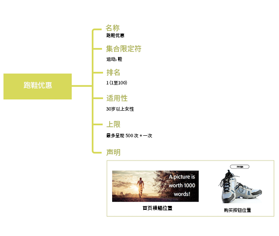
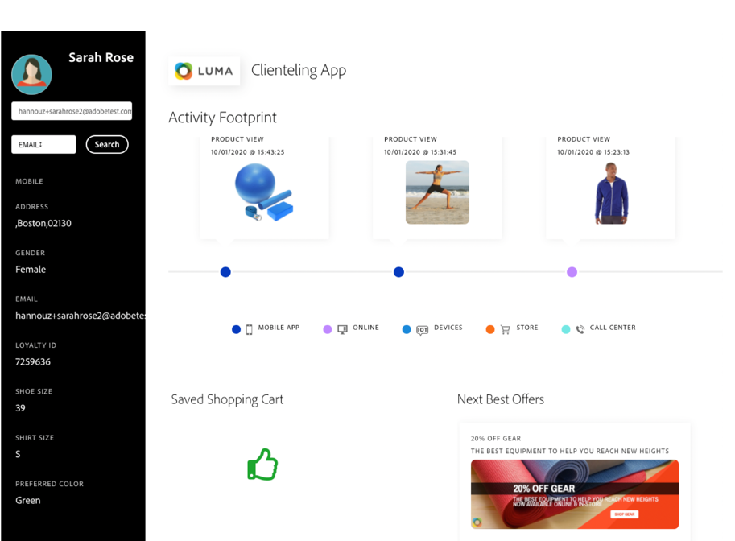

# 关于决策管理{#about-offer-decision}

使用 [!DNL Journey Optimizer] 可在适当的时候将优质的产品和体验提供给您在所有接触点上的客户。设计完成后，用个性化的优惠目标受众。

“决策管理”功能由两个主要组件组成：

* **集中式优惠库**&#x200B;是创建和管理组成优惠的不同元素并定义其规则和约束的接口。
* **优惠决策引擎**&#x200B;利用Adobe Experience Platform数据和实时客户用户档案，以及优惠库，以选择向其提供优惠的适当时间、客户和渠道。

其优势包括：

* 通过跨多个渠道提供个性化优惠而提升的营销活动效果，
* 改进的工作流程：营销团队可以通过创建单个投放并更改模板中不同部分的优惠来改进工作流程，而无需创建多个投放或活动，
* 控制优惠在营销活动和客户中显示的次数。

 [观看这些教程视](#tutorial-videos) 频，了解有关决策管理的更多信息。

## 关于优惠和决定{#offers-offer-activities}

**优惠**&#x200B;由内容、合格规则和限制条件（确定向客户呈现该优惠的条件）组成。

它是使用&#x200B;**优惠库**&#x200B;创建的，这个库提供了一个集中式优惠目录，您可以将合格规则和限制条件与多个内容关联，以创建和发布优惠（请参阅[优惠库用户界面](../get-started/user-interface.md)）。

在优惠库中添加了优惠后，您可以将优惠集成到&#x200B;**决策**(以前称为“优惠活动”)中。

决策是针对您的优惠的容器，这些优惠将利用优惠决策引擎，以便根据投放的目标选择最佳的交付。

## 常见用例

决策管理功能以及与Adobe Experience Platform的集成使您能够涵盖多个使用案例，从而帮助您提高客户的参与度和转化率。

* 根据来自 Adobe Experience Platform 的数据，在您的网站主页上显示与来访客户的兴趣点相匹配的优惠。

   

* 如果客户走到您的商店附近，根据他们的属性（忠诚度、性别、以前的购买记录等）向他们发送推送通知，提醒他们有可用的优惠。

   

* 在联系您的支持团队时，决策管理还可帮助您增强客户的体验。 决策管理API允许您在呼叫中心代理的门户中显示有关客户赎回和次佳优惠的信息。

   

## 教程视频 {#tutorial-videos}

>[!NOTE]
>
>这些视频适用于在Adobe Experience Platform上构建的Offer Decisioning应用程序服务，并非特定于[!DNL Adobe Journey Optimizer]。 但是，它为在[!DNL Journey Optimizer]上下文中使用决策管理提供了通用指导。

### 什么是决策管理？{#what-is-offer-decisioning}

以下视频介绍了决策管理的主要功能、体系结构和使用案例：

>[!VIDEO](https://video.tv.adobe.com/v/326961?quality=12&learn=on)

### 定义和管理优惠{#use-offer-decisioning}

以下视频介绍如何使用决策管理定义和管理优惠并利用实时客户数据。

>[!VIDEO](https://video.tv.adobe.com/v/326841?quality=12&learn=on)
