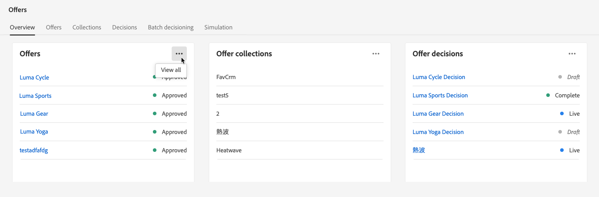
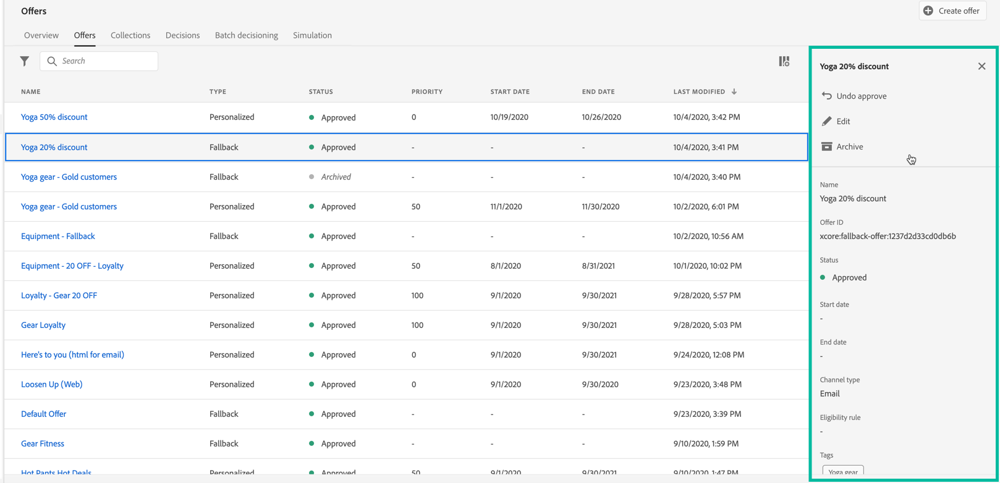
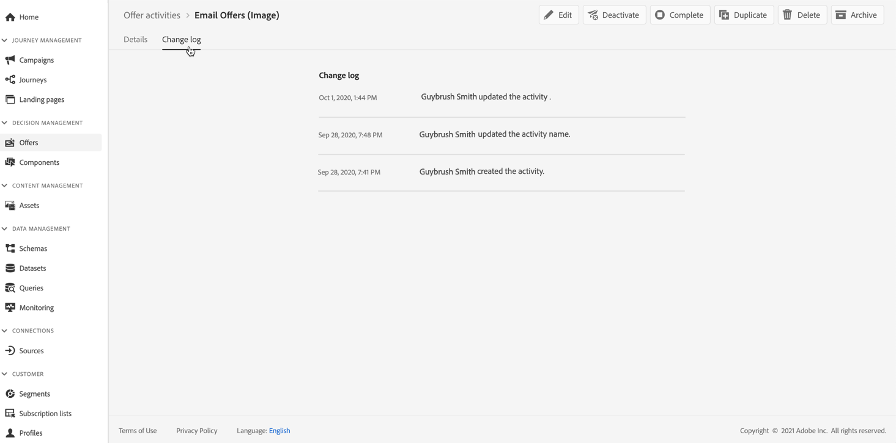

# 用户界面 {#user-interface}

优惠库允许您在一个单一的位置创建和管理投放位置和优惠，并允许您访问所有创建的决策（以前称为“优惠活动”）。

>[!NOTE]
>
>如果您在访问选件库或其某些功能时遇到问题，请咨询已向您授予所需权限的管理员用户。 请参阅 [授予对决策管理的访问权限](starting-offer-decisioning.md#granting-acess-to-decision-management).

使用 **[!UICONTROL Offers]** 菜单管理个性化的后备优惠，将它们组织到收藏集中，然后通过创建决策来发送这些后备优惠：

* **[!UICONTROL Overview]**:新 [!DNL Offer Decisioning]? 按照屏幕上的步骤，开始设置版面、选件和收藏集。 当已经熟悉 [!DNL Offer Decisioning]，获取有关最新选件、收藏集和决策的概述。 请参阅[概述](#overview)。

* **[!UICONTROL Offers]**：访问您的个性化的后备优惠或创建新后备优惠。请参阅[创建优惠](../offer-library/creating-personalized-offers.md)和[创建后备优惠](../offer-library/creating-fallback-offers.md)。

* **[!UICONTROL Collections]**：创建和管理静态和动态优惠收藏集。请参阅[关于优惠收藏集](../offer-library/creating-collections.md)。

* **[!UICONTROL Decisions]**：创建和管理决策以发送优惠。请参阅[创建决策](../offer-activities/create-offer-activities.md)。

使用 **[!UICONTROL Components]** 菜单管理创建优惠所需的组件：

* **[!UICONTROL Placements]**：创建和管理优惠将显示的投放位置。请参阅[创建投放位置](../offer-library/creating-placements.md)。

* **[!UICONTROL Tags]**：创建和管理标记以组织和筛选优惠。请参阅[创建标记](../offer-library/creating-tags.md)。

* **[!UICONTROL Rules]**：管理您的优惠的展示条件。请参阅[创建决策规则](../offer-library/creating-decision-rules.md)。

* **[!UICONTROL Rankings]**：创建和管理排名公式，以确定在给定投放位置应首先显示哪些优惠。请参阅[创建排名公式](../offer-library/create-ranking-formulas.md)。

## 概述 {#overview}

当您是 [!DNL Offer Decisioning], **[!UICONTROL Overview]** 选项卡可引导您完成开始构建首个选件决策所需的主要步骤。

按照屏幕上的步骤开始创建版面、选件和收藏集。

完成这些首要步骤后，系统会提示您创建选件决策（以前称为选件活动）。

>[!NOTE]
>
>创建选件并在决策中使用这些选件的主要步骤，请参见 [此部分](../offer-library/key-steps.md).

当您更熟悉 [!DNL Offer Decisioning] 并且您已经创建了至少一个选件决策， **[!UICONTROL Overview]** 选项卡会显示您最近的选件、收藏集和决策。

单击选件或决定直接访问选定项目的详细信息。

单击 **[!UICONTROL View all]** 按钮以访问选件、收藏集或决策列表。

## 搜索和筛选信息 {#search-and-filter-information}

使用&#x200B;**搜索栏**&#x200B;查找特定项目。

单击列表左上角的过滤器图标即可访问&#x200B;**过滤器**。 它们允许您根据不同的条件筛选显示的元素。例如，您可以筛选为电子邮件通信渠道和图像类型内容创建的投放位置。

## 自定义显示的信息 {#customize-displayed-information}

针对决策管理菜单的列表，可以通过列表右上角的配置按钮对其进行个性化设置。

这允许您根据需要选择要显示的信息。

请注意，将为每个用户保存列自定义。

## 信息窗格 {#information-pane}

在不同的列表中，选择一个元素以显示一个信息窗格，该窗格允许您检索信息并对元素执行基本操作。

通过优惠和优惠活动列表也可对多个元素执行批量操作。为此，请选择所需的优惠或决策，然后从信息窗格中选择要执行的操作。

请注意，您还可以重复现有优惠或决策，以便创建具有 **[!UICONTROL Draft]** 状态的副本。 可以在信息窗格或在优惠或决策的详细视图中执行此操作。

## 优惠和决策更改日志 {#changes-logs}

选件库允许您可视化对选件或决策所做的所有更改。 为此，请在列表中单击优惠名称或决策名称来打开优惠或决策，然后选择 **[!UICONTROL Change log]** 选项卡。

此屏幕中显示所有已完成的更改，还显示执行更改的用户姓名。

