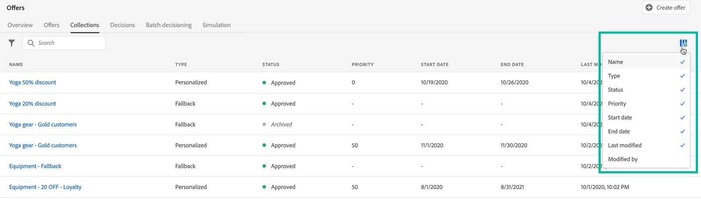

# 选件库用户界面 {#user-interface}

左边栏中的&#x200B;**[!UICONTROL 决策管理]**&#x200B;部分提供两个菜单，用于访问决策管理功能：

使用&#x200B;**[!UICONTROL 优惠]**&#x200B;菜单管理和提供优惠：

* **[!UICONTROL 概述]**：[!DNL decision management]的新用户？ 按照屏幕上的步骤开始设置投放位置、优惠和收藏集。 熟悉[!DNL decision management]后，即可大致了解您最近的优惠、收藏集和决策。 [了解详情](#overview)
* **[!UICONTROL 优惠]**：创建并访问您的个性化和后备优惠。 了解如何创建[优惠](../offer-library/creating-personalized-offers.md)和[后备优惠](../offer-library/creating-fallback-offers.md)
* **[!UICONTROL 收藏集]**：将优惠组织为静态和动态收藏集。 [了解详情](../offer-library/creating-collections.md)
* **[!UICONTROL 决策]**：创建和管理决策以发送优惠。 [了解详情](../offer-activities/create-offer-activities.md)
* **[!UICONTROL 批量决策]**：将优惠决策交付给给给定Adobe Experience Platform受众中的所有用户档案。 [了解详情](../batch-delivery.md)
* **[!UICONTROL 模拟]**：通过模拟将哪些优惠传递到给定投放位置的测试用户档案，验证决策逻辑。 [了解详情](../offer-activities/simulation.md)

使用&#x200B;**[!UICONTROL 组件]**&#x200B;菜单创建和管理创建优惠和决策所需的组件：

* **[!UICONTROL 版面]**：创建和管理优惠将显示的版面。 [了解详情](../offer-library/creating-placements.md)
* **[!UICONTROL 收藏集限定符]**：创建和管理收藏集限定符（以前称为“标记”）以组织和筛选优惠。 [了解详情](../offer-library/creating-tags.md)
* **[!UICONTROL 规则]**：管理提供优惠的条件。 [了解详情](../offer-library/creating-decision-rules.md)
* **[!UICONTROL 排名]**：创建和管理排名公式，以确定在给定投放位置应首先显示哪个优惠。 [了解详情](../ranking/create-ranking-formulas.md)

>[!NOTE]
>
>如果您在访问决策管理或其某些功能时遇到问题，请与管理员用户联系，确认您已获得所需的权限。 请参阅[授予对决策管理的访问权限](starting-offer-decisioning.md#granting-acess-to-decision-management)。

## 概述 {#overview}

当您不熟悉[!DNL decision management]时，**[!UICONTROL 概述]**&#x200B;选项卡将指导您完成开始构建您的第一个优惠决策所需的主要步骤。 按照屏幕上的步骤开始创建投放位置、优惠和收藏集。 完成这些首要步骤后，系统会提示您创建优惠决策。

>[!NOTE]
>
>[此部分](../offer-library/key-steps.md)介绍了创建优惠并在决策中使用优惠的主要步骤。

如果您更熟悉[!DNL decision management]，并且已创建至少一个优惠决策，则&#x200B;**[!UICONTROL 概述]**&#x200B;选项卡会显示您最近的优惠、收藏集和决策。

单击优惠或决策以直接访问所选项目的详细信息。

单击&#x200B;**[!UICONTROL 查看全部]**&#x200B;按钮以访问优惠、收藏集或决策列表。

## 搜索和筛选信息 {#search-and-filter-information}

使用&#x200B;**搜索栏**&#x200B;查找特定项目。

单击列表左上角的过滤器图标即可访问&#x200B;**过滤器**。 它们允许您根据不同的条件筛选显示的元素。例如，您可以筛选为电子邮件通信渠道和图像类型内容创建的投放位置。

## 自定义显示的信息 {#customize-displayed-information}

针对决策管理菜单的列表，可以通过列表右上角的配置按钮对其进行个性化设置。

这允许您根据需要选择要显示的信息。

请注意，将为每个用户保存列自定义。

## 信息窗格 {#information-pane}

在不同的列表中，选择一个元素以显示一个信息窗格，该窗格允许您检索信息并对元素执行基本操作。

通过优惠和优惠活动列表也可对多个元素执行批量操作。为此，请选择所需的优惠或决策，然后从信息窗格中选择要执行的操作。

请注意，您还可以复制现有优惠或决策，以便创建具有&#x200B;**[!UICONTROL 草稿]**&#x200B;状态的副本。 可以在信息窗格或在优惠或决策的详细视图中执行此操作。

## 优惠和决策更改日志 {#changes-logs}

[!DNL Journey Optimizer]允许您可视化对优惠或决策所做的所有更改。 为此，请从左侧菜单访问&#x200B;**[!UICONTROL 审核]**&#x200B;菜单。 [了解如何审核对资源的操作](../../privacy/audit-logs.md)
