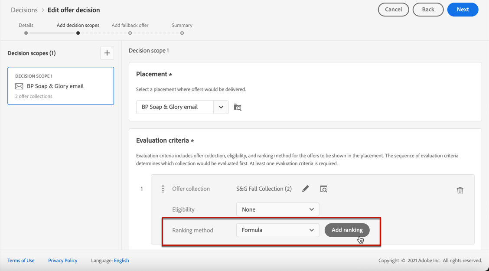

# 在决策中配置优惠选择 {#offers-selection-in-decisions}

如果多个优惠都符合给定投放位置的条件，则可以在配置决策时，选择为每个用户档案选择最佳优惠的方法。 您可以通过以下方式排列选件：
* 优惠优先级
* 排名公式
* [人工智能排名](#use-ranking-strategy)

## 优惠优先级 {#offer-priority}

默认情况下，当多个优惠符合决策中的给定投放位置条件时，具有最高&#x200B;**优先级**&#x200B;的优惠将首先交付给客户。

创建选件时会分配选件的优先级分数。 在[本节](../offer-library/creating-personalized-offers.md)中了解如何创建个性化优惠。

## 排名公式 {#assign-ranking-formula}

除了优惠优先级之外，Journey Optimizer还允许您创建&#x200B;**排名公式**。 这些公式决定应首先为给定投放位置显示哪项优惠，而不是考虑优惠的优先级评分。

例如，您可以提升结束日期距现在不到24小时的所有选件的优先级，或者，如果用户档案的兴趣点为“正在运行”，则提升“正在运行”类别中的选件。

在[本节](../ranking/create-ranking-formulas.md)中了解如何创建排名公式。

创建公式后，您可以将其分配给决策中的投放位置。 为此，请执行以下步骤：

1. 创建决策或编辑现有决策。 请参阅[创建决策](../offer-activities/create-offer-activities.md)。

1. 添加将包含优惠的投放位置。 请参阅[创建版面](../offer-library/creating-placements.md)。

1. 对于每个投放位置，添加一个收藏集。 请参阅[创建收藏集](../offer-library/creating-collections.md)。

1. 选择&#x200B;**[!UICONTROL 公式]**&#x200B;作为排名方法，然后单击&#x200B;**[!UICONTROL 添加排名]**。

   

1. 选择所需的公式，然后单击&#x200B;**[!UICONTROL 选择]**。

   

排名公式现在与投放位置关联。

如果多个优惠符合在此投放位置中显示的条件，决策将使用所选公式计算首先投放哪个优惠。

## 人工智能排名 {#use-ranking-strategy}

<!--If you are an [Adobe Experience Platform](https://experienceleague.adobe.com/docs/experience-platform/landing/home.html?lang=zh-Hans){target="_blank"} user leveraging the **Offer Decisioning** application service,-->

您还可以使用经过训练的模型系统，该系统通过选择人工智能模型自动对要针对给定用户档案显示的选件进行排名。 在[本节](../ranking/create-ranking-strategies.md)中了解如何创建AI模型。

创建AI模型后，您可以将其分配给决策中的投放位置。 为此，请执行以下步骤：

1. 创建决策或编辑现有决策。 请参阅[创建决策](../offer-activities/create-offer-activities.md)。

1. 添加将包含优惠的投放位置。 请参阅[创建版面](../offer-library/creating-placements.md)。

1. 对于每个投放位置，添加一个收藏集。 请参阅[创建收藏集](../offer-library/creating-collections.md)。

1. 从下拉列表中选择&#x200B;**[!UICONTROL AI排名]**&#x200B;对优惠进行排名，然后单击&#x200B;**[!UICONTROL 添加排名]**。

   

1. 选择您创建的AI模型。 将显示模型的所有详细信息。

   

1. 单击&#x200B;**[!UICONTROL 选择]**。 AI模型现在与投放位置相关联。

如果多个选件符合条件，则经过训练的模型系统将确定在给定投放位置应首先显示哪个选件。

