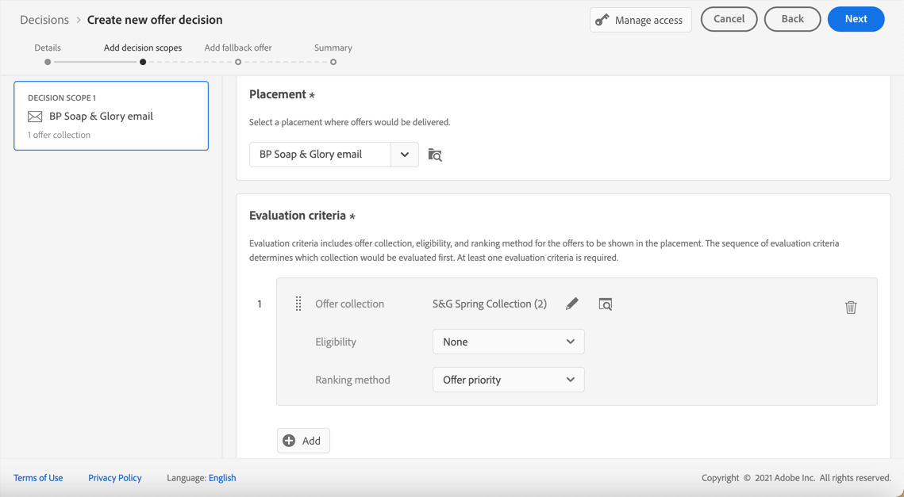

# 创建决策 {#create-offer-activities}

决策（以前称为选件活动）是选件的容器，将利用选件决策引擎来根据投放的目标选择要交付的最佳选件。

➡️ [在此视频中了解如何创建优惠活动](#video)

可在 **[!UICONTROL Offers]** 菜单> **[!UICONTROL Decisions]** 选项卡。 过滤器可帮助您根据其状态或开始和结束日期来检索决策。

在创建决策之前，请确保已在选件库中创建以下组件：

* [版面](../offer-library/creating-placements.md)
* [收藏集](../offer-library/creating-collections.md)
* [个性化优惠](../offer-library/creating-personalized-offers.md)
* [后备优惠](../offer-library/creating-fallback-offers.md)

## 创建决策 {#create-activity}

1. 访问决策列表，然后单击 **[!UICONTROL Create decision]**.

1. 指定决策的名称。

1. 根据需要定义开始和结束日期和时间，然后单击 **[!UICONTROL Next]**.

   

## 定义决策范围 {#add-decision-scopes}

1. 从下拉列表中选择版面。 它将添加到您决策的第一个决策范围中。

   

1. 单击 **[!UICONTROL Add]** ，以选择此版面的评估标准。

   

   每个标准都包含一个与资格约束相关联的选件集合和一个用于确定要在版面中显示的选件的排名方法。

   >[!NOTE]
   >
   >至少需要一个评估标准。

1. 选择包含要考虑的选件的选件集，然后单击 **[!UICONTROL Add]**.

   

   >[!NOTE]
   >
   >您可以单击 **[!UICONTROL Open offer collections]** 链接以在新选项卡中显示收藏集列表，通过该选项卡，您可以浏览收藏集及其包含的选件。

   选定的收藏集将会添加到标准中。

   

1. 使用 **[!UICONTROL Eligibility]** 字段来限制选择此版面的选件。

   此约束可通过使用 **决策规则**&#x200B;或一个或多个 **Adobe Experience Platform区段**. 这两项内容详见 [此部分](#segments-vs-decision-rules).

   * 要将选件的选择限制为Experience Platform区段的成员，请选择 **[!UICONTROL Segments]**，然后单击 **[!UICONTROL Add segments]**.

      

      从左窗格添加一个或多个区段，然后使用 **[!UICONTROL And]** / **[!UICONTROL Or]** 逻辑运算符。

      

      了解如何在 [此部分](../../segment/about-segments.md).

   * 如果要添加包含决策规则的选择约束，请使用 **[!UICONTROL Decision rule]** 选项，然后选择您选择的规则。

      

      了解如何在 [此部分](../offer-library/creating-decision-rules.md).

1. 定义要用于为每个用户档案选择最佳选件的排名方法。

   

   * 默认情况下，如果多个选件符合此版面的条件，则具有最高优先级分数的选件将会交付给客户。

   * 如果要使用特定公式选择要交付的合格选件，请选择 **[!UICONTROL Ranking formula]**. 了解如何在 [此部分](../offer-activities/configure-offer-selection.md).

1. 单击 **[!UICONTROL Add]** 为同一版面定义更多标准。

   

1. 添加多个标准时，将按特定顺序对其进行评估。 添加到序列的第一个集合将首先进行评估，依此类推。

   要更改默认序列，您可以拖放收藏集以根据需要对它们重新排序。

   

1. 您还可以同时评估多个标准。 要执行此操作，请将收藏集拖放到另一个收藏集上。

   

   现在，它们具有相同的排名，因此将同时进行评估。

   

1. 要在此决策中为选件添加其他版面，请使用 **[!UICONTROL New scope]** 按钮。 对每个决策范围重复上述步骤。

   

### 使用区段和决策规则 {#segments-vs-decision-rules}

<!--to move to create-offers?-->

要应用约束，您可以将选件的选择限制为一个或多个选件的成员 **Adobe Experience Platform区段**，或者您可以使用 **决策规则**，两个解决方案对应于不同的使用情况。

基本上，区段的输出是用户档案列表，而决策规则是在决策过程中针对单个用户档案按需执行的函数。 下面详述了这两种用法之间的差异。

* **区段**

   一方面，区段是一组Adobe Experience Platform用户档案，这些用户档案根据用户档案属性和体验事件与特定逻辑进行匹配。 但是，选件管理不会重新计算区段，在显示选件时，该区段可能不是最新的。

   了解有关 [此部分](../../segment/about-segments.md).

* **决策规则**

   另一方面，决策规则基于Adobe Experience Platform中可用的数据，并确定可向谁显示选件。 在选件中选择或为给定版面做出决策后，每次做出决策时都会执行规则，以确保每个用户档案都获得最新和最佳选件。

   了解有关 [此部分](../offer-library/creating-decision-rules.md).

## 添加后备优惠 {#add-fallback}

定义决策范围后，定义将作为最后手段呈现给不符合选件资格规则和限制的客户的备用选件。

为此，请从决策中定义的版面的可用备用选件列表中选择它，然后单击 **[!UICONTROL Next]**.

>[!NOTE]
>
>您可以单击 **[!UICONTROL Open offer library]** 链接，以在新选项卡中显示选件列表。

## 查看并保存决策 {#review}

如果一切配置正确，则会显示决策属性的摘要。

1. 确保做好准备，以便用于向客户展示选件。 将显示所有决策范围及其包含的备用选件。

   

   您可以展开或折叠每个版面。 您还可以预览每个版面的可用选件、资格和排名详细信息。

   

1. 单击 **[!UICONTROL Finish]**。
1. 选择 **[!UICONTROL Save and activate]**。

   

   您还可以将决定另存为草稿，以便在以后编辑和激活它。

该决策会显示在列表中，其中 **[!UICONTROL Live]** 或 **[!UICONTROL Draft]** 状态，具体取决于您是否在上一步中激活了它。

现在，它已准备好用于向客户交付选件。

## 决策列表 {#decision-list}

从决策列表中，您可以选择显示其属性的决策。 从此处，您还可以编辑它，更改其状态(**草稿**, **实时**, **完成**, **已存档**)、复制决策或删除决策。

选择 **[!UICONTROL Edit]** 按钮返回到决策版模式，在该模式中，您可以修改决策 [详细信息](#create-activity), [决策范围](#add-decision-scopes) 和 [后备优惠](#add-fallback).

选择实时决策并单击 **[!UICONTROL Deactivate]** 将决策状态设置回 **[!UICONTROL Draft]**.

再次将状态设置为 **[!UICONTROL Live]**，选择 **[!UICONTROL Activate]** 按钮。

的 **[!UICONTROL More actions]** 按钮可启用下面描述的操作。

* **[!UICONTROL Complete]**:将决策的状态设置为 **[!UICONTROL Complete]**，这意味着无法再调用决策。 此操作仅适用于已激活的决策。 该决策仍可从列表中获取，但您无法将其状态重新设置为 **[!UICONTROL Draft]** 或 **[!UICONTROL Approved]**. 您只能复制、删除或存档它。

* **[!UICONTROL Duplicate]**:创建具有相同属性、决策范围和备用选件的决策。 默认情况下，新决策将 **[!UICONTROL Draft]** 状态。

* **[!UICONTROL Delete]**:从列表中删除决策。

   >[!CAUTION]
   >
   >该决策及其内容将无法再访问。 此操作无法撤消。
   >
   >如果决策在其他对象中使用，则无法删除该决策。

* **[!UICONTROL Archive]**:将决策状态设置为 **[!UICONTROL Archived]**. 该决策仍可从列表中获取，但您无法将其状态重新设置为 **[!UICONTROL Draft]** 或 **[!UICONTROL Approved]**. 您只能复制或删除它。

您还可以通过选中相应的复选框，同时删除或更改多个决策的状态。

如果要更改具有不同状态的多个决策的状态，则只会更改相关状态。

创建决策后，您可以在列表中单击其名称。

这样，您就可以访问该决策的详细信息。 选择 **[!UICONTROL Change log]** 选项卡 [监控所有更改](../get-started/user-interface.md#changes-log) 已经做出决定。

## 操作方法视频{#video}

了解如何在 Offer Decisioning 中创建优惠活动。

>[!VIDEO](https://video.tv.adobe.com/v/329606?quality=12)

