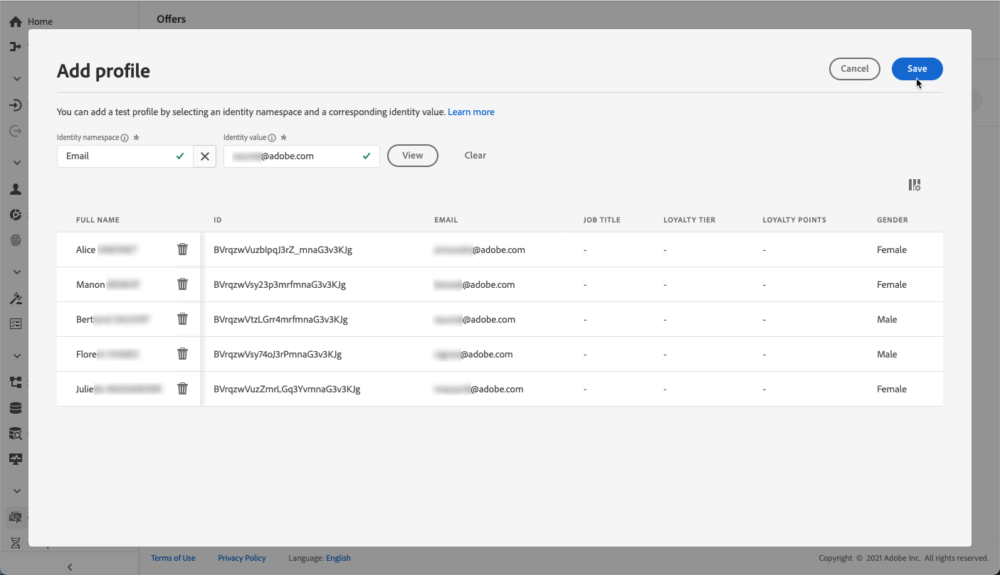
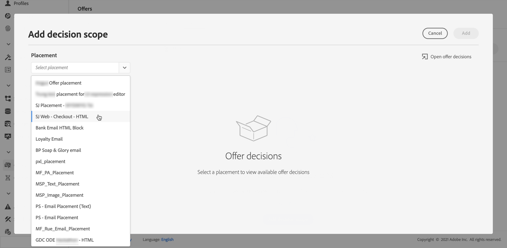

# 创建模拟 {#create-simulations}

>[!CONTEXTUALHELP]
>id="ajo_decisioning_simulation"
>title="模拟优惠决策"
>abstract="模拟允许您模拟在给定投放位置将哪些优惠投放到测试用户档案。 这使您能够测试和优化优惠的各种版本，而不会影响目标收件人。"

## 关于模拟 {#about-simulation}

要验证您的决策逻辑，您可以模拟将哪些选件交付到给定投放位置的测试用户档案。

<!--Simulation allows you to view the results of offer decisions as a selected profile.-->

这使您能够测试和优化优惠的各种版本，而不会影响目标收件人。

>[!NOTE]
>
>此功能可模拟对的单个请求 [!DNL Decisioning] API。 详细了解 [使用决策API提供优惠](../api-reference/offer-delivery-api/decisioning-api.md).

要访问此功能，请选择 **[!UICONTROL 模拟]** 选项卡 **[!UICONTROL 决策管理]** > **[!UICONTROL 选件]** 菜单。

>[!NOTE]
>
>由于模拟不会生成任何决策事件，因此 [上限](../offer-library/creating-personalized-offers.md#capping) 计数不受影响。

<!--
➡️ [Discover this feature in video](#video)
-->

## 选择测试配置文件 {#select-test-profiles}

>[!CONTEXTUALHELP]
>id="ajo_decisioning_simulation_test_profile"
>title="添加测试配置文件"
>abstract="您可通过选择身份命名空间以及对应的身份值来添加测试配置文件。您必须拥有已经可用的测试配置文件才能将它们用于模拟。"
>additional-url="https://experienceleague.adobe.com/docs/journey-optimizer/using/segment/profiles/creating-test-profiles.html" text="创建测试用户档案"

首先，您需要选择将用于模拟的测试用户档案。

>[!CAUTION]
>
>您必须具有可用的测试用户档案，以模拟将向其投放哪些优惠。 了解如何 [创建测试用户档案](../../segment/creating-test-profiles.md).

1. 单击 **[!UICONTROL 管理配置文件]**.

   

1. 选择要用于标识测试配置文件的身份命名空间。 在本例中，我们将使用 **电子邮件** 命名空间。

   >[!NOTE]
   >
   >身份命名空间定义标识符的上下文，例如电子邮件地址或CRM ID。 了解有关Adobe Experience Platform身份命名空间的更多信息 [在此部分中](../../segment/get-started-identity.md){target="_blank"}.

1. 输入身份值并单击 **[!UICONTROL 视图]** 以列出可用的配置文件。

   

1. 如果要测试不同的配置文件数据，请添加其他配置文件，并保存您的选择。

   

1. 添加后，所有用户档案都会列在下拉列表下的 **[!UICONTROL 测试配置文件]**. 您可以在保存的测试配置文件之间切换以显示每个选定配置文件的结果。

   

   >[!NOTE]
   >
   >选定的配置文件将保留作为测试配置文件列在 **[!UICONTROL 模拟]** 选项卡，直到使用以下方式删除它们 **[!UICONTROL 管理配置文件]**.

1. 您可以单击 **[!UICONTROL 配置文件详细信息]** 用于显示所选配置文件数据的链接。

<!--Learn more on [selecting test profiles](messages/preview.md#select-test-profiles)-->

## 添加决策范围 {#add-decision-scopes}

现在，选择要在测试用户档案上模拟的优惠决策。

1. 选择 **[!UICONTROL 添加决策范围]**.

   

1. 从列表中选择一个版面。

   

1. 将显示可用的决策。

   * 您可以使用搜索字段来优化选择。
   * 您可以单击 **[!UICONTROL 打开优惠决策]** 用于打开您创建的所有决策列表的链接。 详细了解 [决策](create-offer-activities.md).

   选择您选择的决策并单击 **[!UICONTROL 添加]**.

   

1. 您刚刚定义的决策范围将显示在主工作区中。

   您可以调整要请求的优惠数量。 例如，如果选择2，则会为此决策范围显示最佳的2个优惠。

   

   >[!NOTE]
   >
   >您最多可以请求30个选件。

1. 重复上述步骤以根据需要添加任意数量的决策。

   

   >[!NOTE]
   >
   >即使您定义了多个决策范围，也只模拟一个API请求。

## 定义模拟设置 {#define-simulation-settings}

要编辑模拟的默认设置，请执行以下步骤。

1. 单击 **[!UICONTROL 设置]**.

   

1. 在 **[!UICONTROL 重复数据删除]** 部分，您可以选择允许跨决策和/或投放位置重复优惠。 这意味着可能会向多个决策/投放位置分配同一优惠。

   

   >[!NOTE]
   >
   >默认情况下，会启用所有重复数据消除标记以进行模拟，这意味着决策引擎允许重复项，从而可以在多个决策/投放位置提出相同的建议。 了解更多关于 [!DNL Decisioning] 中的API请求属性 [本节](../api-reference/offer-delivery-api/decisioning-api.md).

1. 在 **[!UICONTROL 响应格式]** 部分，您可以选择在代码视图中包含元数据。 选中相应的选项，然后选择您选择的元数据。 选择时，它们将显示在请求和响应负载中 **[!UICONTROL 查看代码]**. 了解详情，请参阅 [查看模拟结果](#simulation-results) 部分。

   

   >[!NOTE]
   >
   >打开该选项时，缺省情况下会选择所有项目。

1. 单击&#x200B;**[!UICONTROL 保存]**。

>[!NOTE]
>
>目前，对于模拟数据，您只能使用 **[!UICONTROL 中心]** API。

<!--
In the **[!UICONTROL API for simulation]** section, select the API you want to use: **[!UICONTROL Hub]** or **[!UICONTROL Edge]**.
Hub and Edge are two different end points for simulation data.

In the **[!UICONTROL Context data]** section, you can add as many elements as needed.

    >[!NOTE]
    >
    >This section is hidden if you select Edge API in the section above. Hub allows the use of Context data, Edge does not.

Context data allows the user to add contextual data that could affect the simulation score.
For instance, let's say the customer has an offer for a discount on ice cream. In the rules for that offer, it can have logic that would rank it higher when the temperature is above 80 degrees. In simulation, the user could add context data: temperature=65 and that offer would rank lower, of they could add temperature=95 and that would rank higher.
-->

## 查看模拟结果 {#simulation-results}

添加决策范围并选择测试用户档案后，您可以查看结果。

1. 单击 **[!UICONTROL 查看结果]**.

   

1. 根据为每个决策选择的配置文件显示最佳可用优惠。

   选择选件以显示其详细信息。

   

1. 单击 **[!UICONTROL 查看代码]** 以显示请求负载和响应负载。 [了解详情](#view-code)

1. 从列表中选择另一个用户档案，以显示不同测试用户档案的优惠决策结果。

1. 您可以根据需要多次添加、删除或更新决策范围。

>[!NOTE]
>
>每次更改用户档案或更新决策范围时，您需要使用 **[!UICONTROL 查看结果]** 按钮。

## 查看代码 {#view-code}

1. 使用 **[!UICONTROL 查看代码]** 按钮以显示请求和响应负载。

   

   代码视图显示当前用户的开发人员信息。 默认情况下， **[!UICONTROL 响应有效负载]** 将显示。

   

1. 单击 **[!UICONTROL 响应有效负载]** 或 **[!UICONTROL 请求有效负载]** 以在两个选项卡之间导航。

   

1. 要在外部使用请求有效负载，请执行以下操作 [!DNL Journey Optimizer]  — 例如，为便于进行故障排除，应使用 **[!UICONTROL 复制到剪贴板]** “代码”视图顶部的按钮。

   

   <!--You cannot copy the response payload. ACTUALLY YES YOU CAN > to confirm with PM/dev? -->

   >[!NOTE]
   >
   >将请求或响应负载复制到您自己的代码中时，请确保使用有效值替换{USER_TOKEN}和{API_KEY}。 了解如何在中检索这些值 [ADOBE EXPERIENCE PLATFORM API](https://experienceleague.adobe.com/docs/experience-platform/landing/platform-apis/api-authentication.html){target="_blank"} 文档。

