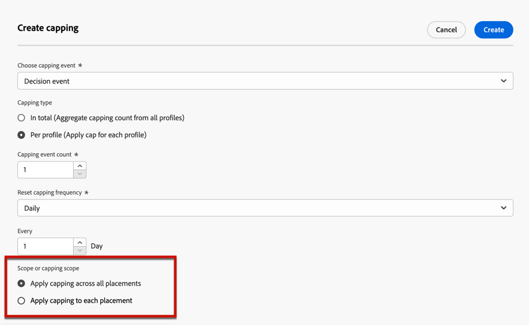

# 向选件添加约束 {#add-constraints}

>[!CONTEXTUALHELP]
>id="od_offer_constraints"
>title="关于选件约束"
>abstract="通过限制，您可以指定与其他选件相比，选件的优先级和呈现给用户的方式。"

>[!CONTEXTUALHELP]
>id="ajo_decisioning_constraints"
>title="关于选件约束"
>abstract="通过限制，您可以指定与其他选件相比，选件的优先级和呈现给用户的方式。"

>[!CONTEXTUALHELP]
>id="od_offer_priority"
>title="关于选件优先级"
>abstract="在此字段中，您可以指定选件的优先级设置。 优先级是用于对满足所有限制（如资格、日期和上限）的选件进行排名的数字。"

>[!CONTEXTUALHELP]
>id="ajo_decisioning_priority"
>title="设置优先级"
>abstract="如果用户符合多个选件的条件，则优先级有助于定义选件与其他选件相比的优先级。 优惠的优先级越高，与其他选件相比，优先级越高。"

利用约束，可定义显示选件的条件。

1. 配置 **[!UICONTROL Offer eligibility]**. [了解详情](#eligibility)

   

   >[!NOTE]
   >
   >选择区段或决策规则时，将显示有关估计的合格用户档案的信息。 单击 **[!UICONTROL Refresh]** 更新数据。

1. 定义 **[!UICONTROL Priority]** 选件（如果用户符合多个选件的条件）。 优惠的优先级越高，与其他选件相比，优先级越高。

   

1. 指定选件的 **[!UICONTROL Capping]**，即显示选件的次数。 [了解详情](#capping)

   

1. 单击 **[!UICONTROL Next]** 以确认您定义的所有约束。

例如，如果设置以下约束：

* 仅对与“金牌忠诚度客户”决策规则匹配的用户考虑选件。
* 选件的优先级设置为“50”，这意味着选件将在优先级为1到49的选件之前和优先级为至少51的选件之后显示。
* 每个用户在所有版面中仅会向该选件显示一次。

## 资格 {#eligibility}

>[!CONTEXTUALHELP]
>id="ajo_decisioning_eligibility"
>title="定义资格"
>abstract="默认情况下，任何用户档案都有资格向您显示选件，但您可以使用区段或决策规则将选件限制为特定用户档案。"

>[!CONTEXTUALHELP]
>id="od_offer_eligibility"
>title="关于优惠资格"
>abstract="在此部分中，您可以使用决策规则确定哪些用户有资格使用选件。"
>additional-url="https://video.tv.adobe.com/v/329373" text="观看演示视频"

的 **[!UICONTROL Offer eligibility]** 部分允许您将选件限制为使用区段或决策规则定义的特定用户档案。

>[!NOTE]
>
>了解有关使用的更多信息 **区段** 与 **决策规则** in [此部分](#segments-vs-decision-rules).

* 默认情况下， **[!UICONTROL All visitors]** 选项，这意味着任何用户档案都有资格获得该选件。

   

* 您还可以将选件的呈现方式限制为一个或多个选件的成员 [Adobe Experience Platform区段](../../segment/about-segments.md).

   为此，请激活 **[!UICONTROL Visitors who fall into one or multiple segments]** 选项，然后从左侧窗格添加一个或多个区段，并使用 **[!UICONTROL And]** / **[!UICONTROL Or]** 逻辑运算符。

   

* 如果要关联特定 [决策规则](../offer-library/creating-decision-rules.md) 在选件中，选择 **[!UICONTROL By defined decision rule]**，然后将所需的规则从左侧窗格拖入 **[!UICONTROL Decision rule]** 的上界。

   

   >[!CAUTION]
   >
   >中当前不支持基于事件的选件 [!DNL Journey Optimizer]. 如果您根据 [事件](https://experienceleague.adobe.com/docs/experience-platform/segmentation/ui/segment-builder.html?lang=en#events){target=&quot;_blank&quot;}，您将无法在选件中利用它。

### 使用区段和决策规则 {#segments-vs-decision-rules}

要应用约束，您可以将选件的选择限制为一个或多个选件的成员 **Adobe Experience Platform区段**，或者您可以使用 **决策规则**，两个解决方案对应于不同的使用情况。

基本上，区段的输出是用户档案列表，而决策规则是在决策过程中针对单个用户档案按需执行的函数。 下面详述了这两种用法之间的差异。

* **区段**

   一方面，区段是一组Adobe Experience Platform用户档案，这些用户档案根据用户档案属性和体验事件与特定逻辑进行匹配。 但是，选件管理不会重新计算区段，在显示选件时，该区段可能不是最新的。

   了解有关 [此部分](../../segment/about-segments.md).

* **决策规则**

   另一方面，决策规则基于Adobe Experience Platform中可用的数据，并确定可向谁显示选件。 在选件中选择或为给定版面做出决策后，每次做出决策时都会执行规则，以确保每个用户档案都获得最新和最佳选件。

   了解有关 [此部分](creating-decision-rules.md).

## 上限 {#capping}

>[!CONTEXTUALHELP]
>id="od_offer_globalcap"
>title="关于优惠上限"
>abstract="在此字段中，您可以指定选件的显示次数。"

>[!CONTEXTUALHELP]
>id="ajo_decisioning_capping"
>title="使用上限"
>abstract="为避免过度取悦客户，请使用上限来定义选件可以显示的最大次数。"

上限用作约束，以定义选件可显示的最大次数。

通过限制用户获得特定选件的次数，您可以避免过度取悦客户，从而使用最佳选件优化每个接触点。

要设置上限，请执行以下步骤。

1. 定义选件可显示的次数。

   

   >[!NOTE]
   >
   >数字必须是大于0的整数。

1. 指定您希望对所有用户还是一个特定配置文件应用上限：

   

   * 选择 **[!UICONTROL In total]** 定义在组合目标受众中可建议选件多少次，即在所有用户中。

      例如，如果您是一家电子产品零售商，并且有一项“电视门卫交易”，则您希望在所有用户档案中仅返回选件200次。

   * 选择 **[!UICONTROL Per profile]** 定义向同一用户建议选件的次数。

      例如，如果您是拥有“白金信用卡”选件的银行，则您不希望此选件在每个用户档案中显示超过5次。 事实上，您认为如果用户查看了选件5次而未对其执行操作，则他们更有机会对下一个最佳选件执行操作。

1. 如果您定义了 [表示](#representations) 为选件指定是否要应用上限 **[!UICONTROL Across all placements]** 或 **[!UICONTROL For each placement]**.

   

   * **[!UICONTROL Across all placements]**:上限计数将总计与选件关联的版面中的所有决策。

      例如，如果选件具有 **电子邮件** 版面和 **Web** 的上限，并在 **所有版面中的每个用户档案2个**，则无论使用何种版面组合，每个用户档案总共可收到选件2次。

   * **[!UICONTROL For each placement]**:上限计数将单独对每个版面应用决策计数。

      例如，如果选件具有 **电子邮件** 版面和 **Web** 的上限，并在 **每次投放的每个用户档案2个**，则每个用户档案最多可收到选件2次（用于电子邮件投放），另外2次（用于Web投放）。

1. 保存并批准后，如果向选件显示您根据定义的条件在此字段中指定的次数，则其投放将停止。

在准备电子邮件时计算建议使用选件的次数。 例如，如果您准备发送一封包含大量选件的电子邮件，则无论是否发送了这封电子邮件，这些数量都将计入您的最大上限。

<!--If an email delivery is deleted or if the preparation is done again before being sent, the capping value for the offer is automatically updated.-->

>[!NOTE]
>
>当选件过期或选件开始日期后2年（以先到者为准）时，上限计数器将重置。 了解如何在 [此部分](creating-personalized-offers.md#create-offer).

### 更改日期对上限的影响 {#capping-change-date}

>[!CONTEXTUALHELP]
>id="ajo_decisioning_offer_change_date"
>title="更改日期可能会影响上限"
>abstract="如果对此选件应用了上限，则当您更改开始或结束日期时，上限可能会受到影响。"

更改选件日期时，您必须继续小心，因为如果满足以下条件，这可能会对上限产生影响：

* 该选件是 [已批准](#review).
* [上限](#capping) 已应用于选件。
* 按用户档案定义上限。

>[!NOTE]
>
>了解如何在 [此部分](creating-personalized-offers.md#create-offer).

每个配置文件的上限存储每个配置文件的上限计数。 当您更改已批准选件的开始和结束日期时，某些配置文件的上限计数可能会根据下面描述的不同方案而受到影响。

以下是 **更改选件开始日期**:

| 方案： 如果…… | 会发生什么情况： 那么…… | 对上限计数的可能影响 |
|--- |--- |--- |
| ...在原始选件开始日期开始之前更新选件开始日期， | ...上限计数将从新开始日期开始。 | 否 |
| ...新的开始日期在当前结束日期之前， | ...上限将继续保留新的开始日期，并且每个用户档案的上一个上限计数将继续。 | 否 |
| ...新开始日期晚于当前结束日期， | ...当前上限将过期，并且新上限计数将从新开始日期所有用户档案的0开始。 | 是 |

以下是 **延长优惠结束日期**:

| 方案： 如果…… | 会发生什么情况： 那么…… | 对上限计数的可能影响 |
|--- |--- |--- |
| ...在原始选件结束日期之前，发生决策请求， | ...将更新上限计数，并且每个用户档案的上一个上限计数将结转。 | 否 |
| ...在原始结束日期之前，不会发出决策请求， | ...上限计数将在每个用户档案的原始结束日期重置。 随后，对于将在原始结束日期之后发生的任何新决策请求，新的上限计数将从0重新开始。 | 是 |

**示例**

假设您有一个选件，且原始开始日期设置为 **1月1日**，过期 **1月31日**.

1. 将显示用户档案X、Y和Z。
1. 开 **1月10日**，则选件的结束日期将更改为 **2月15日**.
1. **从1月11日至1月31日**，则仅会显示选件Z。

   * 因为决策请求在原始结束日期之前发生 **对于配置文件Z**，则选件的结束日期可延长到 **2月15日**.
   * 但是，由于在的原始结束日期之前未发生任何活动 **用户档案X和Y**，其计数器将过期，其上限计数将在 **1月31日**.

