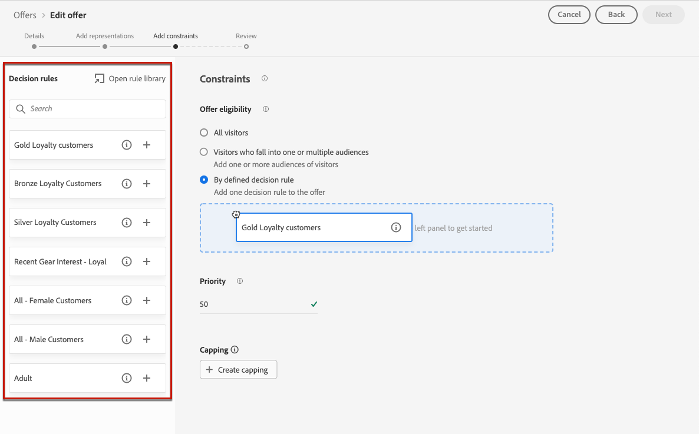

# 将约束添加到产品建议 {#add-constraints}

>[!CONTEXTUALHELP]
>id="od_offer_constraints"
>title="关于产品建议约束"
>abstract="通过约束，您可以指定与其他产品建议相比，该产品建议如何确定优先级并呈现给用户。"

>[!CONTEXTUALHELP]
>id="ajo_decisioning_constraints"
>title="关于产品建议约束"
>abstract="通过约束，您可以指定与其他产品建议相比，该产品建议如何确定优先级并呈现给用户。"

>[!CONTEXTUALHELP]
>id="od_offer_priority"
>title="关于产品建议优先级"
>abstract="在此字段中，您可以指定产品建议的优先级设置。优先级是一个数字，用于对满足所有约束（例如资格、日期和频次封顶）的产品建议进行排名。"

>[!CONTEXTUALHELP]
>id="ajo_decisioning_priority"
>title="设置优先级"
>abstract="如果用户有资格获得多个产品建议，则优先级有助于定义该产品建议相对于其他产品建议的优先级。产品建议的优先级越高，与其他产品建议相比其优先级就越高。"

利用约束，可定义显示优惠的条件。

1. 配置&#x200B;**[!UICONTROL 优惠资格]**。 [了解详情](#eligibility)

   

1. 如果用户符合多个选件的条件，则定义与其他选件相比的选件&#x200B;**[!UICONTROL 优先级]**。 产品建议的优先级越高，与其他产品建议相比其优先级就越高。

   

   >[!NOTE]
   >
   >优惠优先级必须为整数值（无小数）。

1. 指定优惠的&#x200B;**[!UICONTROL 上限]**，这意味着优惠将被显示的次数。 [了解详情](#capping)

   

1. 单击&#x200B;**[!UICONTROL 下一步]**&#x200B;确认您定义的所有约束。

例如，如果设置以下约束：

* 只有符合“金会员客户”决策规则的用户，才会考虑提供此优惠。
* 优惠的优先级设置为“50”，这意味着将在优先级为1到49的优惠之前以及优先级至少为51的优惠之后显示优惠。
* 每个用户在所有投放位置每月仅会显示一次选件。

## 资格 {#eligibility}

>[!CONTEXTUALHELP]
>id="ajo_decisioning_eligibility"
>title="定义资格"
>abstract="默认情况下，任何轮廓都有资格获得产品建议，但您可以使用受众或决策规则将产品建议限制为特定的轮廓。"

>[!CONTEXTUALHELP]
>id="od_offer_eligibility"
>title="关于产品建议资格"
>abstract="在此部分中，您可以使用决策规则来确定哪些用户有资格享受产品建议。"

<!--additional-url="https://video.tv.adobe.com/v/329373" text="Watch demo video"-->

>[!CONTEXTUALHELP]
>id="ajo_decisioning_total_profile_estimate"
>title="对轮廓的总体估计"
>abstract="当您选择受众或决策规则时，可以看到有关估计符合资格的轮廓的信息。"

**[!UICONTROL 优惠资格]**&#x200B;部分允许您将优惠限制为您使用受众或决策规则定义的特定用户档案。

>[!NOTE]
>
>在[此部分](#segments-vs-decision-rules)中了解有关使用&#x200B;**受众**&#x200B;与&#x200B;**决策规则**&#x200B;的更多信息。

* 默认情况下，**[!UICONTROL 所有访客]**&#x200B;选项处于选中状态，这意味着任何配置文件都可以呈现选件。

  

* 您还可以将选件的呈现方式限制为一个或多个[Adobe Experience Platform受众](../../audience/about-audiences.md)的成员。

  为此，请激活&#x200B;**[!UICONTROL 属于一个或多个受众的访客]**&#x200B;选项，然后从左窗格添加一个或多个受众并使用&#x200B;**[!UICONTROL And]** / **[!UICONTROL Or]**&#x200B;逻辑运算符组合这些受众。

  

* 如果要将特定[决策规则](../offer-library/creating-decision-rules.md)关联到优惠，请选择&#x200B;**[!UICONTROL 通过定义的决策规则]**，然后将所需规则从左窗格拖到&#x200B;**[!UICONTROL 决策规则]**&#x200B;区域。

  

  >[!CAUTION]
  >
  >[!DNL Journey Optimizer]当前不支持基于事件的优惠。 如果您创建基于[事件](https://experienceleague.adobe.com/docs/experience-platform/segmentation/ui/segment-builder.html#events){target="_blank"}的决策规则，则无法在优惠中利用它。

在选择受众或决策规则时，您可以看到有关预计的合格用户档案的信息。 单击&#x200B;**[!UICONTROL 刷新]**&#x200B;以更新数据。

>[!NOTE]
>
>当规则参数包含不在配置文件中的数据（如上下文数据）时，配置文件估计不可用。 例如，资格规则要求当前天气为≥80度。

### 使用受众与决策规则 {#segments-vs-decision-rules}

要应用限制，您可以将优惠选择限制为一个或多个&#x200B;**Adobe Experience Platform受众**&#x200B;的成员，也可以使用&#x200B;**决策规则**，这两个解决方案都对应于不同的用法。

基本上，受众的输出是一个用户档案列表，而决策规则是在决策过程中根据请求对单个用户档案执行的函数。 这两种用途之间的区别详见下文。

* **受众**

  一方面，受众是一组Adobe Experience Platform配置文件，它们根据配置文件属性和体验事件匹配特定逻辑。 但是，选件管理不会重新计算受众，它在呈现选件时可能不是最新的。

  在[此章节](../../audience/about-audiences.md)中详细了解受众。

* **决策规则**

  另一方面，决策规则基于Adobe Experience Platform中可用的数据，并确定可向谁显示优惠。 在给定投放位置的优惠或决策中选择优惠后，每次做出决策时都会执行规则，从而确保每个用户档案都获得最新和最佳优惠。

  在[本节](creating-decision-rules.md)中了解有关决策规则的更多信息。

## 频次封顶 {#capping}

>[!CONTEXTUALHELP]
>id="od_offer_globalcap"
>title="关于产品建议频次封顶"
>abstract="在此字段中，可指定可呈现产品建议的次数。"

>[!CONTEXTUALHELP]
>id="ajo_decisioning_capping"
>title="使用频次封顶"
>abstract="为避免过度招揽客户，请使用频次封顶定义可呈现产品建议的最大次数。您最多可以为给定产品建议创建 10 条频次封顶规则。"

<!--additional-url="https://experienceleague.adobe.com/docs/journey-optimizer/using/decisioning/offer-decisioning/managing-offers-in-the-offer-library/configure-offers/add-constraints.html#capping-change-date" text="Changing dates can impact capping"-->

上限用作约束，以定义可显示优惠的最大次数。 通过限制用户获得特定优惠的次数，您可以避免过度向客户提供报价，从而使用最佳优惠优化每个接触点。

您最多可以为给定选件添加10个上限规则。 要设置上限规则，请单击&#x200B;**[!UICONTROL 创建上限]**&#x200B;按钮，然后执行以下步骤：

>[!CAUTION]
>
>无法对之前创建的选件启用或禁用频率封顶。 为此，您需要创建一个新选件。

1. 定义将考虑哪个&#x200B;**[!UICONTROL 上限事件]**&#x200B;以增加计数器。 [了解详情](#capping-event)

1. 选择是将上限应用于所有用户还是仅应用于一个配置文件。 [了解详情](#capping-type)

1. 设置可显示优惠的次数。 [了解详情](#capping-count)

1. 设置&#x200B;**[!UICONTROL 频率]**&#x200B;以定义重置上限计数的频率。 [了解详情](#frequency-capping)

1. 如果您已为优惠定义了多个[呈现](add-representations.md)，请指定是否要对所有投放位置&#x200B;**应用上限**，还是对每个投放位置&#x200B;**应用**。 [了解详情](#placements)

1. 保存并批准优惠后，如果根据您定义的标准和时间范围在此字段中显示了您指定的次数，则将停止投放优惠。

在准备电子邮件时会计算建议使用选件的次数。 例如，如果您准备发送一封包含大量产品建议的电子邮件，则无论是否发送了这封电子邮件，这些数量都将计入您的最大上限。

<!--If an email delivery is deleted or if the preparation is done again before being sent, the capping value for the offer is automatically updated.-->

>[!NOTE]
>
>当优惠到期或优惠开始日期后2年（以先到者为准）时，将重置上限计数器。 在[本节](creating-personalized-offers.md#create-offer)中了解如何定义优惠的日期。

### 频次封顶事件 {#capping-event}

>[!CONTEXTUALHELP]
>id="ajo_decisioning_frequency_capping_impression"
>title="印象"
>abstract="仅入站频道可将印象用作频次封顶事件。"

**[!UICONTROL Choose capping event]**&#x200B;字段允许您定义将考虑哪个事件以增加计数器：

* **[!UICONTROL 决策事件]**（默认值）：可显示优惠的最大次数。
* **[!UICONTROL 点击次数]**：用户可以点击选件的最大次数。
* **[!UICONTROL 展示]**：选件可以向用户显示的最大次数。

  >[!NOTE]
  >
  >将展示次数用作上限事件仅适用于&#x200B;**入站渠道**。

* **[!UICONTROL 自定义事件]**：您可以定义用于限制已发送优惠数量的自定义事件。 例如，您可以限制赎回次数，直到它们相等10000或直到给定用户档案赎回了1次。 为此，请使用[Adobe Experience Platform XDM](https://experienceleague.adobe.com/docs/experience-platform/xdm/home.html){target="_blank"}架构构建自定义事件规则。

  <!--For example, you can cap on the number of redemptions so that the offer can be shown until redemptions equal 10000. You can only select XDM ExperienceEvents. -->

  在下面的示例中，您要限制结账的数量。

   1. 从列表中选择&#x200B;**[!UICONTROL 自定义事件]**&#x200B;并使用&#x200B;**[!UICONTROL 添加自定义事件]**&#x200B;按钮。

   1. 使用&#x200B;**[!UICONTROL 创建自定义事件规则]**&#x200B;生成器选择相关事件。 您可以选择您希望限制选件的任何用户操作。

      在此选择&#x200B;**[!UICONTROL Commerce]** > **[!UICONTROL 结帐]** > **[!UICONTROL 值]**，然后从下拉列表中选择&#x200B;**[!UICONTROL 存在]**。

      

   1. 创建规则后，该规则将显示在&#x200B;**[!UICONTROL 自定义事件查询]**&#x200B;字段中。

      

>[!CAUTION]
>
>对于除决策事件之外的所有上限事件，决策管理反馈可能无法自动收集，这可能导致上限计数器无法正确递增。 [了解详情](../data-collection/data-collection.md)
>
>要确保在上限计数器中跟踪并说明了每个上限事件，请确保用于收集体验事件的架构包含该事件的正确字段组。 [了解详情](../data-collection/schema-requirement.md)

### 上限类型 {#capping-type}

您可以指定希望将上限应用于所有用户还是某个特定配置文件：

* 选择总共&#x200B;**[!UICONTROL 个]**&#x200B;以定义可在组合目标受众中建议多少次选件，即在所有用户中建议多少次。

  例如，如果您是具有“TV doorbuster deal”的电子产品retailer，则希望在所有配置文件中仅返回200次选件。

* 选择&#x200B;**[!UICONTROL 每个配置文件]**&#x200B;以定义可向同一用户建议优惠的次数。

  例如，如果您是一家提供“白金信用卡”优惠的银行，您不希望每个用户档案显示此优惠超过5次。 实际上，您相信，如果用户查看了5次选件且没有对其执行操作，则他们更有可能对下一个最佳选件执行操作。

### 封顶计数 {#capping-count}

**[!UICONTROL 上限计数限制]**&#x200B;字段允许您指定可以展示选件的次数。

>[!NOTE]
>
>数字必须是大于0的整数。

例如，您定义了一个自定义上限事件，例如将结账数量考虑在内。 如果您在&#x200B;**[!UICONTROL 上限计数限制]**&#x200B;字段中输入10，则结账10次后将不再发送任何选件。

### 频率上限 {#frequency-capping}

>[!CONTEXTUALHELP]
>id="ajo_decisioning_frequency_capping"
>title="设置频率上限"
>abstract="您可以选择每天、每周或每月重置产品建议频次封顶计数器。请注意，在启用频次封顶的情况下发布产品建议后，您将无法更改已定义的频率。"

**[!UICONTROL 重置上限频率]**&#x200B;字段允许您定义重置上限计数的频率。 为此，请为盘点定义时间期（每天、每周或每月），并输入您选择的天数/周数/月数。 例如，如果希望每2周重置一次上限计数，请从相应的下拉列表中选择&#x200B;**[!UICONTROL 每周]**，并在其他字段中键入&#x200B;**2**。

>[!NOTE]
>
>频率上限计数器重置发生在您定义的日期的&#x200B;**12 UTC**&#x200B;上午，或者在一周/月的第一天（如果适用）。 一周的开始日期是&#x200B;**星期日**。 您选择的任何持续时间不能超过&#x200B;**2年**（即相应的月数、周数或天数）。
>
>发布优惠后，您将无法更改为该频率选择的时间段（每月、每周或每日）。 如果选件具有&#x200B;**[!UICONTROL 草稿]**&#x200B;状态并且之前从未发布并启用了频率封顶，则您仍可以编辑频率封顶。

+++ **必读：频率上限和决策管理API**

频率上限计数器已更新，并且在3秒内即可在[Edge Decisioning API](../api-reference/offer-delivery-api/start-offer-delivery-apis.md#edge)决策中使用。

每个中心区域与一个或多个边缘区域相关联。 频率限定规则从每个中心区域生成并导出到其关联的边缘区域。 每当使用Edge Decisioning API做出决策时，系统都会强制实施同一边缘区域中可用的规则：

* 如果存在匹配规则，则用户档案的频率上限计数器将递增。
* 否则，将不会为配置文件创建计数器，并且频率上限规则不适用。 因此，即使超出上限阈值，配置文件仍将继续接收个性化优惠。

例如，我们将贵组织的中心区域视为&#x200B;*NLD2*，而您正在发送来自欧洲（*IRL1*&#x200B;边缘区域）的决策请求。 在这种情况下，决策请求将递增用户档案的计数器，因为规则在（爱尔兰） *IRL1*&#x200B;区域可用。 但是，如果决策请求来自像日本这样的区域(*JPN3*)，该区域不是与（荷兰） *NLD2*&#x200B;中心区域绑定的边缘区域，则不会创建任何计数器，也不会实施频率上限规则。

>[!NOTE]
>
>当计数器从Edge传播到Hub或从Hub传播到Edge区域时，可能会延迟几分钟。

有关哪些中心和边缘区域与您的组织关联的更多信息，请联系您的Adobe代表。

对于其他API，频率上限计数器将进行如下更新：

* 在[决策API](../api-reference/offer-delivery-api/start-offer-delivery-apis.md#decisioning)决策中，频率上限计数器可能会延迟几分钟更新，具体取决于流量。

* 在[Batch Decisioning API](../api-reference/offer-delivery-api/batch-decisioning-api.md)决策中，使用频率上限计数器保持固定的快照。 只要使用相同的快照，计数器将保持不变。

+++

### 上限和投放 {#placements}

如果您为优惠定义了多个[呈现](add-representations.md)，请指定是要对所有投放位置还是每个投放位置应用上限。

* **[!UICONTROL 对所有投放位置应用上限]**：上限计数将总计与优惠关联的投放位置中的所有决策。

  例如，如果选件具有&#x200B;**电子邮件**&#x200B;版面和一个&#x200B;**Web**&#x200B;版面，而您在所有版面&#x200B;**中将每个配置文件的上限设置为** 2，则无论版面组合如何，每个配置文件最多可以接收选件的2次。

* **[!UICONTROL 对每个投放位置应用上限]**：上限计数将分别为每个投放位置应用决策计数。

  例如，如果选件具有&#x200B;**电子邮件**&#x200B;版面和一个&#x200B;**Web**&#x200B;版面，而您为每个版面&#x200B;**的每个用户档案将上限设置为** 2，则每个用户档案最多可以接收电子邮件版面2次选件，并且可以接收网站版面2次。

### 更改日期对频次封顶的影响 {#capping-change-date}

>[!CONTEXTUALHELP]
>id="ajo_decisioning_offer_change_date"
>title="更改日期可能会影响频次封顶"
>abstract="如果此产品建议应用了频次封顶，则在更改开始或结束日期时可能会影响该频次封顶。"

更改优惠日期时必须小心操作，因为如果满足以下条件，这可能会对上限产生影响：

* 优惠已获得[批准](#review)。
* [上限](#capping)已应用于选件。
* 上限是按配置文件定义的。

>[!NOTE]
>
>在[本节](creating-personalized-offers.md#create-offer)中了解如何定义优惠的日期。

每个配置文件设置上限会存储每个配置文件上的上限计数。 当您更改已批准优惠的开始和结束日期时，某些用户档案的上限计数可能会根据下面描述的不同情况受到影响。

以下是&#x200B;**更改优惠开始日期**&#x200B;时可能出现的情况：

| 方案： 如果…… | 发生的情况： 然后…… | 对上限计数的可能影响 |
|--- |--- |--- |
| ...优惠开始日期在原始优惠开始日期之前更新， | ...上限计数将从新的开始日期开始。 | 否 |
| ...新的开始日期在当前结束日期之前， | ...上限将继续为新的开始日期，并且每个用户档案的上限计数将结转。 | 否 |
| ...新的开始日期在当前结束日期之后， | ...当前上限将过期，新的上限计数将从新开始日期的所有配置文件的0重新开始。 | 是 |

以下是&#x200B;**延长优惠结束日期**&#x200B;时可能出现的情况：

| 方案： 如果…… | 发生的情况： 然后…… | 对上限计数的可能影响 |
|--- |--- |--- |
| ...决策请求在原始优惠结束日期之前发生， | ...将更新上限计数，并将结转每个用户档案的上一个上限计数。 | 否 |
| ...在原始结束日期之前不会发生任何决策请求， | ...上限计数将在每个用户档案的原始结束日期重置。 对于在原始结束日期之后发生的任何新决策请求，新的上限计数将从0再次开始。 | 是 |

**示例**

假设您有一个优惠，其原始开始日期设置为&#x200B;**1月1日**，截止日期为&#x200B;**1月31日**。

1. 配置文件X、Y和Z将显示选件。
1. 在&#x200B;**1月10日**，优惠的结束日期更改为&#x200B;**2月15日**。
1. **从1月11日至1月31日**，只提供配置文件Z选件。

   * 由于决策请求发生在配置文件Z **的原始结束日期**&#x200B;之前，因此选件的结束日期可以延长到&#x200B;**2015年2月15日**。
   * 但是，由于&#x200B;**配置文件X和Y**&#x200B;的原始结束日期之前未发生任何活动，因此其计数器将过期，并且其上限计数将在&#x200B;**January， 31**&#x200B;重置为0。

