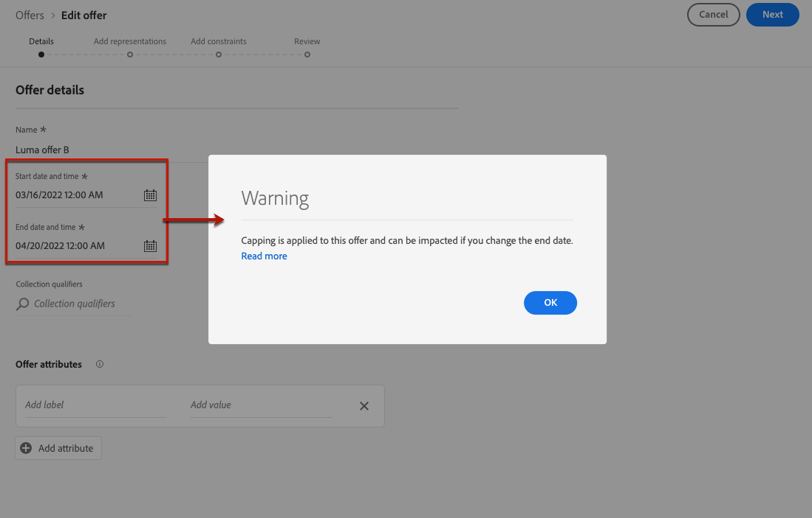

# 向优惠添加约束 {#add-constraints}

>[!CONTEXTUALHELP]
>id="od_offer_constraints"
>title="关于优惠约束"
>abstract="通过约束，您可以指定与其他优惠相比，该优惠如何确定优先级并呈现给用户。"

>[!CONTEXTUALHELP]
>id="ajo_decisioning_constraints"
>title="关于优惠约束"
>abstract="通过约束，您可以指定与其他优惠相比，该优惠如何确定优先级并呈现给用户。"

>[!CONTEXTUALHELP]
>id="od_offer_priority"
>title="关于优惠优先级"
>abstract="在此字段中，您可以指定优惠的优先级设置。优先级是一个数字，用于对满足所有约束（例如资格、日期和频次封顶）的优惠进行排名。"

>[!CONTEXTUALHELP]
>id="ajo_decisioning_priority"
>title="设置优先级"
>abstract="如果用户有资格获得多个优惠，则优先级有助于定义该优惠相对于其他优惠的优先级。优惠的优先级越高，与其他优惠相比其优先级就越高。"

利用约束，可定义显示优惠的条件。

1. 配置 **[!UICONTROL 优惠资格]**. [了解详情](#eligibility)

   

1. 定义 **[!UICONTROL 优先级]** 相较于其他选件（如果用户符合多个选件的条件）。 优惠的优先级越高，与其他优惠相比其优先级就越高。

   

   >[!NOTE]
   >
   >优惠优先级必须为整数值（无小数）。

1. 指定选件的 **[!UICONTROL 上限]**，即优惠的展示次数。 [了解详情](#capping)

   

1. 单击 **[!UICONTROL 下一个]** 以确认您定义的所有约束。

例如，如果设置以下约束：

* 只有符合“金会员客户”决策规则的用户，才会考虑提供此优惠。
* 优惠的优先级设置为“50”，这意味着将在优先级为1到49的优惠之前以及优先级至少为51的优惠之后显示优惠。
* 每个用户每月仅在所有投放位置中显示一次选件。

## 资格 {#eligibility}

>[!CONTEXTUALHELP]
>id="ajo_decisioning_eligibility"
>title="定义资格"
>abstract="默认情况下，任何配置文件都有资格获得优惠，但您可以使用受众或决策规则将优惠限制为特定的配置文件。"

>[!CONTEXTUALHELP]
>id="od_offer_eligibility"
>title="关于优惠资格"
>abstract="在此部分中，您可以使用决策规则来确定哪些用户有资格享受优惠。"
>additional-url="https://video.tv.adobe.com/v/329373" text="观看演示视频"

>[!CONTEXTUALHELP]
>id="ajo_decisioning_total_profile_estimate"
>title="对配置文件的总体估计"
>abstract="当您选择受众或决策规则时，可以看到有关估计符合资格的配置文件的信息。"

此 **[!UICONTROL 优惠资格]** 部分允许您将优惠限制为您使用受众或决策规则定义的特定用户档案。

>[!NOTE]
>
>了解有关使用的更多信息 **受众** 对比 **决策规则** 在 [本节](#segments-vs-decision-rules).

* 默认情况下， **[!UICONTROL 所有访客]** 选项，这意味着任何用户档案都有资格显示选件。

  

* 您还可以将优惠呈现方式限制为一个或多个成员 [Adobe Experience Platform受众](../../audience/about-audiences.md).

  为此，请激活 **[!UICONTROL 属于一个或多个受众的访客]** 选项，然后从左窗格添加一个或多个受众，然后使用 **[!UICONTROL 和]** / **[!UICONTROL 或]** 逻辑运算符。

  

* 如果要关联特定 [决策规则](../offer-library/creating-decision-rules.md) 对于选件，选择 **[!UICONTROL 按定义的决策规则]**，然后将所需规则从左窗格拖入 **[!UICONTROL 决策规则]** 区域。

  

  >[!CAUTION]
  >
  >中当前不支持基于事件的优惠 [!DNL Journey Optimizer]. 如果您根据以下内容创建决策规则： [事件](https://experienceleague.adobe.com/docs/experience-platform/segmentation/ui/segment-builder.html#events){target="_blank"}，您将无法在选件中利用它。

当您选择受众或决策规则时，可以看到有关估计符合资格的配置文件的信息。单击 **[!UICONTROL 刷新]** 以更新数据。

>[!NOTE]
>
>当规则参数包含不在配置文件中的数据（如上下文数据）时，配置文件估计不可用。 例如，资格规则要求当前天气为≥80度。

### 使用受众与决策规则 {#segments-vs-decision-rules}

要应用限制，您可以将选件的选择限制在一或多个成员中 **Adobe Experience Platform受众**，也可以使用 **决策规则**，这两种解决方案分别对应于不同的用途。

基本上，受众的输出是一个用户档案列表，而决策规则是在决策过程中根据请求对单个用户档案执行的函数。 这两种用途之间的区别详见下文。

* **受众**

  一方面，受众是一组Adobe Experience Platform配置文件，它们根据配置文件属性和体验事件匹配特定逻辑。 但是，选件管理不会重新计算受众，它在呈现选件时可能不是最新的。

  在中了解关于受众的更多信息 [本节](../../audience/about-audiences.md).

* **决策规则**

  另一方面，决策规则基于Adobe Experience Platform中可用的数据，并确定可向谁显示优惠。 在给定投放位置的优惠或决策中选择优惠后，每次做出决策时都会执行规则，从而确保每个用户档案都获得最新和最佳优惠。

  在中了解有关决策规则的更多信息 [本节](creating-decision-rules.md).

## 频次封顶 {#capping}

>[!CONTEXTUALHELP]
>id="od_offer_globalcap"
>title="关于优惠频次封顶"
>abstract="在此字段中，可指定可呈现优惠的次数。"

>[!CONTEXTUALHELP]
>id="ajo_decisioning_capping"
>title="使用频次封顶"
>abstract="为避免过度招揽客户，请使用频次封顶定义可呈现优惠的最大次数。"
>additional-url="https://experienceleague.adobe.com/docs/journey-optimizer/using/offer-decisioning/managing-offers-in-the-offer-library/configure-offers/add-constraints.html?lang=zh-Hans#capping-change-date" text="更改日期可能会影响频次封顶"

上限用作约束，以定义可显示优惠的最大次数。

通过限制用户获得特定优惠的次数，您可以避免过度向客户提供报价，从而使用最佳优惠优化每个接触点。

要设置上限，请执行以下步骤。

1. 确保 **[!UICONTROL 启用上限]** 切换按钮处于选中状态。 默认情况下，将启用上限。

   >[!CAUTION]
   >
   >无法对之前创建的选件启用或禁用频率封顶。 为此，您需要创建一个新选件。

1. 定义哪些 **[!UICONTROL 设置事件上限]** 将被考虑以增加计数器。 [了解详情](#capping-event)

1. 设置可显示优惠的次数。 [了解详情](#capping-count)

1. 选择是将上限应用于所有用户还是仅应用于一个配置文件。 [了解详情](#capping-type)

1. 设置 **[!UICONTROL 频率]** 以定义重置上限计数的频率。 [了解详情](#frequency-capping)

1. 如果您定义了多个 [呈现](add-representations.md) 对于选件，指定是否要应用上限 **在所有投放位置中** 或 **到每个投放位置**. [了解详情](#placements)

1. 保存并批准优惠后，如果根据您定义的标准和时间范围在此字段中显示了您指定的次数，则将停止投放优惠。

在准备电子邮件时会计算建议使用选件的次数。 例如，如果您准备发送一封包含大量选件的电子邮件，则无论是否发送了这封电子邮件，这些数量都将计入您的最大上限。

<!--If an email delivery is deleted or if the preparation is done again before being sent, the capping value for the offer is automatically updated.-->

>[!NOTE]
>
>当优惠到期或优惠开始日期后2年（以先到者为准）时，将重置上限计数器。 了解如何在中定义优惠的日期 [本节](creating-personalized-offers.md#create-offer).

### 频次封顶事件 {#capping-event}

>[!CONTEXTUALHELP]
>id="ajo_decisioning_frequency_capping_impression"
>title="印象"
>abstract="仅入站频道可将印象用作频次封顶事件。"

此 **[!UICONTROL 设置事件上限]** 字段允许您定义将考虑哪个事件以增加计数器：

* **[!UICONTROL 决策事件]** （默认值）：可显示选件的最大次数。
* **[!UICONTROL 展示]**：选件可向用户显示的最大次数。

  >[!NOTE]
  >
  >可将展示次数用作上限事件 **入站渠道** 仅限。

* **[!UICONTROL 点击次数]**：用户可单击选件的最大次数。
* **[!UICONTROL 自定义事件]**：您可以定义一个自定义事件，用于限制发送的优惠数量。 例如，您可以限制赎回次数，直到它们相等10000或直到给定用户档案赎回了1次。 为此，请使用 [ADOBE EXPERIENCE PLATFORM XDM](https://experienceleague.adobe.com/docs/experience-platform/xdm/home.html){target="_blank"} 用于构建自定义事件规则的架构。

  <!--For example, you can cap on the number of redemptions so that the offer can be shown until redemptions equal 10000. You can only select XDM ExperienceEvents. -->

  在下面的示例中，您要限制结账的数量。

   1. 选择 **[!UICONTROL 自定义事件]** ，并使用 **[!UICONTROL 添加自定义事件]** 按钮。

      

   1. 使用 **[!UICONTROL 创建自定义事件规则]** 生成器以选择相关事件。 您可以选择您希望限制选件的任何用户操作。

      在此选择 **[!UICONTROL 商务]** > **[!UICONTROL 结账次数]** > **[!UICONTROL 值]** 并选择 **[!UICONTROL 存在]** 下拉列表中。

      

   1. 创建规则后，该规则将显示在 **[!UICONTROL 自定义事件查询]** 字段。

      

>[!CAUTION]
>
>对于除决策事件之外的所有上限事件，决策管理反馈可能无法自动收集，这可能导致上限计数器无法正确递增。 [了解详情](../data-collection/data-collection.md)
>
>要确保在上限计数器中跟踪并说明了每个上限事件，请确保用于收集体验事件的架构包含该事件的正确字段组。 [了解详情](../data-collection/schema-requirement.md)

### 上限计数 {#capping-count}

此 **[!UICONTROL 上限计数限制]** 字段，用于指定可显示选件的次数。

>[!NOTE]
>
>数字必须是大于0的整数。

例如，您定义了一个自定义上限事件，例如将结账数量考虑在内。 如果您在 **[!UICONTROL 上限计数限制]** 字段中，10次结账后将不再发送任何选件。

### 上限类型 {#capping-type}

您还可以指定是否希望将上限应用到所有用户或一个特定配置文件：

* 选择 **[!UICONTROL 总计]** 用于定义可在组合目标受众中建议多少次选件，即在所有用户中均如此。

  例如，如果您是一家具有“TV doorbuster deal”的电子零售商，则希望在所有配置文件中仅返回200次选件。

* 选择 **[!UICONTROL 每个配置文件]** 定义可向同一用户建议选件的次数。

  例如，如果您是一家提供“白金信用卡”优惠的银行，您不希望每个用户档案显示此优惠超过5次。 实际上，您相信，如果用户查看了5次选件且没有对其执行操作，则他们更有可能对下一个最佳选件执行操作。

### 频次上限 {#frequency-capping}

>[!CONTEXTUALHELP]
>id="ajo_decisioning_frequency_capping"
>title="设置频次封顶"
>abstract="您可以选择每天、每周或每月重置优惠频次封顶计数器。请注意，在启用频次封顶的情况下发布优惠后，您将无法更改已定义的频率。"

此 **[!UICONTROL 频率]** 部分允许您定义上限计数的重置频率。 为此，请为盘点定义时间期（每天、每周或每月），并输入您选择的天数/周数/月数。

>[!NOTE]
>
>重置发生在UTC凌晨12点，也就是您定义的日期或一周/月的第一天（如果适用）。 一周的开始日是星期日。 您选择的任何持续时间不得超过2年（即相应的月数、周数或天数）。

例如，如果希望每2周重置一次上限计数，请选择 **[!UICONTROL 每周]** 从相应的下拉列表输入并键入 **2** 在另一个栏位中。 重置将在每隔一个星期日的中午12点(UTC)进行。

>[!CAUTION]
>
>发布优惠后，您将无法更改为该频率选择的时间段（每月、每周或每日）。
>
>如果选件具有 **[!UICONTROL 草稿]** 状态，之前从未发布并启用了频率封顶。

### 上限和投放 {#placements}

如果您定义了多个 [呈现](add-representations.md) 对于选件，指定是要对所有投放位置还是每个投放位置应用上限。

* **[!UICONTROL 在所有投放位置中应用上限]**：上限计数将总计与优惠关联的投放位置中的所有决策。

  例如，如果选件具有 **电子邮件** 投放位置和 **Web** 放置，并将上限设置在 **所有投放位置中每个配置文件2个**，则无论版面组合如何，每个用户档案最多都会收到选件2次。

* **[!UICONTROL 将上限应用于每个投放位置]**：上限计数将分别应用每个投放位置的决策计数。

  例如，如果选件具有 **电子邮件** 投放位置和 **Web** 放置，并将上限设置在 **每次投放每个用户档案2个**，则每个用户档案最多可收到电子邮件投放2次选件，以及网站投放2次选件。

### 更改日期对频次封顶产生的影响 {#capping-change-date}

>[!CONTEXTUALHELP]
>id="ajo_decisioning_offer_change_date"
>title="更改日期可能会影响频次封顶"
>abstract="如果此优惠应用了频次封顶，则在更改开始或结束日期时可能会影响该频次封顶。"

更改优惠日期时必须小心操作，因为如果满足以下条件，这可能会对上限产生影响：

* 选件为 [已批准](#review).
* [上限](#capping) 已应用于选件。
* 上限是按配置文件定义的。

>[!NOTE]
>
>了解如何在中定义优惠的日期 [本节](creating-personalized-offers.md#create-offer).

每个配置文件设置上限会存储每个配置文件上的上限计数。 当您更改已批准优惠的开始和结束日期时，某些用户档案的上限计数可能会根据下面描述的不同情况受到影响。

以下是以下可能的情况 **更改优惠开始日期**：

| 方案： 如果…… | 发生什么情况： 然后…… | 对上限计数的可能影响 |
|--- |--- |--- |
| ...优惠开始日期在原始优惠开始日期之前更新， | ...上限计数将从新的开始日期开始。 | 否 |
| ...新的开始日期在当前结束日期之前， | ...上限将继续为新的开始日期，并且每个用户档案的上限计数将结转。 | 否 |
| ...新的开始日期在当前结束日期之后， | ...当前上限将过期，新的上限计数将从新开始日期的所有配置文件的0重新开始。 | 是 |

以下是以下可能的情况 **延长优惠结束日期**：

| 方案： 如果…… | 发生什么情况： 然后…… | 对上限计数的可能影响 |
|--- |--- |--- |
| ...决策请求在原始优惠结束日期之前发生， | ...将更新上限计数，并将结转每个用户档案的上一个上限计数。 | 否 |
| ...在原始结束日期之前不会发生任何决策请求， | ...上限计数将在每个用户档案的原始结束日期重置。 对于在原始结束日期之后发生的任何新决策请求，新的上限计数将从0再次开始。 | 是 |

**示例**

假设您有一个优惠，其原始开始日期设置为 **1月1日**，到期时间 **一月，31日**.

1. 配置文件X、Y和Z将显示选件。
1. 开启 **1月10日**，则选件的结束日期将更改为 **2月15日**.
1. **一月十一日至一月三十一日**，则仅配置文件Z会呈现选件。

   * 因为决策请求发生在原始结束日期之前 **配置文件Z**，优惠的结束日期可以延长到 **2月15日**.
   * 但是，由于在初始结束日期之前没有发生任何活动， **配置文件X和Y**，则其计数器将过期，其上限计数将重置为0于 **一月，31日**.

