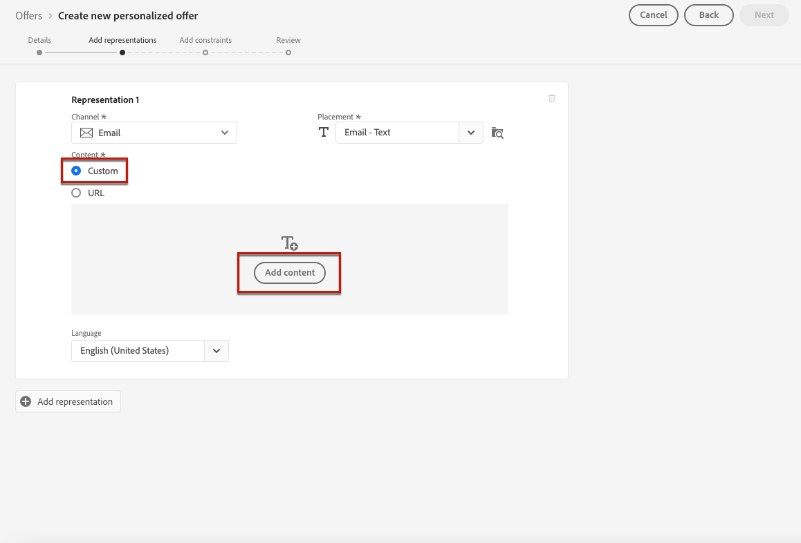

# 向优惠添加呈现 {#add-representations}

>[!CONTEXTUALHELP]
>id="ajo_decisioning_representation"
>title="呈现"
>abstract="添加呈现以定义优惠在消息中的显示位置。 优惠具有的表示越多，在不同投放位置上下文中使用该优惠的机会就越多。"

选件可以显示在消息中的不同位置：在带有图像的顶部横幅中、作为段落中的文本或者HTML块中，等等。 优惠具有的表示越多，在不同投放位置上下文中使用该优惠的机会就越多。

## 配置优惠的呈现 {#representations}

要向优惠添加一个或多个呈现并配置它们，请执行以下步骤。

1. 对于第一种表示法，首先选择 **[!UICONTROL 渠道]** 将被使用。

   

   >[!NOTE]
   >
   >中仅显示选定渠道的可用投放位置 **[!UICONTROL 投放]** 下拉列表。

1. 从列表中选择版面。

   您还可以使用 **[!UICONTROL 投放]** 下拉列表来浏览所有投放位置。

   

   在那里，您仍然可以根据投放位置的渠道和/或内容类型筛选投放位置。 选择投放位置并单击 **[!UICONTROL 选择]**.

   

1. 向演示文稿添加内容。 了解如何在 [本节](#content).

1. 添加内容（如图像或URL）时，您可以指定 **[!UICONTROL 目标链接]**：单击选件的用户将被定向到相应的页面。

   

1. 最后，选择您选择的语言，以帮助识别和管理要向用户显示的内容。

1. 要添加其它表示法，请使用 **[!UICONTROL 添加呈现]** 按钮，并根据需要添加任意数量的呈现。

   

1. 添加所有呈现后，选择 **[!UICONTROL 下一个]**.

## 定义呈现的内容 {#content}

您可以向表示法添加不同类型的内容。

>[!NOTE]
>
>只有与版面的内容类型对应的内容才可供使用。

### 添加图像 {#images}

如果所选版面为图像类型，则可以添加来自 **Adobe Experience Cloud资产** 库，由提供的资产集中存储库 [!DNL Adobe Experience Manager Assets].

>[!NOTE]
>
> 使用 [Adobe Experience Manager Assets Essentials](https://experienceleague.adobe.com/docs/experience-manager-assets-essentials/help/introduction.html){target="_blank"}，您需要部署 [!DNL Assets Essentials] 并确保用户是的一部分 **Assets Essentials消费者用户** 或/和 **Assets Essentials用户** 产品配置文件。 详细了解 [此页面](https://experienceleague.adobe.com/docs/experience-manager-assets-essentials/help/get-started-admins/deploy-administer.html){target="_blank"}.

1. 选择 **[!UICONTROL 资产库]** 选项。

1. 选择 **[!UICONTROL 浏览]**.

   

1. 浏览资源以选择您选择的图像

1. 单击 **[!UICONTROL 选择]**.

   

### 添加HTML或JSON文件 {#html-json}

如果所选投放位置为HTML类型，您还可以添加来自的HTML或JSON内容 [Adobe Experience Cloud资源库](https://experienceleague.adobe.com/docs/experience-manager-assets-essentials/help/introduction.html){target="_blank"})。

例如，您在中创建了一个HTML电子邮件模板 [Adobe Experience Manager](https://experienceleague.adobe.com/docs/experience-manager.html){target="_blank"} 您希望将该文件用于选件内容。 您只需将模板上传到中，而无需创建新文件 **资产库** 以便在优惠的表示法中重复使用它。

要在演示文稿中重用内容，请浏览 **资产库** 如中所述 [本节](#images) 并选择您选择的HTML或JSON文件。


### 添加URL {#urls}

要从外部公共位置添加内容，请选择 **[!UICONTROL URL]**，然后输入要添加的内容的URL地址。

您可以使用个性化编辑器个性化URL。 详细了解 [个性化](../../personalization/personalize.md#use-expression-editor).


例如，您希望将显示为选件的图像个性化。 你想让喜欢城市度假的用户看到纽约的天际线，想让喜欢海滩度假的用户看到夏威夷的北岸。

使用个性化编辑器，使用合并模式检索存储在Adobe Experience Platform中的配置文件属性。 [了解详情](https://experienceleague.adobe.com/docs/experience-platform/profile/union-schemas/union-schemas-overview.html){target="_blank"}


如果您指定 **[!UICONTROL 目标链接]**，您还可以将单击选件的用户定向到的URL个性化。

### 添加自定义文本 {#custom-text}

您还可以在选择兼容的版面时插入文本类型内容。

1. 选择 **[!UICONTROL 自定义]** 选项并单击 **[!UICONTROL 添加内容]**.

   

   >[!NOTE]
   >
   >此选项不适用于图像类型的投放。

1. 键入将在选件中显示的文本。

   

   您可以使用个性化编辑器将内容个性化。 详细了解 [个性化](../../personalization/personalize.md#use-expression-editor).

   

   >[!NOTE]
   >
   >仅 **[!UICONTROL 配置文件属性]**， **[!UICONTROL 受众]** 和 **[!UICONTROL 辅助函数]** 源可用于Decision Management。

## 根据上下文数据个性化呈现{#context-data}

当上下文数据传入 [Edge decisioning](../api-reference/offer-delivery-api/edge-decisioning-api.md) 调用，您可以利用这些数据动态地个性化呈现。 例如，您可以根据实时因素（如决策时的当前天气条件）定制优惠的表示方式。

要实现此目的，请使用将上下文数据变量直接合并到表示法内容中。 `profile.timeSeriesEvents.` 命名空间。

下面是一个语法示例，用于根据用户的操作系统对优惠的表示进行个性化：

```
 iosandroid 
```

包含上下文数据的相应Edge Decisioning请求如下：

```
{
    "body": {
        "xdm": {
            "identityMap": {
                "Email": [
                    {
                        "id": "xyz@abc.com"
                    }
                ]
            },
            "device": {
                "model": "Apple"
            }
        },
        "extra": {
            "query": {
                "decisionScopes": [
                    "eyJ4ZG06..."
                ]
            }
        }
    }
}
```
