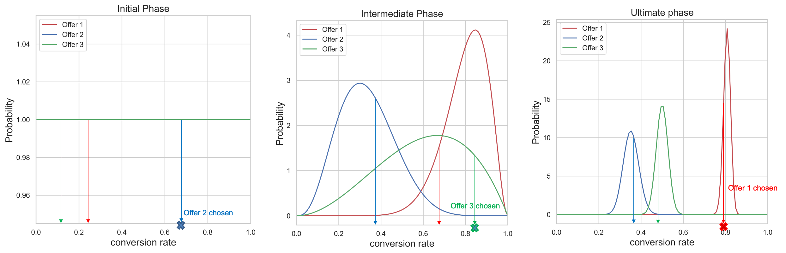

# AI模型 {#ai-models}

## AI模型快速入门 {#get-started-with-ai-rankings}

[!DNL Journey Optimizer] 允许您使用经过培训的模型系统对选件进行排名，以显示给定的用户档案。

>[!CAUTION]
>
>目前，只能对选定用户提前访问AI模型。

此功能允许您创建不同的 **AI模型** 基于您的业务目标。 在决策中使用这些基于目标的不同策略，经过培训的模型系统将帮助您了解不同的AI模型如何影响您的目标。

例如，您可以为电子邮件渠道选择一个AI模型，为推送渠道选择另一个AI模型。 对于每个渠道，经过培训的模型系统将利用多个数据点来确定在给定投放中应首先显示哪个选件，而不是考虑选件的优先级分数或 [排名公式](create-ranking-formulas.md).

>[!NOTE]
>
>当前位于 [!DNL Journey Optimizer] AI排名唯一支持的模型类型是 **自动优化**.

## 自动优化模型 {#auto-optimization}

自动优化模型旨在提供可最大限度地提高业务客户设定的回报(KPI)的选件。 这些关键绩效指标可以是转化率、收入等形式。 此时，自动优化将重点放在通过选件转化作为我们的目标来优化选件点击量。 自动优化是非个性化的，并会根据选件的“全局”性能进行优化。

### 术语

讨论自动优化时，以下术语很有用：

* **多臂老虎机**:A [多臂老虎机](https://en.wikipedia.org/wiki/Multi-armed_bandit){target=&quot;_blank&quot;}优化方法可在探索性学习与对该学习的利用之间取得平衡。

* **Thomson采样**：汤普森采样是一种在线决策问题的算法，在此类问题中，动作按顺序执行，且必须在利用已知内容最大化即时性能与投资以积累可能改善未来性能的新信息之间取得平衡。 [了解详情](#thompson-sampling)

* [**测试版分发**](https://en.wikipedia.org/wiki/Beta_distribution){target=&quot;_blank&quot;}:连续集 [概率分布](https://en.wikipedia.org/wiki/Probability_distribution)在间隔上定义的{target=&quot;_blank&quot;} [0,1] [参数化](https://en.wikipedia.org/wiki/Statistical_parameter){target=&quot;_blank&quot;}，正两个 [形状参数](https://en.wikipedia.org/wiki/Shape_parameter){target=&quot;_blank&quot;}。

### 汤普森采样 {#thompson-sampling}

作为自动优化的基础的算法是 **汤普森采样**. 在本节中，我们讨论了汤普森采样背后的直觉。

[汤普森采样](https://en.wikipedia.org/wiki/Thompson_sampling){target=&quot;_blank&quot;}或Bayesian强盗是多臂老虎机问题的贝叶斯方法。  其基本思想是对待平均回报??作为 **随机变量** 利用我们迄今收集到的数据来更新我们对平均回报的“信念”。 这种“信念”在数学上由 **后验概率分布**  — 基本上是平均奖励的值范围，以及奖励对每次奖励具有该值的可信度（或概率）。 那么，每个决定，我们都会 **从这些后期奖励分布中抽取的点** 并选择其抽样奖励具有最高价值的选件。

下图说明了此过程，其中我们提供了3个不同的选件。 最初，我们没有从数据中得到任何证据，我们假设所有报价都具有统一的后期奖励分布。 我们从每个选件的后奖励分布中抽取一个样本。 从选件2的分发中选择的示例具有最高值。 这是 **勘探**. 在显示选件2后，我们收集任何潜在的奖励（例如转换/无转换），并使用Bayes定理更新选件2的后验分布，如下所述。  我们会继续此过程，并在每次显示选件并收集奖励时更新后验分配。 在第二个数字中，选择选件3 — 尽管选件1具有最高的平均回报（其后奖励分配最靠右），但从每个分配中取样的过程导致我们选择明显次优的选件3。 在这样做时，我们有机会进一步了解Offer 3的真实奖励分配。

随着采集的样本越多，置信度就越高，并且对可能的奖励获得更准确的估计（对应于较窄的奖励分配）。 随着更多证据的出现，这种更新我们信念的过程被称为 **贝叶斯推理**.

最终，如果一个选件（例如，选件1）是明确的入选者，其后的奖励分配将与其他选件分开。 此时，对于每项决策，选件1中的抽样奖励可能最高，我们将以更高的概率进行选择。 这是 **剥削**  — 我们坚信选件1是最好的，因此选择它是为了最大化回报。

**图1**: *对于每个决策，我们从后验奖励分布中抽取一个点。 将选择样本值最高（转化率）的选件。 在初始阶段，所有选件的分布都是一致的，因为我们没有任何关于数据选件转化率的证据。 随着采集样本的增多，后验分布变得越来越窄、更准确。 最终，将每次选择转化率最高的选件。*

<!--

-->

+++**技术详细信息**

要计算/更新分配，我们使用 **贝叶斯定理**. 对于每个选件 ***i***，我们想计算他们***P(??i |数据)***，即每个选件 ***i***，奖励价值的可能性 **??i** 是，鉴于我们迄今为止为该选件收集的数据。

根据贝叶斯定理：

***后验=似然*前验***

的 **先验概率** 是关于产出概率的初步猜测。 在收集了一些证据之后，这种概率被称为 **后验概率**. 

自动优化旨在考虑二进制奖励（单击/无单击）。 在这种情况下，似然度表示N个试验的成功次数，并由 **二项式分布**. 对于某些似然函数，如果选择某个先验，则后验最终与前验的分布相同。 这样之前的事件称为 **共轭先验**. 这种先验方法使得后验分布的计算非常简单。 的 **测试版分发** 是二项似然（二值奖励）前的共轭项，是先验和后验概率分布的一种方便而明智的选择。 ***α*** 和 ***β***. 这些参数可视为成功和失败的计数，以及给出的平均值：

如上所述，似然函数由二项式分布模型建立，成功（转化）和失败（无转化），q为 [随机变量](https://en.wikipedia.org/wiki/Random_variable){target=&quot;_blank&quot;} [测试版分发](https://en.wikipedia.org/wiki/Beta_distribution){target=&quot;_blank&quot;}。

前验分布由Beta分布建模，后验分布采用以下形式：

后验通过仅将成功和失败次数添加到现有参数来计算 ***α***, ***β***.

如上例所示，对于自动优化，我们以先前的分配开始 ***Beta(1, 1)*** （均匀分布），在获得成功和失败后，后验为带参数的Beta分布 ***(s+α,f+β)*** 那个要价。
+++

**相关主题**：

要更深入地研究汤普森采样，请阅读以下研究论文：
* [Thompson抽样的实证评价](https://proceedings.neurips.cc/paper/2011/file/e53a0a2978c28872a4505bdb51db06dc-Paper.pdf){target=&quot;_blank&quot;}
* [多臂老虎机问题的Thompson抽样分析](http://proceedings.mlr.press/v23/agrawal12/agrawal12.pdf){target=&quot;_blank&quot;}

### 冷启动问题

将新选件添加到营销活动中，并且没有关于新选件转化率的可用数据时，会出现“冷启动”问题。 在此期间，我们必须针对选择此新选件的频率制定策略，以便在收集有关此新选件转化率的信息时最大限度地降低性能下降。 有多种解决方案可以解决此问题。 关键是在探索这一新方案之间找到一种平衡，同时我们不会为此付出太多的牺牲。 目前，我们使用“统一分发”作为对新选件转化率（先前分发）的初步猜测。 基本上，我们给出所有转化率值的发生概率相等。

**图2**: *考虑使用3个选件的营销活动。 营销活动处于实时状态时，会向营销活动添加选件4。 最初，我们没有关于选件4的转化率的数据，因此必须解决冷启动问题。 在收集此新选件的数据时，我们会使用统一分布作为对选件4转化率的初步猜测。 如 [汤普森采样](#thompson-sampling) 部分，选择要向用户显示的选件，我们从选件的后验奖励分布中采样点数，然后选择样本值最高的选件。 在以上示例中，选择了选件4，之后根据收集的奖励进行选择，此选件的后验分布会进行更新，如 [汤普森采样](#thompson-sampling) 中。*

### 提升度测量

“提升度”是用于衡量在排名服务中部署的任何策略与基线策略（只是随机提供选件）相比的性能的量度。

例如，如果我们有兴趣测量在排名服务中使用的汤普森采样(TS)策略的性能，并且KPI是转化率(CVR)，则TS策略与基线策略的“提升度”定义为：

