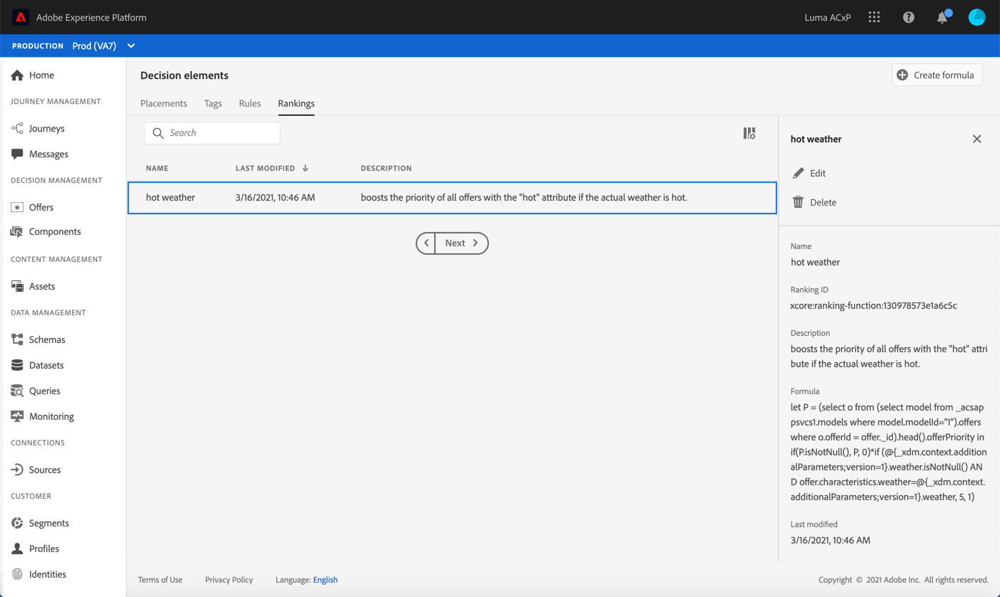

# 创建排名公式 {#create-ranking-formulas}

## 关于公式{#about-ranking-formulas}的排名

**排** 名公式允许您定义规则，以确定应首先为给定版面显示哪个选件，而不考虑选件的优先级得分。

排名公式以&#x200B;**PQL语法**&#x200B;表示，并且可以利用配置文件属性、上下文数据和选件属性。 有关如何使用PQL语法的更多信息，请参阅[专用文档](https://experienceleague.adobe.com/docs/experience-platform/segmentation/pql/overview.html)。

创建排名公式后，您可以将其分配给决策中的版面（以前称为选件活动）。 有关更多信息，请参阅[在决策](../offer-activities/configure-offer-selection.md)中配置选件选择。

## 创建排名公式{#create-ranking-formula}

要创建排名公式，请执行以下步骤：

1. 访问&#x200B;**[!UICONTROL Components]**&#x200B;菜单，然后选择&#x200B;**[!UICONTROL Rankings]**&#x200B;选项卡。 将显示先前创建的排名列表。

   

1. 单击&#x200B;**[!UICONTROL Create ranking]**&#x200B;以创建新的排名公式。

   

1. 指定排名公式名称、说明和公式。

   在本例中，如果实际天气炎热，我们希望使用“hot”属性提高所有选件的优先级。 为此，在决策调用中传递了&#x200B;**contextData.weather=hot**。

   

1. 单击 **[!UICONTROL Save]**。您的排名公式即已创建，您可以从列表中选择它以获取详细信息，并对其进行编辑或删除。

   现在，它已准备好用于对符合条件的选件进行版面排名的决策（请参阅[在决策](../offer-activities/configure-offer-selection.md)中配置选件选择）。

   
