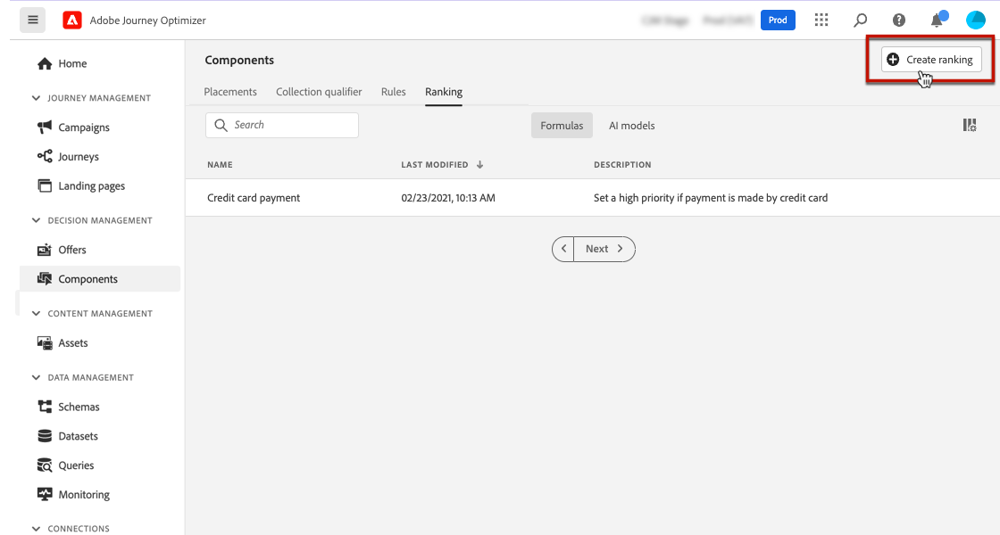

# 创建排名公式 {#create-ranking-formulas}

## 关于排名公式 {#about-ranking-formulas}

**排名公式** 允许您定义规则，以确定应首先为给定版面显示哪个选件，而不是考虑选件的优先级得分。

排名公式以表示 **PQL语法** 和可以利用配置文件属性、上下文数据和选件属性。 有关如何使用PQL语法的更多信息，请参阅 [专用文档](https://experienceleague.adobe.com/docs/experience-platform/segmentation/pql/overview.html).

创建排名公式后，可将其分配给决策中的版面。 有关此内容的更多信息，请参阅 [在决策中配置选件选择](../offer-activities/configure-offer-selection.md).

## 创建排名公式 {#create-ranking-formula}

要创建排名公式，请执行以下步骤：

1. 访问 **[!UICONTROL Components]** 菜单，然后选择 **[!UICONTROL Rankings]** 选项卡。 将显示先前创建的排名列表。

   

1. 单击 **[!UICONTROL Create ranking]** 创建新排名公式。

   

1. 指定排名公式名称、说明和公式。

   在本例中，如果实际天气炎热，我们希望使用“hot”属性提高所有选件的优先级。 为此， **contextData.weather=hot** 在决策呼叫中被传递。

   

1. 单击 **[!UICONTROL Save]**。您的排名公式即已创建，您可以从列表中选择它以获取详细信息，并对其进行编辑或删除。

   现在，它可用于对符合条件的选件进行版面排名的决策(请参阅 [在决策中配置选件选择](../offer-activities/configure-offer-selection.md))。

   

## 公式排名示例 {#ranking-formula-examples}

您可以根据需要创建多个不同的排名公式。 以下是一些示例。

<!--
Boost by offer ID

Boost the priority of an offer with the offer ID *xcore:personalized-offer:13d213cd4cb328ec* by 5.

**Ranking formula:**

```
if( offer._id = "xcore:personalized-offer:13d213cd4cb328ec", offer.rank.priority + 5, offer.rank.priority)
```

Change the offer priority based on a certain profile attribute

Set the offer priority to 30 for offer *xcore:personalized-offer:13d213cd4cb328ec* if the user lives in the city of Bondi.

**Ranking formula:**

```
if( offer._id = "xcore:personalized-offer:13d213cd4cb328ec" and homeAddress.city.equals("Bondi", false), 30, offer.rank.priority)
```

Boost multiple offers by offer ID based on the presence of a profile's segment membership

Boost the priority of offers based on whether the user is a member of a priority segment, which is configured as an attribute in the offer.

**Ranking formula:**

```
if( segmentMembership.get("ups").get(offer.characteristics.prioritySegmentId).status in (["realized","existing"]), offer.rank.priority + 10, offer.rank.priority)
```
-->

### 基于配置文件属性提升具有特定选件属性的选件

如果用户档案位于与选件对应的城市，则该城市中所有选件的优先级应提高一倍。

**排名公式：**

```
if( offer.characteristics.city = homeAddress.city, offer.rank.priority * 2, offer.rank.priority)
```

### 结束日期在现在后24小时内的提升选件

**排名公式：**

```
if( offer.selectionConstraint.endDate occurs <= 24 hours after now, offer.rank.priority * 3, offer.rank.priority)
```

### 基于上下文数据提升具有特定选件属性的选件

您可以根据决策调用中传递的上下文数据提升特定选件。 例如，如果 `contextData.weather=hot` 在决策调用中传递，这是所有选件的优先级 `attribute=hot` 必须增援。

**排名公式：**

```
if (@{_xdm.context.additionalParameters;version=1}.weather.isNotNull()
and offer.characteristics.weather=@{_xdm.context.additionalParameters;version=1}.weather, offer.rank.priority + 5, offer.rank.priority)
```

请注意，使用决策API时，上下文数据会添加到请求正文中的用户档案元素，例如以下示例中的。

**请求正文中的代码片段：**

```
"xdm:profiles": [
{
    "xdm:identityMap": {
        "crmid": [
            {
            "xdm:id": "CRMID1"
            }
        ]
    },
    "xdm:contextData": [
        {
            "@type":"_xdm.context.additionalParameters;version=1",
            "xdm:data":{
                "xdm:weather":"hot"
            }
        }
    ]
 }],
```

### 根据客户购买所提供产品的倾向来提升优惠

您可以根据客户倾向得分提升选件的得分。

在本例中，实例租户为 *_salesvelocity* 并且配置文件架构包含存储在数组中的一系列得分：


鉴于此，对于如下用户档案：

```
{"_salesvelocity": {"individualScoring": [
                    {"core": {
                            "category":"insurance",
                            "propensityScore": 96.9
                        }},
                    {"core": {
                            "category":"personalLoan",
                            "propensityScore": 45.3
                        }},
                    {"core": {
                            "category":"creditCard",
                            "propensityScore": 78.1
                        }}
                    ]}
}
```

选件将包含 *prodeativeType* 与得分中的类别匹配：


然后，您的排名公式可以将每个选件的优先级设置为等于客户 *prodiveScore* 为 *prodeativeType*. 如果未找到分数，请使用选件上设置的静态优先级：

```
let score = (select _Individual_Scoring1 from _salesvelocity.individualScoring
             where _Individual_Scoring1.core.category.equals(offer.characteristics.propensityType, false)).head().core.propensityScore
in if(score.isNotNull(), score, offer.rank.priority)
```
