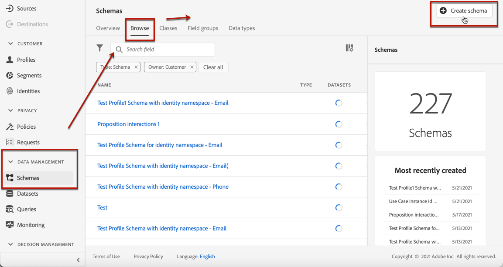

# 创建AI模型 {#ai-rankings}

## 创建排名策略 {#create-ranking-strategy}

要创建排名策略，请执行以下步骤：

1. 访问 **[!UICONTROL Components]** 菜单，然后选择 **[!UICONTROL AI rankings]** 选项卡。

   

   列出了迄今为止创建的所有排名策略。

1. 单击 **[!UICONTROL Create strategy]** 按钮。

1. 填写以下字段：

   

   * **[!UICONTROL Name]**:必须提供的唯一名称。

   * **[!UICONTROL Model type]**:当前位于 [!DNL Journey Optimizer] 唯一支持的模型类型是 **[!UICONTROL Auto-optimization]**. [了解详情](ai-ranking.md#auto-optimization)

   * **[!UICONTROL Optimization metric]**：

      此选项允许营销人员选择如何构建和培训机器学习模型：根据显示的选件、在电子邮件中单击的选件和/或在Web上单击的选件。

      >[!NOTE]
      >
      >您可以根据需要选择所有量度类型。

      优化量度有两种类型：
      * **[!UICONTROL Impression]**:当前展示事件与显示的所有选件相对应。
      * **[!UICONTROL Conversion]**:转化事件与通过电子邮件或Web进行点击的所有选件相对应。

      所有选定的展示事件和/或转化事件都将使用已提供的Web SDK或Mobile SDK自动捕获。 在 [Adobe Experience Platform Web SDK概述](https://experienceleague.adobe.com/docs/experience-platform/edge/home.html?lang=en).

   * **[!UICONTROL Dataset ID]**:对于转化，您需要提供一个数据集，通过从下拉列表中选择该数据集来收集事件。 了解如何在 [此部分](#create-dataset). <!--This dataset needs to be associated with a schema that must have the **[!UICONTROL Proposition Interactions]** field group (previously known as mixin) associated with it.-->

   

   >[!CAUTION]
   >
   >仅从与 **[!UICONTROL Experience Event - Proposition Interactions]** 字段组（以前称为mixin）会显示在下拉列表中。

1. 保存并激活排名策略。

   

现在，它可用于对符合条件的选件进行版面排名的决策。 在 [此部分](../offer-activities/configure-offer-selection.md#use-ranking-strategy).<!--TBC?-->

## 创建数据集以收集事件 {#create-dataset}

您需要创建一个数据集，以收集转化事件。 首先，创建将在数据集中使用的架构：

1. 从 **[!UICONTROL Data Management]** 菜单，选择 **[!UICONTROL Schema]**，转到 **[!UICONTROL Browse]** 选项卡，单击 **[!UICONTROL Create schema]**.

   

1. 选择 **[!UICONTROL XDM ExperienceEvent]**.

   

   >[!NOTE]
   >
   >    在 [XDM系统概述文档](https://experienceleague.adobe.com/docs/experience-platform/xdm/home.html?lang=zh-Hans).


1. 在 **[!UICONTROL Search]** 字段中，键入“建议交互”并选择 **[!UICONTROL Experience Event - Proposition Interactions]** 字段组。

   

   >[!CAUTION]
   >
   >    将在数据集中使用的架构必须具有 **[!UICONTROL Experience Event - Proposition Interactions]** 与其关联的字段组。 否则，您将无法在排名策略中使用它。

1. 单击 **[!UICONTROL Add field groups]**。

   

   >[!NOTE]
   >字段组以前称为mixin。

1. 键入名称并保存架构。<!--How do you edit the fields in this new schema? Examples?-->

>[!NOTE]
>
>    了解有关在 [架构组合的基础知识](https://experienceleague.adobe.com/docs/experience-platform/xdm/schema/composition.html?lang=en#understanding-schemas).

现在，您可以使用此架构创建数据集。 为此，请执行以下步骤：

1. 从 **[!UICONTROL Data Management]** 菜单，选择 **[!UICONTROL Datasets]**，转到 **[!UICONTROL Browse]** 选项卡，单击 **[!UICONTROL Create dataset]**.

   

1. 选择 **[!UICONTROL Create dataset from schema]**。

   

1. 从列表中选择之前创建的架构。

   

1. 单击 **[!UICONTROL Next]**。

1. 为 **[!UICONTROL Name]** 字段，单击 **[!UICONTROL Finish]**.

   

现在，可以选择数据集以在 [创建排名策略](#create-ranking-strategy).

## 提供架构要求 {#schema-requirements}

此时，您必须具有：

* 制定了排名策略，
* 定义要捕获的事件类型 — 显示的选件（展示次数）和/或点击的选件（转化），
* 以及要在哪个数据集中收集事件数据。

现在，每次显示和/或单击选件时，您都希望 **[!UICONTROL Experience Event - Proposition Interactions]** 字段组 [Adobe Experience Platform Web SDK](https://experienceleague.adobe.com/docs/experience-platform/edge/web-sdk-faq.html#what-is-adobe-experience-platform-web-sdk%3F){target=&quot;_blank&quot;}或Mobile SDK。

要发送事件类型（显示的选件或点击的选件），您必须为发送到Adobe Experience Platform的体验事件中的每个事件类型设置正确的值。 以下是在JavaScript代码中实施所需的架构要求：

### 显示选件的方案

**事件类型：** `decisioning.propositionDisplay`
**来源：** Web.sdk/Alloy.js(`sendEvent command -> xdm : {eventType, interactionMixin}`)或批量摄取
+++**有效负载示例：**

```
{
    "@id": "a7864a96-1eac-4934-ab44-54ad037b4f2b",
    "xdm:timestamp": "2020-09-26T15:52:25+00:00",
    "xdm:eventType": "decisioning.propositionDisplay",
    "https://ns.adobe.com/experience/decisioning/propositions":
    [
        {
            "xdm:items":
            [
                {
                    "xdm:id": "personalized-offer:f67bab756ed6ee4",
                },
                {
                    "xdm:id": "personalized-offer:f67bab756ed6ee5",
                }
            ],
            "xdm:id": "3cc33a7e-13ca-4b19-b25d-c816eff9a70a", //decision event id - taken from experience event for “nextBestOffer”
            "xdm:scope": "scope:12cfc3fa94281acb", //decision scope id - taken from experience event for “nextBestOffer”
        }
    ]
}
```

+++

### “已单击选件”方案

**事件类型：** `decisioning.propositionInteract`
**来源：** Web.sdk/Alloy.js(`sendEvent command -> xdm : {eventType, interactionMixin}`)或批量摄取
+++**有效负载示例：**

```
{
    "@id": "a7864a96-1eac-4934-ab44-54ad037b4f2b",
    "xdm:timestamp": "2020-09-26T15:52:25+00:00",
    "xdm:eventType": "decisioning.propositionInteract",
    "https://ns.adobe.com/experience/decisioning/propositions":
    [
        {
            "xdm:items":
            [
                {
                    "xdm:id": "personalized-offer:f67bab756ed6ee4"
                },
                {
                    "xdm:id": "personalized-offer:f67bab756ed6ee5"
                },
            ],
            "xdm:id": "3cc33a7e-13ca-4b19-b25d-c816eff9a70a", //decision event id
            "xdm:scope": "scope:12cfc3fa94281acb", //decision scope id
        }
    ]
}
```

+++

<!--
## Using a ranking strategy {#using-ranking}

To use the ranking strategy you created above, follow the steps below:

Once a ranking strategy has been created, you can assign it to a placement in a decision. For more on this, see [Configure offers selection in decisions](../offer-activities/configure-offer-selection.md).

1. Create a decision.
1. Add a placement.
1. Add a collection.
1. Choose to rank offers by AI ranking (select it from the drop-down list).
1. Click Add ranking.
1. Select the ranking strategy that you created. All the details of the ranking strategy are displayed.
1. Click Next to confirm.
1. Save your decision.

It is now ready to be used in a decision to rank eligible offers for a placement (see [Configure offers selection in decisions](../offer-activities/configure-offer-selection.md)).
-->

